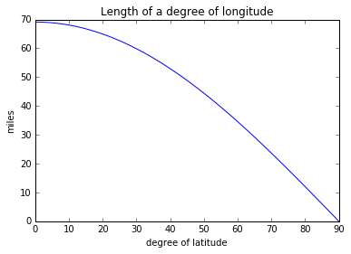

# Spatial Data Processing with PySAL & Pandas

> [`IPYNB`](../content/part1/01_data_processing.ipynb)


```python
#by convention, we use these shorter two-letter names
import pysal as ps
import pandas as pd
import numpy as np
```

PySAL has two simple ways to read in data. But, first, you need to get the path from where your notebook is running on your computer to the place the data is. For example, to find where the notebook is running:


```python
!pwd # on windows !cd
```

    /home/serge/Dropbox/p/pysal/workshops/scipy16/gds_scipy16/content/part1


PySAL has a command that it uses to get the paths of its example datasets. Let's work with a commonly-used dataset first. 


```python
ps.examples.available()
```


    ['arcgis',
     'street_net_pts',
     'Point',
     'taz',
     'Line',
     'calemp',
     'baltim',
     'south',
     'burkitt',
     'mexico',
     'sids2',
     'geodanet',
     'newHaven',
     'networks',
     'snow_maps',
     'us_income',
     '10740',
     'chicago',
     'juvenile',
     'stl',
     'desmith',
     'virginia',
     'book',
     'nat',
     'Polygon',
     'columbus',
     'wmat',
     'sacramento2']


```python
ps.examples.explain('us_income')
```


    {'description': 'Per-capita income for the lower 47 US states 1929-2010',
     'explanation': [' * us48.shp: shapefile ',
      ' * us48.dbf: dbf for shapefile',
      ' * us48.shx: index for shapefile',
      ' * usjoin.csv: attribute data (comma delimited file)'],
     'name': 'us_income'}


```python
csv_path = ps.examples.get_path('usjoin.csv')
```


```python
f = ps.open(csv_path)
f.header
```


    ['Name',
     'STATE_FIPS',
     '1929',
     '1930',
     '1931',
     '1932',
     '1933',
     '1934',
     '1935',
     '1936',
     '1937',
     '1938',
     '1939',
     '1940',
     '1941',
     '1942',
     '1943',
     '1944',
     '1945',
     '1946',
     '1947',
     '1948',
     '1949',
     '1950',
     '1951',
     '1952',
     '1953',
     '1954',
     '1955',
     '1956',
     '1957',
     '1958',
     '1959',
     '1960',
     '1961',
     '1962',
     '1963',
     '1964',
     '1965',
     '1966',
     '1967',
     '1968',
     '1969',
     '1970',
     '1971',
     '1972',
     '1973',
     '1974',
     '1975',
     '1976',
     '1977',
     '1978',
     '1979',
     '1980',
     '1981',
     '1982',
     '1983',
     '1984',
     '1985',
     '1986',
     '1987',
     '1988',
     '1989',
     '1990',
     '1991',
     '1992',
     '1993',
     '1994',
     '1995',
     '1996',
     '1997',
     '1998',
     '1999',
     '2000',
     '2001',
     '2002',
     '2003',
     '2004',
     '2005',
     '2006',
     '2007',
     '2008',
     '2009']


```python
y2009 = f.by_col('2009')
```


```python
y2009
```


    [32274,
     32077,
     31493,
     40902,
     40093,
     52736,
     40135,
     36565,
     33086,
     30987,
     40933,
     33174,
     35983,
     37036,
     31250,
     35151,
     35268,
     47159,
     49590,
     34280,
     40920,
     29318,
     35106,
     32699,
     37057,
     38009,
     41882,
     48123,
     32197,
     46844,
     33564,
     38672,
     35018,
     33708,
     35210,
     38827,
     41283,
     30835,
     36499,
     33512,
     35674,
     30107,
     36752,
     43211,
     40619,
     31843,
     35676,
     42504]


### Working with shapefiles

We can also work with local files outside the built-in examples.

To read in a shapefile, we will need the path to the file.


```python
shp_path = '../data/texas.shp'
print(shp_path)
```

    ../data/texas.shp


Then, we open the file using the `ps.open` command:


```python
f = ps.open(shp_path)
```

`f` is what we call a "file handle." That means that it only *points* to the data and provides ways to work with it. By itself, it does not read the whole dataset into memory. To see basic information about the file, we can use a few different methods. 

For instance, the header of the file, which contains most of the metadata about the file:


```python
f.header
```


    {'BBOX Mmax': 0.0,
     'BBOX Mmin': 0.0,
     'BBOX Xmax': -93.50721740722656,
     'BBOX Xmin': -106.6495132446289,
     'BBOX Ymax': 36.49387741088867,
     'BBOX Ymin': 25.845197677612305,
     'BBOX Zmax': 0.0,
     'BBOX Zmin': 0.0,
     'File Code': 9994,
     'File Length': 49902,
     'Shape Type': 5,
     'Unused0': 0,
     'Unused1': 0,
     'Unused2': 0,
     'Unused3': 0,
     'Unused4': 0,
     'Version': 1000}


To actually read in the shapes from memory, you can use the following commands:


```python
f.by_row(14) #gets the 14th shape from the file
```


    <pysal.cg.shapes.Polygon at 0x7fc5b08a3860>


```python
all_polygons = f.read() #reads in all polygons from memory
```


```python
len(all_polygons)
```


    254


So, all 254 polygons have been read in from file. These are stored in PySAL shape objects, which can be used by PySAL and can be converted to other Python shape objects.

They typically have a few methods. So, since we've read in polygonal data, we can get some properties about the polygons. Let's just have a look at the first polygon:


```python
all_polygons
```


    [<pysal.cg.shapes.Polygon at 0x7fc5b08a3748>,
     <pysal.cg.shapes.Polygon at 0x7fc5b08a39e8>,
     <pysal.cg.shapes.Polygon at 0x7fc5b08a36a0>,
     <pysal.cg.shapes.Polygon at 0x7fc5b08a3710>,
     <pysal.cg.shapes.Polygon at 0x7fc5b08a38d0>,
     <pysal.cg.shapes.Polygon at 0x7fc5b08a3ac8>,
     <pysal.cg.shapes.Polygon at 0x7fc5b08a3b38>,
     <pysal.cg.shapes.Polygon at 0x7fc5b08a3ba8>,
     <pysal.cg.shapes.Polygon at 0x7fc5b08a3c18>,
     <pysal.cg.shapes.Polygon at 0x7fc5b08a3c88>,
     <pysal.cg.shapes.Polygon at 0x7fc5b08a3cf8>,
     <pysal.cg.shapes.Polygon at 0x7fc5b08a3d68>,
     <pysal.cg.shapes.Polygon at 0x7fc5b08a3dd8>,
     <pysal.cg.shapes.Polygon at 0x7fc5b08a3e48>,
     <pysal.cg.shapes.Polygon at 0x7fc5b08a3ef0>,
     <pysal.cg.shapes.Polygon at 0x7fc5b08a3f60>,
     <pysal.cg.shapes.Polygon at 0x7fc5b08a3fd0>,
     <pysal.cg.shapes.Polygon at 0x7fc5b08a20f0>,
     <pysal.cg.shapes.Polygon at 0x7fc5b08a3e80>,
     <pysal.cg.shapes.Polygon at 0x7fc5b08a22e8>,
     <pysal.cg.shapes.Polygon at 0x7fc5b08a2320>,
     <pysal.cg.shapes.Polygon at 0x7fc5b001b208>,
     <pysal.cg.shapes.Polygon at 0x7fc5b001b908>,
     <pysal.cg.shapes.Polygon at 0x7fc5b001b048>,
     <pysal.cg.shapes.Polygon at 0x7fc5b001b0b8>,
     <pysal.cg.shapes.Polygon at 0x7fc5b001b128>,
     <pysal.cg.shapes.Polygon at 0x7fc5b08a2240>,
     <pysal.cg.shapes.Polygon at 0x7fc5b001b198>,
     <pysal.cg.shapes.Polygon at 0x7fc5b001b518>,
     <pysal.cg.shapes.Polygon at 0x7fc5b001bc50>,
     <pysal.cg.shapes.Polygon at 0x7fc5b001bd30>,
     <pysal.cg.shapes.Polygon at 0x7fc5b001bb38>,
     <pysal.cg.shapes.Polygon at 0x7fc5b001ba90>,
     <pysal.cg.shapes.Polygon at 0x7fc5b001b9e8>,
     <pysal.cg.shapes.Polygon at 0x7fc5b001b390>,
     <pysal.cg.shapes.Polygon at 0x7fc5b001b5c0>,
     <pysal.cg.shapes.Polygon at 0x7fc5b001b4e0>,
     <pysal.cg.shapes.Polygon at 0x7fc5b001b7b8>,
     <pysal.cg.shapes.Polygon at 0x7fc5b001b6d8>,
     <pysal.cg.shapes.Polygon at 0x7fc5b001b780>,
     <pysal.cg.shapes.Polygon at 0x7fc5b001b978>,
     <pysal.cg.shapes.Polygon at 0x7fc5b001b940>,
     <pysal.cg.shapes.Polygon at 0x7fc5b001bdd8>,
     <pysal.cg.shapes.Polygon at 0x7fc5b001be48>,
     <pysal.cg.shapes.Polygon at 0x7fc5b001beb8>,
     <pysal.cg.shapes.Polygon at 0x7fc5b001bf28>,
     <pysal.cg.shapes.Polygon at 0x7fc5b001bf98>,
     <pysal.cg.shapes.Polygon at 0x7fc5b001b278>,
     <pysal.cg.shapes.Polygon at 0x7fc5b001b6a0>,
     <pysal.cg.shapes.Polygon at 0x7fc5b001b7f0>,
     <pysal.cg.shapes.Polygon at 0x7fc5b001bbe0>,
     <pysal.cg.shapes.Polygon at 0x7fc5b001b2e8>,
     <pysal.cg.shapes.Polygon at 0x7fc5b001b828>,
     <pysal.cg.shapes.Polygon at 0x7fc5b001b8d0>,
     <pysal.cg.shapes.Polygon at 0x7fc5b08a40b8>,
     <pysal.cg.shapes.Polygon at 0x7fc5b08a4128>,
     <pysal.cg.shapes.Polygon at 0x7fc5b08a4198>,
     <pysal.cg.shapes.Polygon at 0x7fc5b08a4208>,
     <pysal.cg.shapes.Polygon at 0x7fc5b08a4278>,
     <pysal.cg.shapes.Polygon at 0x7fc5b08a42e8>,
     <pysal.cg.shapes.Polygon at 0x7fc5b08a4358>,
     <pysal.cg.shapes.Polygon at 0x7fc5b08a43c8>,
     <pysal.cg.shapes.Polygon at 0x7fc5b08a4438>,
     <pysal.cg.shapes.Polygon at 0x7fc5b08a44a8>,
     <pysal.cg.shapes.Polygon at 0x7fc5b08a4518>,
     <pysal.cg.shapes.Polygon at 0x7fc5b08a4588>,
     <pysal.cg.shapes.Polygon at 0x7fc5b08a45f8>,
     <pysal.cg.shapes.Polygon at 0x7fc5b08a4668>,
     <pysal.cg.shapes.Polygon at 0x7fc5b08a46d8>,
     <pysal.cg.shapes.Polygon at 0x7fc5b08a4748>,
     <pysal.cg.shapes.Polygon at 0x7fc5b08a47b8>,
     <pysal.cg.shapes.Polygon at 0x7fc5b08a4828>,
     <pysal.cg.shapes.Polygon at 0x7fc5b08a4898>,
     <pysal.cg.shapes.Polygon at 0x7fc5b08a4908>,
     <pysal.cg.shapes.Polygon at 0x7fc5b08a4978>,
     <pysal.cg.shapes.Polygon at 0x7fc5b08a49e8>,
     <pysal.cg.shapes.Polygon at 0x7fc5b08a4a58>,
     <pysal.cg.shapes.Polygon at 0x7fc5b08a4ac8>,
     <pysal.cg.shapes.Polygon at 0x7fc5b08a4b38>,
     <pysal.cg.shapes.Polygon at 0x7fc5b08a4ba8>,
     <pysal.cg.shapes.Polygon at 0x7fc5b08a4c18>,
     <pysal.cg.shapes.Polygon at 0x7fc5b08a4c88>,
     <pysal.cg.shapes.Polygon at 0x7fc5b08a4cf8>,
     <pysal.cg.shapes.Polygon at 0x7fc5b08a4d68>,
     <pysal.cg.shapes.Polygon at 0x7fc5b08a4dd8>,
     <pysal.cg.shapes.Polygon at 0x7fc5b08a4e48>,
     <pysal.cg.shapes.Polygon at 0x7fc5b08a4eb8>,
     <pysal.cg.shapes.Polygon at 0x7fc5b08a4f28>,
     <pysal.cg.shapes.Polygon at 0x7fc5b08a4f98>,
     <pysal.cg.shapes.Polygon at 0x7fc5b08a4fd0>,
     <pysal.cg.shapes.Polygon at 0x7fc5b08b40b8>,
     <pysal.cg.shapes.Polygon at 0x7fc5b08b4128>,
     <pysal.cg.shapes.Polygon at 0x7fc5b08b4198>,
     <pysal.cg.shapes.Polygon at 0x7fc5b08b4208>,
     <pysal.cg.shapes.Polygon at 0x7fc5b08b4278>,
     <pysal.cg.shapes.Polygon at 0x7fc5b08b42e8>,
     <pysal.cg.shapes.Polygon at 0x7fc5b08b4358>,
     <pysal.cg.shapes.Polygon at 0x7fc5b08b43c8>,
     <pysal.cg.shapes.Polygon at 0x7fc5b08b4438>,
     <pysal.cg.shapes.Polygon at 0x7fc5b08b44a8>,
     <pysal.cg.shapes.Polygon at 0x7fc5b08b4518>,
     <pysal.cg.shapes.Polygon at 0x7fc5b08b4588>,
     <pysal.cg.shapes.Polygon at 0x7fc5b08b45f8>,
     <pysal.cg.shapes.Polygon at 0x7fc5b08b4668>,
     <pysal.cg.shapes.Polygon at 0x7fc5b08b46d8>,
     <pysal.cg.shapes.Polygon at 0x7fc5b08b4748>,
     <pysal.cg.shapes.Polygon at 0x7fc5b08b47b8>,
     <pysal.cg.shapes.Polygon at 0x7fc5b08b4828>,
     <pysal.cg.shapes.Polygon at 0x7fc5b08b4898>,
     <pysal.cg.shapes.Polygon at 0x7fc5b08b4908>,
     <pysal.cg.shapes.Polygon at 0x7fc5b08b4978>,
     <pysal.cg.shapes.Polygon at 0x7fc5b08b49e8>,
     <pysal.cg.shapes.Polygon at 0x7fc5b08b4a58>,
     <pysal.cg.shapes.Polygon at 0x7fc5b08b4ac8>,
     <pysal.cg.shapes.Polygon at 0x7fc5b08b4b38>,
     <pysal.cg.shapes.Polygon at 0x7fc5b08b4ba8>,
     <pysal.cg.shapes.Polygon at 0x7fc5b08b4c18>,
     <pysal.cg.shapes.Polygon at 0x7fc5b08b4c88>,
     <pysal.cg.shapes.Polygon at 0x7fc5b08b4cf8>,
     <pysal.cg.shapes.Polygon at 0x7fc5b08b4d68>,
     <pysal.cg.shapes.Polygon at 0x7fc5b08b4dd8>,
     <pysal.cg.shapes.Polygon at 0x7fc5b08b4e48>,
     <pysal.cg.shapes.Polygon at 0x7fc5b08b4eb8>,
     <pysal.cg.shapes.Polygon at 0x7fc5b08b4f28>,
     <pysal.cg.shapes.Polygon at 0x7fc5b08b4f98>,
     <pysal.cg.shapes.Polygon at 0x7fc5b08b4fd0>,
     <pysal.cg.shapes.Polygon at 0x7fc5b08cd0b8>,
     <pysal.cg.shapes.Polygon at 0x7fc5b08cd128>,
     <pysal.cg.shapes.Polygon at 0x7fc5b08cd198>,
     <pysal.cg.shapes.Polygon at 0x7fc5b08cd208>,
     <pysal.cg.shapes.Polygon at 0x7fc5b08cd278>,
     <pysal.cg.shapes.Polygon at 0x7fc5b08cd2e8>,
     <pysal.cg.shapes.Polygon at 0x7fc5b08cd358>,
     <pysal.cg.shapes.Polygon at 0x7fc5b08cd3c8>,
     <pysal.cg.shapes.Polygon at 0x7fc5b08cd438>,
     <pysal.cg.shapes.Polygon at 0x7fc5b08cd4a8>,
     <pysal.cg.shapes.Polygon at 0x7fc5b08cd518>,
     <pysal.cg.shapes.Polygon at 0x7fc5b08cd588>,
     <pysal.cg.shapes.Polygon at 0x7fc5b08cd5f8>,
     <pysal.cg.shapes.Polygon at 0x7fc5b08cd668>,
     <pysal.cg.shapes.Polygon at 0x7fc5b08cd6d8>,
     <pysal.cg.shapes.Polygon at 0x7fc5b08cd748>,
     <pysal.cg.shapes.Polygon at 0x7fc5b08cd7b8>,
     <pysal.cg.shapes.Polygon at 0x7fc5b08cd828>,
     <pysal.cg.shapes.Polygon at 0x7fc5b08cd898>,
     <pysal.cg.shapes.Polygon at 0x7fc5b08cd908>,
     <pysal.cg.shapes.Polygon at 0x7fc5b08cd978>,
     <pysal.cg.shapes.Polygon at 0x7fc5b08cd9e8>,
     <pysal.cg.shapes.Polygon at 0x7fc5b08cda58>,
     <pysal.cg.shapes.Polygon at 0x7fc5b08cdac8>,
     <pysal.cg.shapes.Polygon at 0x7fc5b08cdb38>,
     <pysal.cg.shapes.Polygon at 0x7fc5b08cdba8>,
     <pysal.cg.shapes.Polygon at 0x7fc5b08cdc18>,
     <pysal.cg.shapes.Polygon at 0x7fc5b08cdc88>,
     <pysal.cg.shapes.Polygon at 0x7fc5b08cdcf8>,
     <pysal.cg.shapes.Polygon at 0x7fc5b08cdd68>,
     <pysal.cg.shapes.Polygon at 0x7fc5b08cddd8>,
     <pysal.cg.shapes.Polygon at 0x7fc5b08cde48>,
     <pysal.cg.shapes.Polygon at 0x7fc5b08cdeb8>,
     <pysal.cg.shapes.Polygon at 0x7fc5b08cdf28>,
     <pysal.cg.shapes.Polygon at 0x7fc5b08cdf98>,
     <pysal.cg.shapes.Polygon at 0x7fc5b08cdfd0>,
     <pysal.cg.shapes.Polygon at 0x7fc5afff30b8>,
     <pysal.cg.shapes.Polygon at 0x7fc5afff3128>,
     <pysal.cg.shapes.Polygon at 0x7fc5afff3198>,
     <pysal.cg.shapes.Polygon at 0x7fc5afff3208>,
     <pysal.cg.shapes.Polygon at 0x7fc5afff3278>,
     <pysal.cg.shapes.Polygon at 0x7fc5afff32e8>,
     <pysal.cg.shapes.Polygon at 0x7fc5afff3358>,
     <pysal.cg.shapes.Polygon at 0x7fc5afff33c8>,
     <pysal.cg.shapes.Polygon at 0x7fc5afff3438>,
     <pysal.cg.shapes.Polygon at 0x7fc5afff34a8>,
     <pysal.cg.shapes.Polygon at 0x7fc5afff3518>,
     <pysal.cg.shapes.Polygon at 0x7fc5afff3588>,
     <pysal.cg.shapes.Polygon at 0x7fc5afff35f8>,
     <pysal.cg.shapes.Polygon at 0x7fc5afff3668>,
     <pysal.cg.shapes.Polygon at 0x7fc5afff36d8>,
     <pysal.cg.shapes.Polygon at 0x7fc5afff3748>,
     <pysal.cg.shapes.Polygon at 0x7fc5afff37b8>,
     <pysal.cg.shapes.Polygon at 0x7fc5afff3828>,
     <pysal.cg.shapes.Polygon at 0x7fc5afff3898>,
     <pysal.cg.shapes.Polygon at 0x7fc5afff3908>,
     <pysal.cg.shapes.Polygon at 0x7fc5afff3978>,
     <pysal.cg.shapes.Polygon at 0x7fc5afff39e8>,
     <pysal.cg.shapes.Polygon at 0x7fc5afff3a58>,
     <pysal.cg.shapes.Polygon at 0x7fc5afff3ac8>,
     <pysal.cg.shapes.Polygon at 0x7fc5afff3b38>,
     <pysal.cg.shapes.Polygon at 0x7fc5afff3ba8>,
     <pysal.cg.shapes.Polygon at 0x7fc5afff3c18>,
     <pysal.cg.shapes.Polygon at 0x7fc5afff3c88>,
     <pysal.cg.shapes.Polygon at 0x7fc5afff3cf8>,
     <pysal.cg.shapes.Polygon at 0x7fc5afff3d68>,
     <pysal.cg.shapes.Polygon at 0x7fc5afff3dd8>,
     <pysal.cg.shapes.Polygon at 0x7fc5afff3e48>,
     <pysal.cg.shapes.Polygon at 0x7fc5afff3eb8>,
     <pysal.cg.shapes.Polygon at 0x7fc5afff3f28>,
     <pysal.cg.shapes.Polygon at 0x7fc5afff3f98>,
     <pysal.cg.shapes.Polygon at 0x7fc5afff3fd0>,
     <pysal.cg.shapes.Polygon at 0x7fc5aff940b8>,
     <pysal.cg.shapes.Polygon at 0x7fc5aff94128>,
     <pysal.cg.shapes.Polygon at 0x7fc5aff94198>,
     <pysal.cg.shapes.Polygon at 0x7fc5aff94208>,
     <pysal.cg.shapes.Polygon at 0x7fc5aff94278>,
     <pysal.cg.shapes.Polygon at 0x7fc5aff942e8>,
     <pysal.cg.shapes.Polygon at 0x7fc5aff94358>,
     <pysal.cg.shapes.Polygon at 0x7fc5aff943c8>,
     <pysal.cg.shapes.Polygon at 0x7fc5aff94438>,
     <pysal.cg.shapes.Polygon at 0x7fc5aff944a8>,
     <pysal.cg.shapes.Polygon at 0x7fc5aff94518>,
     <pysal.cg.shapes.Polygon at 0x7fc5aff94588>,
     <pysal.cg.shapes.Polygon at 0x7fc5aff945f8>,
     <pysal.cg.shapes.Polygon at 0x7fc5aff94668>,
     <pysal.cg.shapes.Polygon at 0x7fc5aff946d8>,
     <pysal.cg.shapes.Polygon at 0x7fc5aff94748>,
     <pysal.cg.shapes.Polygon at 0x7fc5aff947b8>,
     <pysal.cg.shapes.Polygon at 0x7fc5aff94828>,
     <pysal.cg.shapes.Polygon at 0x7fc5aff94898>,
     <pysal.cg.shapes.Polygon at 0x7fc5aff94908>,
     <pysal.cg.shapes.Polygon at 0x7fc5aff94978>,
     <pysal.cg.shapes.Polygon at 0x7fc5aff949e8>,
     <pysal.cg.shapes.Polygon at 0x7fc5aff94a58>,
     <pysal.cg.shapes.Polygon at 0x7fc5aff94a20>,
     <pysal.cg.shapes.Polygon at 0x7fc5aff94ba8>,
     <pysal.cg.shapes.Polygon at 0x7fc5aff94c18>,
     <pysal.cg.shapes.Polygon at 0x7fc5aff94c88>,
     <pysal.cg.shapes.Polygon at 0x7fc5aff94cf8>,
     <pysal.cg.shapes.Polygon at 0x7fc5aff94d68>,
     <pysal.cg.shapes.Polygon at 0x7fc5aff94dd8>,
     <pysal.cg.shapes.Polygon at 0x7fc5aff94e48>,
     <pysal.cg.shapes.Polygon at 0x7fc5aff94eb8>,
     <pysal.cg.shapes.Polygon at 0x7fc5aff94f28>,
     <pysal.cg.shapes.Polygon at 0x7fc5aff94f98>,
     <pysal.cg.shapes.Polygon at 0x7fc5aff94fd0>,
     <pysal.cg.shapes.Polygon at 0x7fc5affb90b8>,
     <pysal.cg.shapes.Polygon at 0x7fc5affb9128>,
     <pysal.cg.shapes.Polygon at 0x7fc5affb9198>,
     <pysal.cg.shapes.Polygon at 0x7fc5affb9208>,
     <pysal.cg.shapes.Polygon at 0x7fc5affb9278>,
     <pysal.cg.shapes.Polygon at 0x7fc5affb92e8>,
     <pysal.cg.shapes.Polygon at 0x7fc5affb92b0>,
     <pysal.cg.shapes.Polygon at 0x7fc5affb94a8>,
     <pysal.cg.shapes.Polygon at 0x7fc5affb9518>,
     <pysal.cg.shapes.Polygon at 0x7fc5affb94e0>,
     <pysal.cg.shapes.Polygon at 0x7fc5affb9668>,
     <pysal.cg.shapes.Polygon at 0x7fc5affb96d8>,
     <pysal.cg.shapes.Polygon at 0x7fc5affb96a0>,
     <pysal.cg.shapes.Polygon at 0x7fc5affb9710>,
     <pysal.cg.shapes.Polygon at 0x7fc5affb9898>,
     <pysal.cg.shapes.Polygon at 0x7fc5affb9908>,
     <pysal.cg.shapes.Polygon at 0x7fc5affb9978>,
     <pysal.cg.shapes.Polygon at 0x7fc5affb9940>,
     <pysal.cg.shapes.Polygon at 0x7fc5affb9ac8>,
     <pysal.cg.shapes.Polygon at 0x7fc5affb9b38>,
     <pysal.cg.shapes.Polygon at 0x7fc5affb9b00>]


```python
all_polygons[0].centroid #the centroid of the first polygon
```


    (-100.27156110567945, 36.27508640938005)


```python
all_polygons[0].area
```


    0.23682222998468205


```python
all_polygons[0].perimeter
```


    1.9582821721538344


While in the Jupyter Notebook, you can examine what properties an object has by using the tab key.


```python
polygon = all_polygons[0]
```


```python
polygon. #press tab when the cursor is right after the dot
```


      File "<ipython-input-20-aa03438a2fa8>", line 1
        polygon. #press tab when the cursor is right after the dot
                                                                  ^
    SyntaxError: invalid syntax


### Working with Data Tables


```python
dbf_path = "../data/texas.dbf"
print(dbf_path)
```

    ../data/texas.dbf


When you're working with tables of data, like a `csv` or `dbf`, you can extract your data in the following way. Let's open the dbf file we got the path for above.


```python
f = ps.open(dbf_path)
```

Just like with the shapefile, we can examine the header of the dbf file.


```python
f.header
```


    ['NAME',
     'STATE_NAME',
     'STATE_FIPS',
     'CNTY_FIPS',
     'FIPS',
     'STFIPS',
     'COFIPS',
     'FIPSNO',
     'SOUTH',
     'HR60',
     'HR70',
     'HR80',
     'HR90',
     'HC60',
     'HC70',
     'HC80',
     'HC90',
     'PO60',
     'PO70',
     'PO80',
     'PO90',
     'RD60',
     'RD70',
     'RD80',
     'RD90',
     'PS60',
     'PS70',
     'PS80',
     'PS90',
     'UE60',
     'UE70',
     'UE80',
     'UE90',
     'DV60',
     'DV70',
     'DV80',
     'DV90',
     'MA60',
     'MA70',
     'MA80',
     'MA90',
     'POL60',
     'POL70',
     'POL80',
     'POL90',
     'DNL60',
     'DNL70',
     'DNL80',
     'DNL90',
     'MFIL59',
     'MFIL69',
     'MFIL79',
     'MFIL89',
     'FP59',
     'FP69',
     'FP79',
     'FP89',
     'BLK60',
     'BLK70',
     'BLK80',
     'BLK90',
     'GI59',
     'GI69',
     'GI79',
     'GI89',
     'FH60',
     'FH70',
     'FH80',
     'FH90']


So, the header is a list containing the names of all of the fields we can read.
If we just wanted to grab the data of interest, `HR90`, we can use either `by_col` or `by_col_array`, depending on the format we want the resulting data in:


```python
HR90 = f.by_col('HR90')
print(type(HR90).__name__, HR90[0:5])
HR90 = f.by_col_array('HR90')
print(type(HR90).__name__, HR90[0:5])
```

    list [0.0, 0.0, 18.31166453, 0.0, 3.6517674554]
    ndarray [[  0.        ]
     [  0.        ]
     [ 18.31166453]
     [  0.        ]
     [  3.65176746]]


As you can see, the `by_col` function returns a list of data, with no shape. It can only return one column at a time:


```python
HRs = f.by_col('HR90', 'HR80')
```


    ---------------------------------------------------------------------------

    TypeError                                 Traceback (most recent call last)

    <ipython-input-25-1fef6a3c3a50> in <module>()
    ----> 1 HRs = f.by_col('HR90', 'HR80')
    

    TypeError: __call__() takes 2 positional arguments but 3 were given


This error message is called a "traceback," as you see in the top right, and it usually provides feedback on why the previous command did not execute correctly. Here, you see that one-too-many arguments was provided to `__call__`, which tells us we cannot pass as many arguments as we did to `by_col`.

If you want to read in many columns at once and store them to an array, use `by_col_array`:


```python
HRs = f.by_col_array('HR90', 'HR80')
```


```python
HRs
```


    array([[  0.        ,   0.        ],
           [  0.        ,  10.50199538],
           [ 18.31166453,   5.10386362],
           [  0.        ,   0.        ],
           [  3.65176746,  10.4297038 ],
           [  0.        ,   0.        ],
           [  0.        ,  18.85369532],
           [  2.59514448,   6.33617194],
           [  0.        ,   0.        ],
           [  5.59753708,   6.0331825 ],
           [ 17.3692707 ,  14.53139626],
           [  5.06893755,   4.9960032 ],
           [  9.73560868,   8.84307335],
           [  5.66989851,   4.67049647],
           [  0.        ,   0.        ],
           [  4.08893052,   4.44077341],
           [ 16.49348507,   0.        ],
           [  0.        ,   7.17154332],
           [  0.        ,   8.1799591 ],
           [  3.48074279,   7.8746358 ],
           [  0.        ,   6.0397415 ],
           [  3.67511944,  12.63104711],
           [  8.19705726,  17.14148582],
           [  0.        ,   0.        ],
           [ 11.19883532,   4.79616307],
           [  8.53606487,   5.95876534],
           [  6.30954634,   5.23450586],
           [ 19.83995768,   8.36942649],
           [ 43.51610096,   0.        ],
           [ 14.83459427,   0.        ],
           [  7.8459064 ,   6.77920141],
           [  5.76850971,  12.41398879],
           [  2.21160651,   5.3564733 ],
           [  4.7187618 ,  16.32386549],
           [  0.        ,   0.        ],
           [ 13.6190056 ,   9.08475248],
           [  0.        ,   0.        ],
           [  5.78904712,   5.74382539],
           [ 11.6411725 ,  10.35132393],
           [ 11.57638838,   5.93938854],
           [  8.66447889,   7.23170379],
           [  7.58454876,  11.06999399],
           [ 16.12643122,   4.11776817],
           [  0.        ,   0.        ],
           [  0.        ,   9.41885655],
           [  0.        ,  11.28795575],
           [  8.68383071,  18.26906873],
           [  4.18077679,   0.        ],
           [  5.50986955,   7.17463051],
           [ 20.67397147,  18.76524676],
           [  0.        ,   0.        ],
           [  0.        ,  13.81692573],
           [  7.75526031,   8.85335741],
           [ 13.7258939 ,  20.66542674],
           [  9.54973022,   4.49964003],
           [  4.80598249,   5.01724679],
           [  5.24022789,   4.89079552],
           [  9.3250237 ,   9.65344145],
           [  3.15613527,   6.68621809],
           [ 15.27205076,  15.54581351],
           [  0.        ,   4.31499461],
           [  0.        ,   0.        ],
           [  3.677958  ,   3.4935108 ],
           [  0.        ,   0.        ],
           [ 16.55903295,  13.85425326],
           [  4.27240878,  24.17911891],
           [ 12.96260289,   6.24687656],
           [  0.        ,   0.        ],
           [  5.04362738,   6.85824018],
           [  0.        ,   4.01654818],
           [  5.78041365,   7.92173328],
           [  0.        ,  29.62152801],
           [ 11.11778178,   7.92841771],
           [ 16.82821755,  10.78167116],
           [  4.53823463,   8.09814957],
           [  5.32162576,  13.85310171],
           [  5.14522395,   3.73616684],
           [ 15.7535989 ,  15.99138866],
           [ 24.88112651,  22.42368558],
           [  7.81127949,   4.58883994],
           [ 14.89203276,  13.77695116],
           [  0.        ,   8.51426139],
           [  6.06428138,   9.65176434],
           [  0.        ,   5.65834889],
           [  7.15537906,  10.99384345],
           [  0.        ,   0.        ],
           [ 16.26129579,   6.17894217],
           [  3.69959304,   6.71636779],
           [  0.        ,  10.13941698],
           [  4.25034534,  12.82275456],
           [ 13.35470086,  35.39253539],
           [ 22.97970126,  16.23307275],
           [  7.02790077,   6.36415707],
           [  8.69822382,  15.94438598],
           [ 10.13378803,  16.35947213],
           [ 15.88088069,  17.42271184],
           [  5.83200398,   7.39109226],
           [  4.60071541,   7.52700312],
           [  9.78469752,  12.27479928],
           [ 10.30741159,  11.11792209],
           [ 11.33681683,  23.13278217],
           [  8.31669993,  11.00352113],
           [  9.01485648,   5.13347023],
           [  5.62160947,   3.03250849],
           [  0.        ,   7.11642471],
           [  6.97447343,   5.00387801],
           [  6.02627456,   5.7607005 ],
           [  2.38171793,   4.43262411],
           [  9.14599291,  17.72107035],
           [  0.        ,  12.86752879],
           [  9.67949484,  14.86488601],
           [ 12.52316786,  15.0987553 ],
           [  6.21890547,  16.04878832],
           [  9.82342395,  13.32054561],
           [  7.47328301,   5.28387625],
           [  6.61157025,  12.43688282],
           [  9.74445175,   6.11989754],
           [  0.        ,   0.        ],
           [  0.        ,  25.56237219],
           [  7.50391611,  12.90801426],
           [  0.        ,   0.        ],
           [  3.86428627,  23.46473585],
           [ 11.77123447,  21.66866018],
           [  0.        ,   8.42318059],
           [  3.43288706,   6.38630776],
           [  3.87923928,   9.07523369],
           [ 12.49375312,  15.63273495],
           [  4.31053063,   0.        ],
           [ 12.64382349,   2.24769611],
           [ 39.13511398,   0.        ],
           [  6.30835226,  12.65742675],
           [  0.        ,   0.        ],
           [ 11.43510578,   0.        ],
           [  7.66270572,   8.82130059],
           [ 21.17938943,  20.21602264],
           [ 16.56770109,  10.15099607],
           [ 10.95830365,  15.67420453],
           [  7.95696871,  16.48206751],
           [  0.        ,   0.        ],
           [  4.67195116,   2.34878245],
           [  8.125292  ,   7.86311883],
           [  5.08323802,  11.92520511],
           [  8.33437513,  11.38303927],
           [  0.        ,   7.24637681],
           [  7.49568998,  14.43313849],
           [  0.        ,   0.        ],
           [  7.89577576,  17.37196859],
           [  6.95458655,   7.66107408],
           [ 21.83235867,  14.94835344],
           [ 10.95050372,   0.        ],
           [  0.        ,  24.05002405],
           [ 15.26338885,   7.27212284],
           [  7.52785306,  11.14454474],
           [  0.        ,  15.26426254],
           [  6.1716966 ,  10.74575543],
           [  4.93060178,   8.32986256],
           [  8.73743993,   7.05467372],
           [ 13.6286201 ,   4.5605874 ],
           [  6.44703759,  15.92392912],
           [ 12.21077898,  13.08936447],
           [ 17.19605965,   7.54489211],
           [  7.50219707,   9.74627205],
           [  9.7761267 ,  16.38874094],
           [  7.26343008,  17.59633996],
           [ 17.12915382,   0.        ],
           [  0.        ,  18.78110621],
           [ 11.14827202,   0.        ],
           [  0.        ,   0.        ],
           [ 24.52182442,   7.2337963 ],
           [ 10.01241539,   4.10939202],
           [  7.20126218,  10.36955499],
           [  5.8796725 ,   3.74468722],
           [  4.37653521,   7.4795914 ],
           [ 19.4760931 ,   9.05059281],
           [  2.86590434,   9.85804416],
           [  4.06064211,   3.92049241],
           [ 12.2159785 ,   8.74584572],
           [  5.31123858,  17.18213058],
           [  2.44648318,  18.95016108],
           [ 24.26006793,   8.20411847],
           [ 24.18379686,   0.        ],
           [ 15.35921361,   4.40160218],
           [  0.        ,   0.        ],
           [ 10.04469891,   6.42508353],
           [  8.15396066,  12.39355249],
           [ 11.52573257,  12.19319205],
           [ 12.96613246,   9.13075237],
           [  4.03355921,   9.82294148],
           [  0.        ,   0.        ],
           [ 16.74480911,   7.12098554],
           [ 11.37958502,  22.65262204],
           [ 10.45396336,  14.82919464],
           [  6.37251153,  12.12231415],
           [  5.08021662,  12.3170912 ],
           [  0.        ,   0.        ],
           [  6.88687448,   3.71298617],
           [  7.34537976,   5.79105861],
           [ 14.25110446,  13.46937401],
           [ 10.35080964,   8.34943582],
           [ 15.03778243,  14.47900809],
           [  9.95272456,  10.6202209 ],
           [ 23.54931879,  32.62023941],
           [  4.56965293,   0.        ],
           [  8.40392631,  15.04381511],
           [ 27.63957988,   0.        ],
           [  3.78902698,   8.46131066],
           [  4.50172352,   6.40216576],
           [  5.43980852,  10.62529884],
           [  6.31193587,   4.70543949],
           [ 13.27492367,   8.99054195],
           [  9.24884004,   9.27749707],
           [  8.13293053,  15.03039196],
           [ 23.24905551,  15.79498114],
           [ 18.39050982,  19.38376483],
           [  8.54325327,   4.31704369],
           [ 12.48439451,   0.        ],
           [  7.508447  ,   8.28321985],
           [ 11.42530705,  11.88301175],
           [  0.        ,   0.        ],
           [  5.91179943,  10.22090923],
           [ 15.17946265,  18.03273111],
           [ 10.30169242,  13.92536007],
           [  8.84642604,   7.05355411],
           [  5.11286653,  12.48252447],
           [  5.45857488,  10.64325151],
           [ 10.83188908,  21.14835572],
           [  5.3526027 ,   9.8089703 ],
           [  7.17221841,   8.72004302],
           [ 24.66699556,   8.5719184 ],
           [ 12.37133808,  12.09043646],
           [  8.24674254,   0.        ],
           [  0.        ,   6.41889723],
           [  0.        ,   3.47005344],
           [  5.30468802,  16.64745806],
           [ 31.72186271,  18.1356547 ],
           [ 40.7996736 ,   0.        ],
           [  9.58497077,  11.72986129],
           [  4.17920428,   3.58847382],
           [  5.24851729,  11.92057491],
           [  9.25654901,  11.08223015],
           [  6.80862653,  10.9170933 ],
           [  5.5890901 ,   2.33754091],
           [ 18.0626516 ,  26.63044926],
           [  5.3079965 ,  10.95950463],
           [ 10.30414398,  17.39897719],
           [  5.50527405,  13.98964766],
           [ 13.04886801,   6.4499484 ],
           [ 10.77702339,   0.        ],
           [  8.12611734,  27.6854928 ],
           [  0.        ,   0.        ],
           [ 14.80823338,  17.11533289],
           [  7.30031678,   8.23832776],
           [  5.648122  ,   7.62122511],
           [ 12.30201446,  11.76132146]])


It is best to use `by_col_array` on data of a single type. That is, if you read in a lot of columns, some of them numbers and some of them strings, all columns will get converted to the same datatype:


```python
allcolumns = f.by_col_array(['NAME', 'STATE_NAME', 'HR90', 'HR80'])
```


```python
allcolumns
```


    array([['Lipscomb', 'Texas', '0.0', '0.0'],
           ['Sherman', 'Texas', '0.0', '10.501995379'],
           ['Dallam', 'Texas', '18.31166453', '5.1038636248'],
           ..., 
           ['Hidalgo', 'Texas', '7.3003167816', '8.2383277607'],
           ['Willacy', 'Texas', '5.6481219994', '7.6212251119'],
           ['Cameron', 'Texas', '12.302014455', '11.761321464']], 
          dtype='<U13')


Note that the numerical columns, `HR90` & `HR80` are now considered strings, since they show up with the single tickmarks around them, like `'0.0'`.

These methods work similarly for `.csv` files as well.

### Using Pandas with PySAL

A new functionality added to PySAL recently allows you to work with shapefile/dbf pairs using Pandas. This *optional* extension is only turned on if you have Pandas installed. The extension is the `ps.pdio` module:


```python
ps.pdio
```


    <module 'pysal.contrib.pdutilities' from '/home/serge/anaconda2/envs/gds-scipy16/lib/python3.5/site-packages/pysal/contrib/pdutilities/__init__.py'>


To use it, you can read in shapefile/dbf pairs using the `ps.pdio.read_files` command. 


```python
shp_path = ps.examples.get_path('NAT.shp')
data_table = ps.pdio.read_files(shp_path)
```

This reads in *the entire database table* and adds a column to the end, called `geometry`, that stores the geometries read in from the shapefile. 

Now, you can work with it like a standard pandas dataframe.


```python
data_table.head()
```


<div>
<table border="1" class="dataframe">
  <thead>
    <tr style="text-align: right;">
      <th></th>
      <th>NAME</th>
      <th>STATE_NAME</th>
      <th>STATE_FIPS</th>
      <th>CNTY_FIPS</th>
      <th>FIPS</th>
      <th>STFIPS</th>
      <th>COFIPS</th>
      <th>FIPSNO</th>
      <th>SOUTH</th>
      <th>HR60</th>
      <th>...</th>
      <th>BLK90</th>
      <th>GI59</th>
      <th>GI69</th>
      <th>GI79</th>
      <th>GI89</th>
      <th>FH60</th>
      <th>FH70</th>
      <th>FH80</th>
      <th>FH90</th>
      <th>geometry</th>
    </tr>
  </thead>
  <tbody>
    <tr>
      <th>0</th>
      <td>Lake of the Woods</td>
      <td>Minnesota</td>
      <td>27</td>
      <td>077</td>
      <td>27077</td>
      <td>27</td>
      <td>77</td>
      <td>27077</td>
      <td>0</td>
      <td>0.000000</td>
      <td>...</td>
      <td>0.024534</td>
      <td>0.285235</td>
      <td>0.372336</td>
      <td>0.342104</td>
      <td>0.336455</td>
      <td>11.279621</td>
      <td>5.4</td>
      <td>5.663881</td>
      <td>9.515860</td>
      <td>&lt;pysal.cg.shapes.Polygon object at 0x7fc5afe7e...</td>
    </tr>
    <tr>
      <th>1</th>
      <td>Ferry</td>
      <td>Washington</td>
      <td>53</td>
      <td>019</td>
      <td>53019</td>
      <td>53</td>
      <td>19</td>
      <td>53019</td>
      <td>0</td>
      <td>0.000000</td>
      <td>...</td>
      <td>0.317712</td>
      <td>0.256158</td>
      <td>0.360665</td>
      <td>0.361928</td>
      <td>0.360640</td>
      <td>10.053476</td>
      <td>2.6</td>
      <td>10.079576</td>
      <td>11.397059</td>
      <td>&lt;pysal.cg.shapes.Polygon object at 0x7fc5afe7e...</td>
    </tr>
    <tr>
      <th>2</th>
      <td>Stevens</td>
      <td>Washington</td>
      <td>53</td>
      <td>065</td>
      <td>53065</td>
      <td>53</td>
      <td>65</td>
      <td>53065</td>
      <td>0</td>
      <td>1.863863</td>
      <td>...</td>
      <td>0.210030</td>
      <td>0.283999</td>
      <td>0.394083</td>
      <td>0.357566</td>
      <td>0.369942</td>
      <td>9.258437</td>
      <td>5.6</td>
      <td>6.812127</td>
      <td>10.352015</td>
      <td>&lt;pysal.cg.shapes.Polygon object at 0x7fc5afe7e...</td>
    </tr>
    <tr>
      <th>3</th>
      <td>Okanogan</td>
      <td>Washington</td>
      <td>53</td>
      <td>047</td>
      <td>53047</td>
      <td>53</td>
      <td>47</td>
      <td>53047</td>
      <td>0</td>
      <td>2.612330</td>
      <td>...</td>
      <td>0.155922</td>
      <td>0.258540</td>
      <td>0.371218</td>
      <td>0.381240</td>
      <td>0.394519</td>
      <td>9.039900</td>
      <td>8.1</td>
      <td>10.084926</td>
      <td>12.840340</td>
      <td>&lt;pysal.cg.shapes.Polygon object at 0x7fc5afe7e...</td>
    </tr>
    <tr>
      <th>4</th>
      <td>Pend Oreille</td>
      <td>Washington</td>
      <td>53</td>
      <td>051</td>
      <td>53051</td>
      <td>53</td>
      <td>51</td>
      <td>53051</td>
      <td>0</td>
      <td>0.000000</td>
      <td>...</td>
      <td>0.134605</td>
      <td>0.243263</td>
      <td>0.365614</td>
      <td>0.358706</td>
      <td>0.387848</td>
      <td>8.243930</td>
      <td>4.1</td>
      <td>7.557643</td>
      <td>10.313002</td>
      <td>&lt;pysal.cg.shapes.Polygon object at 0x7fc5afe7e...</td>
    </tr>
  </tbody>
</table>
<p>5 rows × 70 columns</p>
</div>


The `read_files` function only works on shapefile/dbf pairs. If you need to read in data using CSVs, use pandas directly:


```python
usjoin = pd.read_csv(csv_path)
#usjoin = ps.pdio.read_files(csv_path) #will not work, not a shp/dbf pair
```


```python
usjoin.head()
```


<div>
<table border="1" class="dataframe">
  <thead>
    <tr style="text-align: right;">
      <th></th>
      <th>Name</th>
      <th>STATE_FIPS</th>
      <th>1929</th>
      <th>1930</th>
      <th>1931</th>
      <th>1932</th>
      <th>1933</th>
      <th>1934</th>
      <th>1935</th>
      <th>1936</th>
      <th>...</th>
      <th>2000</th>
      <th>2001</th>
      <th>2002</th>
      <th>2003</th>
      <th>2004</th>
      <th>2005</th>
      <th>2006</th>
      <th>2007</th>
      <th>2008</th>
      <th>2009</th>
    </tr>
  </thead>
  <tbody>
    <tr>
      <th>0</th>
      <td>Alabama</td>
      <td>1</td>
      <td>323</td>
      <td>267</td>
      <td>224</td>
      <td>162</td>
      <td>166</td>
      <td>211</td>
      <td>217</td>
      <td>251</td>
      <td>...</td>
      <td>23471</td>
      <td>24467</td>
      <td>25161</td>
      <td>26065</td>
      <td>27665</td>
      <td>29097</td>
      <td>30634</td>
      <td>31988</td>
      <td>32819</td>
      <td>32274</td>
    </tr>
    <tr>
      <th>1</th>
      <td>Arizona</td>
      <td>4</td>
      <td>600</td>
      <td>520</td>
      <td>429</td>
      <td>321</td>
      <td>308</td>
      <td>362</td>
      <td>416</td>
      <td>462</td>
      <td>...</td>
      <td>25578</td>
      <td>26232</td>
      <td>26469</td>
      <td>27106</td>
      <td>28753</td>
      <td>30671</td>
      <td>32552</td>
      <td>33470</td>
      <td>33445</td>
      <td>32077</td>
    </tr>
    <tr>
      <th>2</th>
      <td>Arkansas</td>
      <td>5</td>
      <td>310</td>
      <td>228</td>
      <td>215</td>
      <td>157</td>
      <td>157</td>
      <td>187</td>
      <td>207</td>
      <td>247</td>
      <td>...</td>
      <td>22257</td>
      <td>23532</td>
      <td>23929</td>
      <td>25074</td>
      <td>26465</td>
      <td>27512</td>
      <td>29041</td>
      <td>31070</td>
      <td>31800</td>
      <td>31493</td>
    </tr>
    <tr>
      <th>3</th>
      <td>California</td>
      <td>6</td>
      <td>991</td>
      <td>887</td>
      <td>749</td>
      <td>580</td>
      <td>546</td>
      <td>603</td>
      <td>660</td>
      <td>771</td>
      <td>...</td>
      <td>32275</td>
      <td>32750</td>
      <td>32900</td>
      <td>33801</td>
      <td>35663</td>
      <td>37463</td>
      <td>40169</td>
      <td>41943</td>
      <td>42377</td>
      <td>40902</td>
    </tr>
    <tr>
      <th>4</th>
      <td>Colorado</td>
      <td>8</td>
      <td>634</td>
      <td>578</td>
      <td>471</td>
      <td>354</td>
      <td>353</td>
      <td>368</td>
      <td>444</td>
      <td>542</td>
      <td>...</td>
      <td>32949</td>
      <td>34228</td>
      <td>33963</td>
      <td>34092</td>
      <td>35543</td>
      <td>37388</td>
      <td>39662</td>
      <td>41165</td>
      <td>41719</td>
      <td>40093</td>
    </tr>
  </tbody>
</table>
<p>5 rows × 83 columns</p>
</div>


The nice thing about working with pandas dataframes is that they have very powerful baked-in support for relational-style queries. By this, I mean that it is very easy to find things like:

The number of counties in each state:


```python
data_table.groupby("STATE_NAME").size()
```


    STATE_NAME
    Alabama                  67
    Arizona                  14
    Arkansas                 75
    California               58
    Colorado                 63
    Connecticut               8
    Delaware                  3
    District of Columbia      1
    Florida                  67
    Georgia                 159
    Idaho                    44
    Illinois                102
    Indiana                  92
    Iowa                     99
    Kansas                  105
    Kentucky                120
    Louisiana                64
    Maine                    16
    Maryland                 24
    Massachusetts            12
    Michigan                 83
    Minnesota                87
    Mississippi              82
    Missouri                115
    Montana                  55
    Nebraska                 93
    Nevada                   17
    New Hampshire            10
    New Jersey               21
    New Mexico               32
    New York                 58
    North Carolina          100
    North Dakota             53
    Ohio                     88
    Oklahoma                 77
    Oregon                   36
    Pennsylvania             67
    Rhode Island              5
    South Carolina           46
    South Dakota             66
    Tennessee                95
    Texas                   254
    Utah                     29
    Vermont                  14
    Virginia                123
    Washington               38
    West Virginia            55
    Wisconsin                70
    Wyoming                  23
    dtype: int64


Or, to get the rows of the table that are in Arizona, we can use the `query` function of the dataframe:


```python
data_table.query('STATE_NAME == "Arizona"')
```


<div>
<table border="1" class="dataframe">
  <thead>
    <tr style="text-align: right;">
      <th></th>
      <th>NAME</th>
      <th>STATE_NAME</th>
      <th>STATE_FIPS</th>
      <th>CNTY_FIPS</th>
      <th>FIPS</th>
      <th>STFIPS</th>
      <th>COFIPS</th>
      <th>FIPSNO</th>
      <th>SOUTH</th>
      <th>HR60</th>
      <th>...</th>
      <th>BLK90</th>
      <th>GI59</th>
      <th>GI69</th>
      <th>GI79</th>
      <th>GI89</th>
      <th>FH60</th>
      <th>FH70</th>
      <th>FH80</th>
      <th>FH90</th>
      <th>geometry</th>
    </tr>
  </thead>
  <tbody>
    <tr>
      <th>1707</th>
      <td>Navajo</td>
      <td>Arizona</td>
      <td>04</td>
      <td>017</td>
      <td>04017</td>
      <td>4</td>
      <td>17</td>
      <td>4017</td>
      <td>0</td>
      <td>5.263989</td>
      <td>...</td>
      <td>0.905251</td>
      <td>0.366863</td>
      <td>0.414135</td>
      <td>0.401999</td>
      <td>0.445299</td>
      <td>13.146998</td>
      <td>12.1</td>
      <td>13.762783</td>
      <td>18.033782</td>
      <td>&lt;pysal.cg.shapes.Polygon object at 0x7fc5af845...</td>
    </tr>
    <tr>
      <th>1708</th>
      <td>Coconino</td>
      <td>Arizona</td>
      <td>04</td>
      <td>005</td>
      <td>04005</td>
      <td>4</td>
      <td>5</td>
      <td>4005</td>
      <td>0</td>
      <td>3.185449</td>
      <td>...</td>
      <td>1.469081</td>
      <td>0.301222</td>
      <td>0.377785</td>
      <td>0.381655</td>
      <td>0.403188</td>
      <td>9.475171</td>
      <td>8.5</td>
      <td>11.181563</td>
      <td>15.267643</td>
      <td>&lt;pysal.cg.shapes.Polygon object at 0x7fc5af845...</td>
    </tr>
    <tr>
      <th>1722</th>
      <td>Mohave</td>
      <td>Arizona</td>
      <td>04</td>
      <td>015</td>
      <td>04015</td>
      <td>4</td>
      <td>15</td>
      <td>4015</td>
      <td>0</td>
      <td>0.000000</td>
      <td>...</td>
      <td>0.324075</td>
      <td>0.279339</td>
      <td>0.347150</td>
      <td>0.375790</td>
      <td>0.374383</td>
      <td>11.508554</td>
      <td>4.8</td>
      <td>7.018268</td>
      <td>9.214294</td>
      <td>&lt;pysal.cg.shapes.Polygon object at 0x7fc5af7e7...</td>
    </tr>
    <tr>
      <th>1726</th>
      <td>Apache</td>
      <td>Arizona</td>
      <td>04</td>
      <td>001</td>
      <td>04001</td>
      <td>4</td>
      <td>1</td>
      <td>4001</td>
      <td>0</td>
      <td>10.951223</td>
      <td>...</td>
      <td>0.162361</td>
      <td>0.395913</td>
      <td>0.450552</td>
      <td>0.431013</td>
      <td>0.489132</td>
      <td>15.014738</td>
      <td>14.6</td>
      <td>18.727548</td>
      <td>22.933635</td>
      <td>&lt;pysal.cg.shapes.Polygon object at 0x7fc5af7e7...</td>
    </tr>
    <tr>
      <th>2002</th>
      <td>Yavapai</td>
      <td>Arizona</td>
      <td>04</td>
      <td>025</td>
      <td>04025</td>
      <td>4</td>
      <td>25</td>
      <td>4025</td>
      <td>0</td>
      <td>3.458771</td>
      <td>...</td>
      <td>0.298011</td>
      <td>0.289509</td>
      <td>0.378195</td>
      <td>0.376313</td>
      <td>0.384089</td>
      <td>9.930032</td>
      <td>8.6</td>
      <td>7.516372</td>
      <td>9.483521</td>
      <td>&lt;pysal.cg.shapes.Polygon object at 0x7fc5af6f5...</td>
    </tr>
    <tr>
      <th>2182</th>
      <td>Gila</td>
      <td>Arizona</td>
      <td>04</td>
      <td>007</td>
      <td>04007</td>
      <td>4</td>
      <td>7</td>
      <td>4007</td>
      <td>0</td>
      <td>6.473749</td>
      <td>...</td>
      <td>0.246171</td>
      <td>0.265294</td>
      <td>0.337519</td>
      <td>0.353848</td>
      <td>0.386976</td>
      <td>10.470261</td>
      <td>8.1</td>
      <td>9.934237</td>
      <td>11.706102</td>
      <td>&lt;pysal.cg.shapes.Polygon object at 0x7fc5af68c...</td>
    </tr>
    <tr>
      <th>2262</th>
      <td>Maricopa</td>
      <td>Arizona</td>
      <td>04</td>
      <td>013</td>
      <td>04013</td>
      <td>4</td>
      <td>13</td>
      <td>4013</td>
      <td>0</td>
      <td>6.179259</td>
      <td>...</td>
      <td>3.499221</td>
      <td>0.277828</td>
      <td>0.352374</td>
      <td>0.366015</td>
      <td>0.372756</td>
      <td>10.642382</td>
      <td>9.8</td>
      <td>11.857260</td>
      <td>14.404902</td>
      <td>&lt;pysal.cg.shapes.Polygon object at 0x7fc5af5fd...</td>
    </tr>
    <tr>
      <th>2311</th>
      <td>Greenlee</td>
      <td>Arizona</td>
      <td>04</td>
      <td>011</td>
      <td>04011</td>
      <td>4</td>
      <td>11</td>
      <td>4011</td>
      <td>0</td>
      <td>2.896284</td>
      <td>...</td>
      <td>0.349650</td>
      <td>0.177691</td>
      <td>0.257158</td>
      <td>0.283518</td>
      <td>0.337256</td>
      <td>9.806115</td>
      <td>6.7</td>
      <td>5.295110</td>
      <td>10.453284</td>
      <td>&lt;pysal.cg.shapes.Polygon object at 0x7fc5af5aa...</td>
    </tr>
    <tr>
      <th>2326</th>
      <td>Graham</td>
      <td>Arizona</td>
      <td>04</td>
      <td>009</td>
      <td>04009</td>
      <td>4</td>
      <td>9</td>
      <td>4009</td>
      <td>0</td>
      <td>4.746648</td>
      <td>...</td>
      <td>1.890487</td>
      <td>0.310256</td>
      <td>0.362926</td>
      <td>0.383554</td>
      <td>0.408379</td>
      <td>11.979335</td>
      <td>10.1</td>
      <td>11.961367</td>
      <td>16.129032</td>
      <td>&lt;pysal.cg.shapes.Polygon object at 0x7fc5af5aa...</td>
    </tr>
    <tr>
      <th>2353</th>
      <td>Pinal</td>
      <td>Arizona</td>
      <td>04</td>
      <td>021</td>
      <td>04021</td>
      <td>4</td>
      <td>21</td>
      <td>4021</td>
      <td>0</td>
      <td>13.828390</td>
      <td>...</td>
      <td>3.134586</td>
      <td>0.304294</td>
      <td>0.369974</td>
      <td>0.361193</td>
      <td>0.400130</td>
      <td>10.822965</td>
      <td>8.8</td>
      <td>10.341699</td>
      <td>15.304144</td>
      <td>&lt;pysal.cg.shapes.Polygon object at 0x7fc5af550...</td>
    </tr>
    <tr>
      <th>2499</th>
      <td>Pima</td>
      <td>Arizona</td>
      <td>04</td>
      <td>019</td>
      <td>04019</td>
      <td>4</td>
      <td>19</td>
      <td>4019</td>
      <td>0</td>
      <td>5.520841</td>
      <td>...</td>
      <td>3.118252</td>
      <td>0.268266</td>
      <td>0.367218</td>
      <td>0.375039</td>
      <td>0.392144</td>
      <td>11.381626</td>
      <td>10.2</td>
      <td>12.689768</td>
      <td>16.163178</td>
      <td>&lt;pysal.cg.shapes.Polygon object at 0x7fc5af4d4...</td>
    </tr>
    <tr>
      <th>2514</th>
      <td>Cochise</td>
      <td>Arizona</td>
      <td>04</td>
      <td>003</td>
      <td>04003</td>
      <td>4</td>
      <td>3</td>
      <td>4003</td>
      <td>0</td>
      <td>4.845049</td>
      <td>...</td>
      <td>5.201590</td>
      <td>0.261208</td>
      <td>0.359500</td>
      <td>0.359701</td>
      <td>0.399208</td>
      <td>10.197573</td>
      <td>8.7</td>
      <td>9.912732</td>
      <td>13.733872</td>
      <td>&lt;pysal.cg.shapes.Polygon object at 0x7fc5af4f9...</td>
    </tr>
    <tr>
      <th>2615</th>
      <td>Santa Cruz</td>
      <td>Arizona</td>
      <td>04</td>
      <td>023</td>
      <td>04023</td>
      <td>4</td>
      <td>23</td>
      <td>4023</td>
      <td>0</td>
      <td>9.252406</td>
      <td>...</td>
      <td>0.326863</td>
      <td>0.327130</td>
      <td>0.396807</td>
      <td>0.393240</td>
      <td>0.413795</td>
      <td>19.007213</td>
      <td>14.7</td>
      <td>15.690913</td>
      <td>18.272244</td>
      <td>&lt;pysal.cg.shapes.Polygon object at 0x7fc5af46a...</td>
    </tr>
    <tr>
      <th>3080</th>
      <td>La Paz</td>
      <td>Arizona</td>
      <td>04</td>
      <td>012</td>
      <td>04012</td>
      <td>4</td>
      <td>12</td>
      <td>4012</td>
      <td>0</td>
      <td>5.046682</td>
      <td>...</td>
      <td>2.628811</td>
      <td>0.271556</td>
      <td>0.364110</td>
      <td>0.372662</td>
      <td>0.405743</td>
      <td>9.216414</td>
      <td>8.0</td>
      <td>9.296093</td>
      <td>12.379134</td>
      <td>&lt;pysal.cg.shapes.Polygon object at 0x7fc5af2f9...</td>
    </tr>
  </tbody>
</table>
<p>14 rows × 70 columns</p>
</div>


Behind the scenes, this uses a fast vectorized library, `numexpr`, to essentially do the following. 

First, compare each row's `STATE_NAME` column to `'Arizona'` and return `True` if the row matches:


```python
data_table.STATE_NAME == 'Arizona'
```


    0       False
    1       False
    2       False
    3       False
    4       False
    5       False
    6       False
    7       False
    8       False
    9       False
    10      False
    11      False
    12      False
    13      False
    14      False
    15      False
    16      False
    17      False
    18      False
    19      False
    20      False
    21      False
    22      False
    23      False
    24      False
    25      False
    26      False
    27      False
    28      False
    29      False
            ...  
    3055    False
    3056    False
    3057    False
    3058    False
    3059    False
    3060    False
    3061    False
    3062    False
    3063    False
    3064    False
    3065    False
    3066    False
    3067    False
    3068    False
    3069    False
    3070    False
    3071    False
    3072    False
    3073    False
    3074    False
    3075    False
    3076    False
    3077    False
    3078    False
    3079    False
    3080     True
    3081    False
    3082    False
    3083    False
    3084    False
    Name: STATE_NAME, dtype: bool


Then, use that to filter out rows where the condition is true:


```python
data_table[data_table.STATE_NAME == 'Arizona']
```


<div>
<table border="1" class="dataframe">
  <thead>
    <tr style="text-align: right;">
      <th></th>
      <th>NAME</th>
      <th>STATE_NAME</th>
      <th>STATE_FIPS</th>
      <th>CNTY_FIPS</th>
      <th>FIPS</th>
      <th>STFIPS</th>
      <th>COFIPS</th>
      <th>FIPSNO</th>
      <th>SOUTH</th>
      <th>HR60</th>
      <th>...</th>
      <th>BLK90</th>
      <th>GI59</th>
      <th>GI69</th>
      <th>GI79</th>
      <th>GI89</th>
      <th>FH60</th>
      <th>FH70</th>
      <th>FH80</th>
      <th>FH90</th>
      <th>geometry</th>
    </tr>
  </thead>
  <tbody>
    <tr>
      <th>1707</th>
      <td>Navajo</td>
      <td>Arizona</td>
      <td>04</td>
      <td>017</td>
      <td>04017</td>
      <td>4</td>
      <td>17</td>
      <td>4017</td>
      <td>0</td>
      <td>5.263989</td>
      <td>...</td>
      <td>0.905251</td>
      <td>0.366863</td>
      <td>0.414135</td>
      <td>0.401999</td>
      <td>0.445299</td>
      <td>13.146998</td>
      <td>12.1</td>
      <td>13.762783</td>
      <td>18.033782</td>
      <td>&lt;pysal.cg.shapes.Polygon object at 0x7fc5af845...</td>
    </tr>
    <tr>
      <th>1708</th>
      <td>Coconino</td>
      <td>Arizona</td>
      <td>04</td>
      <td>005</td>
      <td>04005</td>
      <td>4</td>
      <td>5</td>
      <td>4005</td>
      <td>0</td>
      <td>3.185449</td>
      <td>...</td>
      <td>1.469081</td>
      <td>0.301222</td>
      <td>0.377785</td>
      <td>0.381655</td>
      <td>0.403188</td>
      <td>9.475171</td>
      <td>8.5</td>
      <td>11.181563</td>
      <td>15.267643</td>
      <td>&lt;pysal.cg.shapes.Polygon object at 0x7fc5af845...</td>
    </tr>
    <tr>
      <th>1722</th>
      <td>Mohave</td>
      <td>Arizona</td>
      <td>04</td>
      <td>015</td>
      <td>04015</td>
      <td>4</td>
      <td>15</td>
      <td>4015</td>
      <td>0</td>
      <td>0.000000</td>
      <td>...</td>
      <td>0.324075</td>
      <td>0.279339</td>
      <td>0.347150</td>
      <td>0.375790</td>
      <td>0.374383</td>
      <td>11.508554</td>
      <td>4.8</td>
      <td>7.018268</td>
      <td>9.214294</td>
      <td>&lt;pysal.cg.shapes.Polygon object at 0x7fc5af7e7...</td>
    </tr>
    <tr>
      <th>1726</th>
      <td>Apache</td>
      <td>Arizona</td>
      <td>04</td>
      <td>001</td>
      <td>04001</td>
      <td>4</td>
      <td>1</td>
      <td>4001</td>
      <td>0</td>
      <td>10.951223</td>
      <td>...</td>
      <td>0.162361</td>
      <td>0.395913</td>
      <td>0.450552</td>
      <td>0.431013</td>
      <td>0.489132</td>
      <td>15.014738</td>
      <td>14.6</td>
      <td>18.727548</td>
      <td>22.933635</td>
      <td>&lt;pysal.cg.shapes.Polygon object at 0x7fc5af7e7...</td>
    </tr>
    <tr>
      <th>2002</th>
      <td>Yavapai</td>
      <td>Arizona</td>
      <td>04</td>
      <td>025</td>
      <td>04025</td>
      <td>4</td>
      <td>25</td>
      <td>4025</td>
      <td>0</td>
      <td>3.458771</td>
      <td>...</td>
      <td>0.298011</td>
      <td>0.289509</td>
      <td>0.378195</td>
      <td>0.376313</td>
      <td>0.384089</td>
      <td>9.930032</td>
      <td>8.6</td>
      <td>7.516372</td>
      <td>9.483521</td>
      <td>&lt;pysal.cg.shapes.Polygon object at 0x7fc5af6f5...</td>
    </tr>
    <tr>
      <th>2182</th>
      <td>Gila</td>
      <td>Arizona</td>
      <td>04</td>
      <td>007</td>
      <td>04007</td>
      <td>4</td>
      <td>7</td>
      <td>4007</td>
      <td>0</td>
      <td>6.473749</td>
      <td>...</td>
      <td>0.246171</td>
      <td>0.265294</td>
      <td>0.337519</td>
      <td>0.353848</td>
      <td>0.386976</td>
      <td>10.470261</td>
      <td>8.1</td>
      <td>9.934237</td>
      <td>11.706102</td>
      <td>&lt;pysal.cg.shapes.Polygon object at 0x7fc5af68c...</td>
    </tr>
    <tr>
      <th>2262</th>
      <td>Maricopa</td>
      <td>Arizona</td>
      <td>04</td>
      <td>013</td>
      <td>04013</td>
      <td>4</td>
      <td>13</td>
      <td>4013</td>
      <td>0</td>
      <td>6.179259</td>
      <td>...</td>
      <td>3.499221</td>
      <td>0.277828</td>
      <td>0.352374</td>
      <td>0.366015</td>
      <td>0.372756</td>
      <td>10.642382</td>
      <td>9.8</td>
      <td>11.857260</td>
      <td>14.404902</td>
      <td>&lt;pysal.cg.shapes.Polygon object at 0x7fc5af5fd...</td>
    </tr>
    <tr>
      <th>2311</th>
      <td>Greenlee</td>
      <td>Arizona</td>
      <td>04</td>
      <td>011</td>
      <td>04011</td>
      <td>4</td>
      <td>11</td>
      <td>4011</td>
      <td>0</td>
      <td>2.896284</td>
      <td>...</td>
      <td>0.349650</td>
      <td>0.177691</td>
      <td>0.257158</td>
      <td>0.283518</td>
      <td>0.337256</td>
      <td>9.806115</td>
      <td>6.7</td>
      <td>5.295110</td>
      <td>10.453284</td>
      <td>&lt;pysal.cg.shapes.Polygon object at 0x7fc5af5aa...</td>
    </tr>
    <tr>
      <th>2326</th>
      <td>Graham</td>
      <td>Arizona</td>
      <td>04</td>
      <td>009</td>
      <td>04009</td>
      <td>4</td>
      <td>9</td>
      <td>4009</td>
      <td>0</td>
      <td>4.746648</td>
      <td>...</td>
      <td>1.890487</td>
      <td>0.310256</td>
      <td>0.362926</td>
      <td>0.383554</td>
      <td>0.408379</td>
      <td>11.979335</td>
      <td>10.1</td>
      <td>11.961367</td>
      <td>16.129032</td>
      <td>&lt;pysal.cg.shapes.Polygon object at 0x7fc5af5aa...</td>
    </tr>
    <tr>
      <th>2353</th>
      <td>Pinal</td>
      <td>Arizona</td>
      <td>04</td>
      <td>021</td>
      <td>04021</td>
      <td>4</td>
      <td>21</td>
      <td>4021</td>
      <td>0</td>
      <td>13.828390</td>
      <td>...</td>
      <td>3.134586</td>
      <td>0.304294</td>
      <td>0.369974</td>
      <td>0.361193</td>
      <td>0.400130</td>
      <td>10.822965</td>
      <td>8.8</td>
      <td>10.341699</td>
      <td>15.304144</td>
      <td>&lt;pysal.cg.shapes.Polygon object at 0x7fc5af550...</td>
    </tr>
    <tr>
      <th>2499</th>
      <td>Pima</td>
      <td>Arizona</td>
      <td>04</td>
      <td>019</td>
      <td>04019</td>
      <td>4</td>
      <td>19</td>
      <td>4019</td>
      <td>0</td>
      <td>5.520841</td>
      <td>...</td>
      <td>3.118252</td>
      <td>0.268266</td>
      <td>0.367218</td>
      <td>0.375039</td>
      <td>0.392144</td>
      <td>11.381626</td>
      <td>10.2</td>
      <td>12.689768</td>
      <td>16.163178</td>
      <td>&lt;pysal.cg.shapes.Polygon object at 0x7fc5af4d4...</td>
    </tr>
    <tr>
      <th>2514</th>
      <td>Cochise</td>
      <td>Arizona</td>
      <td>04</td>
      <td>003</td>
      <td>04003</td>
      <td>4</td>
      <td>3</td>
      <td>4003</td>
      <td>0</td>
      <td>4.845049</td>
      <td>...</td>
      <td>5.201590</td>
      <td>0.261208</td>
      <td>0.359500</td>
      <td>0.359701</td>
      <td>0.399208</td>
      <td>10.197573</td>
      <td>8.7</td>
      <td>9.912732</td>
      <td>13.733872</td>
      <td>&lt;pysal.cg.shapes.Polygon object at 0x7fc5af4f9...</td>
    </tr>
    <tr>
      <th>2615</th>
      <td>Santa Cruz</td>
      <td>Arizona</td>
      <td>04</td>
      <td>023</td>
      <td>04023</td>
      <td>4</td>
      <td>23</td>
      <td>4023</td>
      <td>0</td>
      <td>9.252406</td>
      <td>...</td>
      <td>0.326863</td>
      <td>0.327130</td>
      <td>0.396807</td>
      <td>0.393240</td>
      <td>0.413795</td>
      <td>19.007213</td>
      <td>14.7</td>
      <td>15.690913</td>
      <td>18.272244</td>
      <td>&lt;pysal.cg.shapes.Polygon object at 0x7fc5af46a...</td>
    </tr>
    <tr>
      <th>3080</th>
      <td>La Paz</td>
      <td>Arizona</td>
      <td>04</td>
      <td>012</td>
      <td>04012</td>
      <td>4</td>
      <td>12</td>
      <td>4012</td>
      <td>0</td>
      <td>5.046682</td>
      <td>...</td>
      <td>2.628811</td>
      <td>0.271556</td>
      <td>0.364110</td>
      <td>0.372662</td>
      <td>0.405743</td>
      <td>9.216414</td>
      <td>8.0</td>
      <td>9.296093</td>
      <td>12.379134</td>
      <td>&lt;pysal.cg.shapes.Polygon object at 0x7fc5af2f9...</td>
    </tr>
  </tbody>
</table>
<p>14 rows × 70 columns</p>
</div>


We might need this behind the scenes knowledge when we want to chain together conditions, or when we need to do spatial queries. 

This is because spatial queries are somewhat more complex. Let's say, for example, we want all of the counties in the US to the West of `-121` longitude. We need a way to express that question. Ideally, we want something like:

```
SELECT
        *
FROM
        data_table
WHERE
        x_centroid < -121
```

So, let's refer to an arbitrary polygon in the the dataframe's geometry column as `poly`. The centroid of a PySAL polygon is stored as an `(X,Y)` pair, so the longitude is the first element of the pair, `poly.centroid[0]`. 

Then, applying this condition to each geometry, we get the same kind of filter we used above to grab only counties in Arizona:


```python
data_table.geometry.apply(lambda x: x.centroid[0] < -121)
```


    0       False
    1       False
    2       False
    3       False
    4       False
    5       False
    6       False
    7       False
    8       False
    9       False
    10      False
    11      False
    12      False
    13      False
    14      False
    15      False
    16      False
    17      False
    18      False
    19      False
    20      False
    21      False
    22      False
    23      False
    24      False
    25      False
    26      False
    27       True
    28      False
    29      False
            ...  
    3055    False
    3056    False
    3057    False
    3058    False
    3059    False
    3060    False
    3061    False
    3062    False
    3063    False
    3064    False
    3065    False
    3066    False
    3067    False
    3068    False
    3069    False
    3070    False
    3071    False
    3072    False
    3073    False
    3074    False
    3075    False
    3076    False
    3077    False
    3078    False
    3079    False
    3080    False
    3081    False
    3082    False
    3083    False
    3084    False
    Name: geometry, dtype: bool


If we use this as a filter on the table, we can get only the rows that match that condition, just like we did for the `STATE_NAME` query:


```python
data_table[data_table.geometry.apply(lambda x: x.centroid[0] < -119)]
```


<div>
<table border="1" class="dataframe">
  <thead>
    <tr style="text-align: right;">
      <th></th>
      <th>NAME</th>
      <th>STATE_NAME</th>
      <th>STATE_FIPS</th>
      <th>CNTY_FIPS</th>
      <th>FIPS</th>
      <th>STFIPS</th>
      <th>COFIPS</th>
      <th>FIPSNO</th>
      <th>SOUTH</th>
      <th>HR60</th>
      <th>...</th>
      <th>BLK90</th>
      <th>GI59</th>
      <th>GI69</th>
      <th>GI79</th>
      <th>GI89</th>
      <th>FH60</th>
      <th>FH70</th>
      <th>FH80</th>
      <th>FH90</th>
      <th>geometry</th>
    </tr>
  </thead>
  <tbody>
    <tr>
      <th>3</th>
      <td>Okanogan</td>
      <td>Washington</td>
      <td>53</td>
      <td>047</td>
      <td>53047</td>
      <td>53</td>
      <td>47</td>
      <td>53047</td>
      <td>0</td>
      <td>2.612330</td>
      <td>...</td>
      <td>0.155922</td>
      <td>0.258540</td>
      <td>0.371218</td>
      <td>0.381240</td>
      <td>0.394519</td>
      <td>9.039900</td>
      <td>8.1</td>
      <td>10.084926</td>
      <td>12.840340</td>
      <td>&lt;pysal.cg.shapes.Polygon object at 0x7fc5afe7e...</td>
    </tr>
    <tr>
      <th>27</th>
      <td>Whatcom</td>
      <td>Washington</td>
      <td>53</td>
      <td>073</td>
      <td>53073</td>
      <td>53</td>
      <td>73</td>
      <td>53073</td>
      <td>0</td>
      <td>1.422131</td>
      <td>...</td>
      <td>0.508687</td>
      <td>0.247630</td>
      <td>0.346935</td>
      <td>0.369436</td>
      <td>0.358418</td>
      <td>9.174415</td>
      <td>7.1</td>
      <td>9.718054</td>
      <td>11.135022</td>
      <td>&lt;pysal.cg.shapes.Polygon object at 0x7fc5afe7e...</td>
    </tr>
    <tr>
      <th>31</th>
      <td>Skagit</td>
      <td>Washington</td>
      <td>53</td>
      <td>057</td>
      <td>53057</td>
      <td>53</td>
      <td>57</td>
      <td>53057</td>
      <td>0</td>
      <td>2.596560</td>
      <td>...</td>
      <td>0.351958</td>
      <td>0.239346</td>
      <td>0.344830</td>
      <td>0.364623</td>
      <td>0.362265</td>
      <td>8.611518</td>
      <td>7.9</td>
      <td>10.480031</td>
      <td>11.382484</td>
      <td>&lt;pysal.cg.shapes.Polygon object at 0x7fc5afae5...</td>
    </tr>
    <tr>
      <th>42</th>
      <td>Chelan</td>
      <td>Washington</td>
      <td>53</td>
      <td>007</td>
      <td>53007</td>
      <td>53</td>
      <td>7</td>
      <td>53007</td>
      <td>0</td>
      <td>4.908698</td>
      <td>...</td>
      <td>0.153110</td>
      <td>0.246292</td>
      <td>0.367681</td>
      <td>0.374505</td>
      <td>0.383486</td>
      <td>8.787907</td>
      <td>8.1</td>
      <td>9.968454</td>
      <td>12.236493</td>
      <td>&lt;pysal.cg.shapes.Polygon object at 0x7fc5afae5...</td>
    </tr>
    <tr>
      <th>44</th>
      <td>Clallam</td>
      <td>Washington</td>
      <td>53</td>
      <td>009</td>
      <td>53009</td>
      <td>53</td>
      <td>9</td>
      <td>53009</td>
      <td>0</td>
      <td>3.330891</td>
      <td>...</td>
      <td>0.568504</td>
      <td>0.240573</td>
      <td>0.349320</td>
      <td>0.361619</td>
      <td>0.366854</td>
      <td>8.788882</td>
      <td>6.5</td>
      <td>9.660900</td>
      <td>12.281690</td>
      <td>&lt;pysal.cg.shapes.Polygon object at 0x7fc5afae5...</td>
    </tr>
    <tr>
      <th>47</th>
      <td>Snohomish</td>
      <td>Washington</td>
      <td>53</td>
      <td>061</td>
      <td>53061</td>
      <td>53</td>
      <td>61</td>
      <td>53061</td>
      <td>0</td>
      <td>2.129319</td>
      <td>...</td>
      <td>1.023748</td>
      <td>0.234133</td>
      <td>0.300980</td>
      <td>0.331988</td>
      <td>0.325067</td>
      <td>8.244432</td>
      <td>7.4</td>
      <td>10.701071</td>
      <td>12.202467</td>
      <td>&lt;pysal.cg.shapes.Polygon object at 0x7fc5afae5...</td>
    </tr>
    <tr>
      <th>48</th>
      <td>Island</td>
      <td>Washington</td>
      <td>53</td>
      <td>029</td>
      <td>53029</td>
      <td>53</td>
      <td>29</td>
      <td>53029</td>
      <td>0</td>
      <td>0.000000</td>
      <td>...</td>
      <td>2.415483</td>
      <td>0.252990</td>
      <td>0.357682</td>
      <td>0.369762</td>
      <td>0.350930</td>
      <td>8.854708</td>
      <td>6.8</td>
      <td>8.505577</td>
      <td>8.509372</td>
      <td>&lt;pysal.cg.shapes.Polygon object at 0x7fc5afae5...</td>
    </tr>
    <tr>
      <th>55</th>
      <td>Douglas</td>
      <td>Washington</td>
      <td>53</td>
      <td>017</td>
      <td>53017</td>
      <td>53</td>
      <td>17</td>
      <td>53017</td>
      <td>0</td>
      <td>0.000000</td>
      <td>...</td>
      <td>0.171723</td>
      <td>0.226980</td>
      <td>0.334582</td>
      <td>0.344151</td>
      <td>0.354161</td>
      <td>5.654367</td>
      <td>5.7</td>
      <td>8.019537</td>
      <td>9.421265</td>
      <td>&lt;pysal.cg.shapes.Polygon object at 0x7fc5afae5...</td>
    </tr>
    <tr>
      <th>57</th>
      <td>Jefferson</td>
      <td>Washington</td>
      <td>53</td>
      <td>031</td>
      <td>53031</td>
      <td>53</td>
      <td>31</td>
      <td>53031</td>
      <td>0</td>
      <td>0.000000</td>
      <td>...</td>
      <td>0.416956</td>
      <td>0.229855</td>
      <td>0.326232</td>
      <td>0.379629</td>
      <td>0.381017</td>
      <td>8.978723</td>
      <td>6.0</td>
      <td>9.088992</td>
      <td>10.860725</td>
      <td>&lt;pysal.cg.shapes.Polygon object at 0x7fc5afae5...</td>
    </tr>
    <tr>
      <th>68</th>
      <td>Grant</td>
      <td>Washington</td>
      <td>53</td>
      <td>025</td>
      <td>53025</td>
      <td>53</td>
      <td>25</td>
      <td>53025</td>
      <td>0</td>
      <td>2.868802</td>
      <td>...</td>
      <td>1.093904</td>
      <td>0.238669</td>
      <td>0.357791</td>
      <td>0.359363</td>
      <td>0.391437</td>
      <td>5.406621</td>
      <td>8.7</td>
      <td>8.476791</td>
      <td>11.984283</td>
      <td>&lt;pysal.cg.shapes.Polygon object at 0x7fc5afd7d...</td>
    </tr>
    <tr>
      <th>71</th>
      <td>Kitsap</td>
      <td>Washington</td>
      <td>53</td>
      <td>035</td>
      <td>53035</td>
      <td>53</td>
      <td>35</td>
      <td>53035</td>
      <td>0</td>
      <td>0.791991</td>
      <td>...</td>
      <td>2.691706</td>
      <td>0.241070</td>
      <td>0.315654</td>
      <td>0.338109</td>
      <td>0.347093</td>
      <td>9.499651</td>
      <td>8.1</td>
      <td>9.760890</td>
      <td>11.430652</td>
      <td>&lt;pysal.cg.shapes.Polygon object at 0x7fc5afd7d...</td>
    </tr>
    <tr>
      <th>80</th>
      <td>King</td>
      <td>Washington</td>
      <td>53</td>
      <td>033</td>
      <td>53033</td>
      <td>53</td>
      <td>33</td>
      <td>53033</td>
      <td>0</td>
      <td>3.351108</td>
      <td>...</td>
      <td>5.061238</td>
      <td>0.250251</td>
      <td>0.317439</td>
      <td>0.346038</td>
      <td>0.335487</td>
      <td>10.452660</td>
      <td>9.8</td>
      <td>12.742441</td>
      <td>14.089579</td>
      <td>&lt;pysal.cg.shapes.Polygon object at 0x7fc5afd7d...</td>
    </tr>
    <tr>
      <th>85</th>
      <td>Mason</td>
      <td>Washington</td>
      <td>53</td>
      <td>045</td>
      <td>53045</td>
      <td>53</td>
      <td>45</td>
      <td>53045</td>
      <td>0</td>
      <td>0.000000</td>
      <td>...</td>
      <td>0.865914</td>
      <td>0.243041</td>
      <td>0.342107</td>
      <td>0.357727</td>
      <td>0.361988</td>
      <td>7.596109</td>
      <td>6.1</td>
      <td>9.091962</td>
      <td>9.157372</td>
      <td>&lt;pysal.cg.shapes.Polygon object at 0x7fc5afd7d...</td>
    </tr>
    <tr>
      <th>89</th>
      <td>Kittitas</td>
      <td>Washington</td>
      <td>53</td>
      <td>037</td>
      <td>53037</td>
      <td>53</td>
      <td>37</td>
      <td>53037</td>
      <td>0</td>
      <td>0.000000</td>
      <td>...</td>
      <td>0.565014</td>
      <td>0.275403</td>
      <td>0.363728</td>
      <td>0.369092</td>
      <td>0.373211</td>
      <td>8.921569</td>
      <td>7.4</td>
      <td>9.341475</td>
      <td>11.244541</td>
      <td>&lt;pysal.cg.shapes.Polygon object at 0x7fc5afd7d...</td>
    </tr>
    <tr>
      <th>92</th>
      <td>Grays Harbor</td>
      <td>Washington</td>
      <td>53</td>
      <td>027</td>
      <td>53027</td>
      <td>53</td>
      <td>27</td>
      <td>53027</td>
      <td>0</td>
      <td>1.224028</td>
      <td>...</td>
      <td>0.185430</td>
      <td>0.253515</td>
      <td>0.338063</td>
      <td>0.355237</td>
      <td>0.379909</td>
      <td>9.881310</td>
      <td>8.7</td>
      <td>10.305788</td>
      <td>13.887620</td>
      <td>&lt;pysal.cg.shapes.Polygon object at 0x7fc5afd7d...</td>
    </tr>
    <tr>
      <th>107</th>
      <td>Pierce</td>
      <td>Washington</td>
      <td>53</td>
      <td>053</td>
      <td>53053</td>
      <td>53</td>
      <td>53</td>
      <td>53053</td>
      <td>0</td>
      <td>2.176685</td>
      <td>...</td>
      <td>7.200577</td>
      <td>0.251915</td>
      <td>0.340964</td>
      <td>0.359040</td>
      <td>0.355849</td>
      <td>10.097699</td>
      <td>9.6</td>
      <td>12.245220</td>
      <td>15.130166</td>
      <td>&lt;pysal.cg.shapes.Polygon object at 0x7fc5afd6b...</td>
    </tr>
    <tr>
      <th>116</th>
      <td>Thurston</td>
      <td>Washington</td>
      <td>53</td>
      <td>067</td>
      <td>53067</td>
      <td>53</td>
      <td>67</td>
      <td>53067</td>
      <td>0</td>
      <td>1.211042</td>
      <td>...</td>
      <td>1.776256</td>
      <td>0.257806</td>
      <td>0.333057</td>
      <td>0.344955</td>
      <td>0.343702</td>
      <td>9.231516</td>
      <td>8.3</td>
      <td>11.253655</td>
      <td>12.657732</td>
      <td>&lt;pysal.cg.shapes.Polygon object at 0x7fc5afd6b...</td>
    </tr>
    <tr>
      <th>119</th>
      <td>Yakima</td>
      <td>Washington</td>
      <td>53</td>
      <td>077</td>
      <td>53077</td>
      <td>53</td>
      <td>77</td>
      <td>53077</td>
      <td>0</td>
      <td>2.067369</td>
      <td>...</td>
      <td>1.026358</td>
      <td>0.278058</td>
      <td>0.375976</td>
      <td>0.382248</td>
      <td>0.396539</td>
      <td>10.117495</td>
      <td>9.4</td>
      <td>11.496508</td>
      <td>14.513773</td>
      <td>&lt;pysal.cg.shapes.Polygon object at 0x7fc5afd6b...</td>
    </tr>
    <tr>
      <th>130</th>
      <td>Pacific</td>
      <td>Washington</td>
      <td>53</td>
      <td>049</td>
      <td>53049</td>
      <td>53</td>
      <td>49</td>
      <td>53049</td>
      <td>0</td>
      <td>0.000000</td>
      <td>...</td>
      <td>0.301875</td>
      <td>0.268615</td>
      <td>0.363945</td>
      <td>0.379914</td>
      <td>0.393149</td>
      <td>8.792049</td>
      <td>6.7</td>
      <td>8.486192</td>
      <td>12.150046</td>
      <td>&lt;pysal.cg.shapes.Polygon object at 0x7fc5afd6b...</td>
    </tr>
    <tr>
      <th>131</th>
      <td>Lewis</td>
      <td>Washington</td>
      <td>53</td>
      <td>041</td>
      <td>53041</td>
      <td>53</td>
      <td>41</td>
      <td>53041</td>
      <td>0</td>
      <td>1.592686</td>
      <td>...</td>
      <td>0.318407</td>
      <td>0.274614</td>
      <td>0.349660</td>
      <td>0.366018</td>
      <td>0.375737</td>
      <td>9.287954</td>
      <td>7.8</td>
      <td>9.428291</td>
      <td>11.757922</td>
      <td>&lt;pysal.cg.shapes.Polygon object at 0x7fc5afd6b...</td>
    </tr>
    <tr>
      <th>139</th>
      <td>Benton</td>
      <td>Washington</td>
      <td>53</td>
      <td>005</td>
      <td>53005</td>
      <td>53</td>
      <td>5</td>
      <td>53005</td>
      <td>0</td>
      <td>2.148112</td>
      <td>...</td>
      <td>0.963930</td>
      <td>0.248750</td>
      <td>0.318018</td>
      <td>0.316142</td>
      <td>0.354510</td>
      <td>6.319655</td>
      <td>7.2</td>
      <td>7.757376</td>
      <td>12.720710</td>
      <td>&lt;pysal.cg.shapes.Polygon object at 0x7fc5afe31...</td>
    </tr>
    <tr>
      <th>169</th>
      <td>Skamania</td>
      <td>Washington</td>
      <td>53</td>
      <td>059</td>
      <td>53059</td>
      <td>53</td>
      <td>59</td>
      <td>53059</td>
      <td>0</td>
      <td>0.000000</td>
      <td>...</td>
      <td>0.060321</td>
      <td>0.209437</td>
      <td>0.292057</td>
      <td>0.332103</td>
      <td>0.351568</td>
      <td>6.478659</td>
      <td>7.2</td>
      <td>6.893424</td>
      <td>10.092552</td>
      <td>&lt;pysal.cg.shapes.Polygon object at 0x7fc5afe31...</td>
    </tr>
    <tr>
      <th>170</th>
      <td>Cowlitz</td>
      <td>Washington</td>
      <td>53</td>
      <td>015</td>
      <td>53015</td>
      <td>53</td>
      <td>15</td>
      <td>53015</td>
      <td>0</td>
      <td>0.576691</td>
      <td>...</td>
      <td>0.350711</td>
      <td>0.233591</td>
      <td>0.311116</td>
      <td>0.340234</td>
      <td>0.364415</td>
      <td>8.280594</td>
      <td>7.4</td>
      <td>10.562645</td>
      <td>12.664654</td>
      <td>&lt;pysal.cg.shapes.Polygon object at 0x7fc5afe31...</td>
    </tr>
    <tr>
      <th>171</th>
      <td>Wahkiakum</td>
      <td>Washington</td>
      <td>53</td>
      <td>069</td>
      <td>53069</td>
      <td>53</td>
      <td>69</td>
      <td>53069</td>
      <td>0</td>
      <td>0.000000</td>
      <td>...</td>
      <td>0.090171</td>
      <td>0.295670</td>
      <td>0.331690</td>
      <td>0.392993</td>
      <td>0.356290</td>
      <td>7.094595</td>
      <td>3.7</td>
      <td>5.722326</td>
      <td>3.433476</td>
      <td>&lt;pysal.cg.shapes.Polygon object at 0x7fc5afe31...</td>
    </tr>
    <tr>
      <th>181</th>
      <td>Clatsop</td>
      <td>Oregon</td>
      <td>41</td>
      <td>007</td>
      <td>41007</td>
      <td>41</td>
      <td>7</td>
      <td>41007</td>
      <td>0</td>
      <td>3.652301</td>
      <td>...</td>
      <td>0.342332</td>
      <td>0.257003</td>
      <td>0.346553</td>
      <td>0.370412</td>
      <td>0.372314</td>
      <td>9.032872</td>
      <td>8.8</td>
      <td>11.249418</td>
      <td>11.210713</td>
      <td>&lt;pysal.cg.shapes.Polygon object at 0x7fc5afddd...</td>
    </tr>
    <tr>
      <th>183</th>
      <td>Columbia</td>
      <td>Oregon</td>
      <td>41</td>
      <td>009</td>
      <td>41009</td>
      <td>41</td>
      <td>9</td>
      <td>41009</td>
      <td>0</td>
      <td>0.000000</td>
      <td>...</td>
      <td>0.111830</td>
      <td>0.247079</td>
      <td>0.332061</td>
      <td>0.331716</td>
      <td>0.344570</td>
      <td>7.871321</td>
      <td>6.4</td>
      <td>8.386444</td>
      <td>9.064105</td>
      <td>&lt;pysal.cg.shapes.Polygon object at 0x7fc5afddd...</td>
    </tr>
    <tr>
      <th>193</th>
      <td>Clark</td>
      <td>Washington</td>
      <td>53</td>
      <td>011</td>
      <td>53011</td>
      <td>53</td>
      <td>11</td>
      <td>53011</td>
      <td>0</td>
      <td>1.421328</td>
      <td>...</td>
      <td>1.250142</td>
      <td>0.236781</td>
      <td>0.314911</td>
      <td>0.334015</td>
      <td>0.347354</td>
      <td>8.734203</td>
      <td>8.3</td>
      <td>11.253167</td>
      <td>13.134993</td>
      <td>&lt;pysal.cg.shapes.Polygon object at 0x7fc5afddd...</td>
    </tr>
    <tr>
      <th>194</th>
      <td>Klickitat</td>
      <td>Washington</td>
      <td>53</td>
      <td>039</td>
      <td>53039</td>
      <td>53</td>
      <td>39</td>
      <td>53039</td>
      <td>0</td>
      <td>4.954788</td>
      <td>...</td>
      <td>0.156476</td>
      <td>0.235588</td>
      <td>0.324473</td>
      <td>0.349545</td>
      <td>0.386482</td>
      <td>7.597173</td>
      <td>5.7</td>
      <td>7.925994</td>
      <td>11.148123</td>
      <td>&lt;pysal.cg.shapes.Polygon object at 0x7fc5afddd...</td>
    </tr>
    <tr>
      <th>209</th>
      <td>Morrow</td>
      <td>Oregon</td>
      <td>41</td>
      <td>049</td>
      <td>41049</td>
      <td>41</td>
      <td>49</td>
      <td>41049</td>
      <td>0</td>
      <td>0.000000</td>
      <td>...</td>
      <td>0.104918</td>
      <td>0.258914</td>
      <td>0.386480</td>
      <td>0.344703</td>
      <td>0.355750</td>
      <td>8.645054</td>
      <td>6.4</td>
      <td>6.876513</td>
      <td>10.473458</td>
      <td>&lt;pysal.cg.shapes.Polygon object at 0x7fc5afdfe...</td>
    </tr>
    <tr>
      <th>213</th>
      <td>Gilliam</td>
      <td>Oregon</td>
      <td>41</td>
      <td>021</td>
      <td>41021</td>
      <td>41</td>
      <td>21</td>
      <td>41021</td>
      <td>0</td>
      <td>10.861301</td>
      <td>...</td>
      <td>0.000000</td>
      <td>0.265393</td>
      <td>0.321723</td>
      <td>0.364265</td>
      <td>0.364216</td>
      <td>6.631300</td>
      <td>3.9</td>
      <td>5.882353</td>
      <td>5.600000</td>
      <td>&lt;pysal.cg.shapes.Polygon object at 0x7fc5afdfe...</td>
    </tr>
    <tr>
      <th>...</th>
      <td>...</td>
      <td>...</td>
      <td>...</td>
      <td>...</td>
      <td>...</td>
      <td>...</td>
      <td>...</td>
      <td>...</td>
      <td>...</td>
      <td>...</td>
      <td>...</td>
      <td>...</td>
      <td>...</td>
      <td>...</td>
      <td>...</td>
      <td>...</td>
      <td>...</td>
      <td>...</td>
      <td>...</td>
      <td>...</td>
      <td>...</td>
    </tr>
    <tr>
      <th>1225</th>
      <td>Douglas</td>
      <td>Nevada</td>
      <td>32</td>
      <td>005</td>
      <td>32005</td>
      <td>32</td>
      <td>5</td>
      <td>32005</td>
      <td>0</td>
      <td>9.575792</td>
      <td>...</td>
      <td>0.311177</td>
      <td>0.292605</td>
      <td>0.360017</td>
      <td>0.351567</td>
      <td>0.352298</td>
      <td>9.417040</td>
      <td>8.0</td>
      <td>8.768691</td>
      <td>10.673943</td>
      <td>&lt;pysal.cg.shapes.Polygon object at 0x7fc5afa47...</td>
    </tr>
    <tr>
      <th>1233</th>
      <td>El Dorado</td>
      <td>California</td>
      <td>06</td>
      <td>017</td>
      <td>06017</td>
      <td>6</td>
      <td>17</td>
      <td>6017</td>
      <td>0</td>
      <td>2.268345</td>
      <td>...</td>
      <td>0.480971</td>
      <td>0.260403</td>
      <td>0.353832</td>
      <td>0.364251</td>
      <td>0.353717</td>
      <td>7.651381</td>
      <td>8.6</td>
      <td>8.830400</td>
      <td>9.903846</td>
      <td>&lt;pysal.cg.shapes.Polygon object at 0x7fc5afa47...</td>
    </tr>
    <tr>
      <th>1262</th>
      <td>Yolo</td>
      <td>California</td>
      <td>06</td>
      <td>113</td>
      <td>06113</td>
      <td>6</td>
      <td>113</td>
      <td>6113</td>
      <td>0</td>
      <td>4.564334</td>
      <td>...</td>
      <td>2.248178</td>
      <td>0.245169</td>
      <td>0.360779</td>
      <td>0.384666</td>
      <td>0.380016</td>
      <td>9.174198</td>
      <td>9.5</td>
      <td>12.683387</td>
      <td>15.338817</td>
      <td>&lt;pysal.cg.shapes.Polygon object at 0x7fc5af9a5...</td>
    </tr>
    <tr>
      <th>1263</th>
      <td>Alpine</td>
      <td>California</td>
      <td>06</td>
      <td>003</td>
      <td>06003</td>
      <td>6</td>
      <td>3</td>
      <td>6003</td>
      <td>0</td>
      <td>0.000000</td>
      <td>...</td>
      <td>0.539084</td>
      <td>0.297662</td>
      <td>0.387663</td>
      <td>0.461051</td>
      <td>0.404120</td>
      <td>13.186813</td>
      <td>15.3</td>
      <td>14.285714</td>
      <td>14.545455</td>
      <td>&lt;pysal.cg.shapes.Polygon object at 0x7fc5af9a5...</td>
    </tr>
    <tr>
      <th>1281</th>
      <td>Napa</td>
      <td>California</td>
      <td>06</td>
      <td>055</td>
      <td>06055</td>
      <td>6</td>
      <td>55</td>
      <td>6055</td>
      <td>0</td>
      <td>1.011787</td>
      <td>...</td>
      <td>1.086986</td>
      <td>0.252514</td>
      <td>0.338110</td>
      <td>0.354059</td>
      <td>0.343060</td>
      <td>9.978769</td>
      <td>8.4</td>
      <td>11.310572</td>
      <td>12.655043</td>
      <td>&lt;pysal.cg.shapes.Polygon object at 0x7fc5af9a5...</td>
    </tr>
    <tr>
      <th>1282</th>
      <td>Sonoma</td>
      <td>California</td>
      <td>06</td>
      <td>097</td>
      <td>06097</td>
      <td>6</td>
      <td>97</td>
      <td>6097</td>
      <td>0</td>
      <td>3.392706</td>
      <td>...</td>
      <td>1.428822</td>
      <td>0.286516</td>
      <td>0.359706</td>
      <td>0.358379</td>
      <td>0.339574</td>
      <td>10.679100</td>
      <td>9.7</td>
      <td>13.217968</td>
      <td>13.695357</td>
      <td>&lt;pysal.cg.shapes.Polygon object at 0x7fc5af9a5...</td>
    </tr>
    <tr>
      <th>1301</th>
      <td>Sacramento</td>
      <td>California</td>
      <td>06</td>
      <td>067</td>
      <td>06067</td>
      <td>6</td>
      <td>67</td>
      <td>6067</td>
      <td>0</td>
      <td>5.370163</td>
      <td>...</td>
      <td>9.328393</td>
      <td>0.249000</td>
      <td>0.337241</td>
      <td>0.364755</td>
      <td>0.369319</td>
      <td>10.244809</td>
      <td>11.5</td>
      <td>16.006905</td>
      <td>19.174287</td>
      <td>&lt;pysal.cg.shapes.Polygon object at 0x7fc5af9c6...</td>
    </tr>
    <tr>
      <th>1316</th>
      <td>Amador</td>
      <td>California</td>
      <td>06</td>
      <td>005</td>
      <td>06005</td>
      <td>6</td>
      <td>5</td>
      <td>6005</td>
      <td>0</td>
      <td>13.346680</td>
      <td>...</td>
      <td>5.599387</td>
      <td>0.255639</td>
      <td>0.336212</td>
      <td>0.350179</td>
      <td>0.352553</td>
      <td>10.256410</td>
      <td>6.1</td>
      <td>6.326246</td>
      <td>6.550665</td>
      <td>&lt;pysal.cg.shapes.Polygon object at 0x7fc5af9c6...</td>
    </tr>
    <tr>
      <th>1367</th>
      <td>Calaveras</td>
      <td>California</td>
      <td>06</td>
      <td>009</td>
      <td>06009</td>
      <td>6</td>
      <td>9</td>
      <td>6009</td>
      <td>0</td>
      <td>0.000000</td>
      <td>...</td>
      <td>0.575036</td>
      <td>0.259709</td>
      <td>0.372213</td>
      <td>0.359259</td>
      <td>0.363952</td>
      <td>8.001475</td>
      <td>5.3</td>
      <td>7.320998</td>
      <td>8.581175</td>
      <td>&lt;pysal.cg.shapes.Polygon object at 0x7fc5af986...</td>
    </tr>
    <tr>
      <th>1381</th>
      <td>Tuolumne</td>
      <td>California</td>
      <td>06</td>
      <td>109</td>
      <td>06109</td>
      <td>6</td>
      <td>109</td>
      <td>6109</td>
      <td>0</td>
      <td>0.000000</td>
      <td>...</td>
      <td>3.200842</td>
      <td>0.239674</td>
      <td>0.352969</td>
      <td>0.365622</td>
      <td>0.370429</td>
      <td>9.093278</td>
      <td>7.5</td>
      <td>9.443525</td>
      <td>11.263086</td>
      <td>&lt;pysal.cg.shapes.Polygon object at 0x7fc5af986...</td>
    </tr>
    <tr>
      <th>1401</th>
      <td>Marin</td>
      <td>California</td>
      <td>06</td>
      <td>041</td>
      <td>06041</td>
      <td>6</td>
      <td>41</td>
      <td>6041</td>
      <td>0</td>
      <td>1.589248</td>
      <td>...</td>
      <td>3.551561</td>
      <td>0.257563</td>
      <td>0.327787</td>
      <td>0.379240</td>
      <td>0.304507</td>
      <td>9.385675</td>
      <td>8.9</td>
      <td>13.567974</td>
      <td>13.108163</td>
      <td>&lt;pysal.cg.shapes.Polygon object at 0x7fc5af92a...</td>
    </tr>
    <tr>
      <th>1404</th>
      <td>San Joaquin</td>
      <td>California</td>
      <td>06</td>
      <td>077</td>
      <td>06077</td>
      <td>6</td>
      <td>77</td>
      <td>6077</td>
      <td>0</td>
      <td>4.800211</td>
      <td>...</td>
      <td>5.637208</td>
      <td>0.269695</td>
      <td>0.357810</td>
      <td>0.379657</td>
      <td>0.380451</td>
      <td>11.316301</td>
      <td>11.0</td>
      <td>14.402091</td>
      <td>16.685961</td>
      <td>&lt;pysal.cg.shapes.Polygon object at 0x7fc5af92a...</td>
    </tr>
    <tr>
      <th>1447</th>
      <td>Solano</td>
      <td>California</td>
      <td>06</td>
      <td>095</td>
      <td>06095</td>
      <td>6</td>
      <td>95</td>
      <td>6095</td>
      <td>0</td>
      <td>2.724182</td>
      <td>...</td>
      <td>13.465386</td>
      <td>0.252932</td>
      <td>0.335622</td>
      <td>0.337554</td>
      <td>0.333782</td>
      <td>9.665733</td>
      <td>9.9</td>
      <td>12.355744</td>
      <td>14.541984</td>
      <td>&lt;pysal.cg.shapes.Polygon object at 0x7fc5af94e...</td>
    </tr>
    <tr>
      <th>1462</th>
      <td>Contra Costa</td>
      <td>California</td>
      <td>06</td>
      <td>013</td>
      <td>06013</td>
      <td>6</td>
      <td>13</td>
      <td>6013</td>
      <td>0</td>
      <td>2.200328</td>
      <td>...</td>
      <td>9.278839</td>
      <td>0.252832</td>
      <td>0.321427</td>
      <td>0.357907</td>
      <td>0.329502</td>
      <td>9.251923</td>
      <td>9.1</td>
      <td>13.023921</td>
      <td>14.336422</td>
      <td>&lt;pysal.cg.shapes.Polygon object at 0x7fc5af8ef...</td>
    </tr>
    <tr>
      <th>1466</th>
      <td>Stanislaus</td>
      <td>California</td>
      <td>06</td>
      <td>099</td>
      <td>06099</td>
      <td>6</td>
      <td>99</td>
      <td>6099</td>
      <td>0</td>
      <td>3.814513</td>
      <td>...</td>
      <td>1.740787</td>
      <td>0.287586</td>
      <td>0.374758</td>
      <td>0.384705</td>
      <td>0.379009</td>
      <td>10.625296</td>
      <td>10.4</td>
      <td>12.840434</td>
      <td>14.886001</td>
      <td>&lt;pysal.cg.shapes.Polygon object at 0x7fc5af8ef...</td>
    </tr>
    <tr>
      <th>1514</th>
      <td>Alameda</td>
      <td>California</td>
      <td>06</td>
      <td>001</td>
      <td>06001</td>
      <td>6</td>
      <td>1</td>
      <td>6001</td>
      <td>0</td>
      <td>4.073952</td>
      <td>...</td>
      <td>17.921531</td>
      <td>0.263382</td>
      <td>0.335990</td>
      <td>0.365478</td>
      <td>0.359518</td>
      <td>13.515003</td>
      <td>12.8</td>
      <td>18.040036</td>
      <td>19.474298</td>
      <td>&lt;pysal.cg.shapes.Polygon object at 0x7fc5af897...</td>
    </tr>
    <tr>
      <th>1515</th>
      <td>Mariposa</td>
      <td>California</td>
      <td>06</td>
      <td>043</td>
      <td>06043</td>
      <td>6</td>
      <td>43</td>
      <td>6043</td>
      <td>0</td>
      <td>6.582412</td>
      <td>...</td>
      <td>0.853028</td>
      <td>0.282992</td>
      <td>0.343502</td>
      <td>0.368125</td>
      <td>0.382142</td>
      <td>8.489857</td>
      <td>5.3</td>
      <td>9.494885</td>
      <td>10.015136</td>
      <td>&lt;pysal.cg.shapes.Polygon object at 0x7fc5af897...</td>
    </tr>
    <tr>
      <th>1530</th>
      <td>San Francisco</td>
      <td>California</td>
      <td>06</td>
      <td>075</td>
      <td>06075</td>
      <td>6</td>
      <td>75</td>
      <td>6075</td>
      <td>0</td>
      <td>5.718279</td>
      <td>...</td>
      <td>10.917607</td>
      <td>0.267329</td>
      <td>0.373572</td>
      <td>0.405414</td>
      <td>0.386516</td>
      <td>18.275071</td>
      <td>16.5</td>
      <td>20.872237</td>
      <td>21.048826</td>
      <td>&lt;pysal.cg.shapes.Polygon object at 0x7fc5af8b9...</td>
    </tr>
    <tr>
      <th>1538</th>
      <td>Madera</td>
      <td>California</td>
      <td>06</td>
      <td>039</td>
      <td>06039</td>
      <td>6</td>
      <td>39</td>
      <td>6039</td>
      <td>0</td>
      <td>7.413265</td>
      <td>...</td>
      <td>2.831195</td>
      <td>0.316579</td>
      <td>0.388238</td>
      <td>0.385107</td>
      <td>0.385413</td>
      <td>10.153102</td>
      <td>10.1</td>
      <td>9.479228</td>
      <td>13.164557</td>
      <td>&lt;pysal.cg.shapes.Polygon object at 0x7fc5af8b9...</td>
    </tr>
    <tr>
      <th>1559</th>
      <td>San Mateo</td>
      <td>California</td>
      <td>06</td>
      <td>081</td>
      <td>06081</td>
      <td>6</td>
      <td>81</td>
      <td>6081</td>
      <td>0</td>
      <td>2.625339</td>
      <td>...</td>
      <td>5.431304</td>
      <td>0.246884</td>
      <td>0.311345</td>
      <td>0.353205</td>
      <td>0.316528</td>
      <td>9.004051</td>
      <td>9.6</td>
      <td>12.425667</td>
      <td>13.585338</td>
      <td>&lt;pysal.cg.shapes.Polygon object at 0x7fc5af8b9...</td>
    </tr>
    <tr>
      <th>1574</th>
      <td>Merced</td>
      <td>California</td>
      <td>06</td>
      <td>047</td>
      <td>06047</td>
      <td>6</td>
      <td>47</td>
      <td>6047</td>
      <td>0</td>
      <td>3.316896</td>
      <td>...</td>
      <td>4.777386</td>
      <td>0.300205</td>
      <td>0.370810</td>
      <td>0.393887</td>
      <td>0.392755</td>
      <td>9.450982</td>
      <td>10.2</td>
      <td>12.244723</td>
      <td>14.458134</td>
      <td>&lt;pysal.cg.shapes.Polygon object at 0x7fc5af858...</td>
    </tr>
    <tr>
      <th>1591</th>
      <td>Fresno</td>
      <td>California</td>
      <td>06</td>
      <td>019</td>
      <td>06019</td>
      <td>6</td>
      <td>19</td>
      <td>6019</td>
      <td>0</td>
      <td>5.192037</td>
      <td>...</td>
      <td>5.007266</td>
      <td>0.286651</td>
      <td>0.379884</td>
      <td>0.394981</td>
      <td>0.412947</td>
      <td>11.788963</td>
      <td>11.8</td>
      <td>13.998747</td>
      <td>18.523541</td>
      <td>&lt;pysal.cg.shapes.Polygon object at 0x7fc5af858...</td>
    </tr>
    <tr>
      <th>1609</th>
      <td>Santa Clara</td>
      <td>California</td>
      <td>06</td>
      <td>085</td>
      <td>06085</td>
      <td>6</td>
      <td>85</td>
      <td>6085</td>
      <td>0</td>
      <td>1.920138</td>
      <td>...</td>
      <td>3.753463</td>
      <td>0.255751</td>
      <td>0.314337</td>
      <td>0.342757</td>
      <td>0.321904</td>
      <td>9.456542</td>
      <td>9.4</td>
      <td>13.471862</td>
      <td>14.161957</td>
      <td>&lt;pysal.cg.shapes.Polygon object at 0x7fc5af87d...</td>
    </tr>
    <tr>
      <th>1664</th>
      <td>Santa Cruz</td>
      <td>California</td>
      <td>06</td>
      <td>087</td>
      <td>06087</td>
      <td>6</td>
      <td>87</td>
      <td>6087</td>
      <td>0</td>
      <td>1.583174</td>
      <td>...</td>
      <td>1.145673</td>
      <td>0.312758</td>
      <td>0.379682</td>
      <td>0.388574</td>
      <td>0.355819</td>
      <td>11.134820</td>
      <td>10.9</td>
      <td>13.014953</td>
      <td>13.947277</td>
      <td>&lt;pysal.cg.shapes.Polygon object at 0x7fc5af81d...</td>
    </tr>
    <tr>
      <th>1731</th>
      <td>San Benito</td>
      <td>California</td>
      <td>06</td>
      <td>069</td>
      <td>06069</td>
      <td>6</td>
      <td>69</td>
      <td>6069</td>
      <td>0</td>
      <td>2.165065</td>
      <td>...</td>
      <td>0.555904</td>
      <td>0.268587</td>
      <td>0.367888</td>
      <td>0.362120</td>
      <td>0.356692</td>
      <td>12.671045</td>
      <td>9.2</td>
      <td>9.988866</td>
      <td>12.592351</td>
      <td>&lt;pysal.cg.shapes.Polygon object at 0x7fc5af7e7...</td>
    </tr>
    <tr>
      <th>1745</th>
      <td>Monterey</td>
      <td>California</td>
      <td>06</td>
      <td>053</td>
      <td>06053</td>
      <td>6</td>
      <td>53</td>
      <td>6053</td>
      <td>0</td>
      <td>3.697150</td>
      <td>...</td>
      <td>6.424394</td>
      <td>0.262592</td>
      <td>0.356412</td>
      <td>0.379990</td>
      <td>0.368213</td>
      <td>10.793717</td>
      <td>10.9</td>
      <td>12.932905</td>
      <td>13.794950</td>
      <td>&lt;pysal.cg.shapes.Polygon object at 0x7fc5af808...</td>
    </tr>
    <tr>
      <th>1834</th>
      <td>Kings</td>
      <td>California</td>
      <td>06</td>
      <td>031</td>
      <td>06031</td>
      <td>6</td>
      <td>31</td>
      <td>6031</td>
      <td>0</td>
      <td>6.005525</td>
      <td>...</td>
      <td>8.123663</td>
      <td>0.293930</td>
      <td>0.371253</td>
      <td>0.380979</td>
      <td>0.389920</td>
      <td>10.600383</td>
      <td>10.4</td>
      <td>11.971643</td>
      <td>16.711427</td>
      <td>&lt;pysal.cg.shapes.Polygon object at 0x7fc5af7c4...</td>
    </tr>
    <tr>
      <th>1958</th>
      <td>San Luis Obispo</td>
      <td>California</td>
      <td>06</td>
      <td>079</td>
      <td>06079</td>
      <td>6</td>
      <td>79</td>
      <td>6079</td>
      <td>0</td>
      <td>3.290394</td>
      <td>...</td>
      <td>2.637202</td>
      <td>0.276889</td>
      <td>0.369912</td>
      <td>0.372312</td>
      <td>0.360786</td>
      <td>9.618126</td>
      <td>9.2</td>
      <td>11.318788</td>
      <td>12.722236</td>
      <td>&lt;pysal.cg.shapes.Polygon object at 0x7fc5af729...</td>
    </tr>
    <tr>
      <th>2117</th>
      <td>Ventura</td>
      <td>California</td>
      <td>06</td>
      <td>111</td>
      <td>06111</td>
      <td>6</td>
      <td>111</td>
      <td>6111</td>
      <td>0</td>
      <td>3.180374</td>
      <td>...</td>
      <td>2.336118</td>
      <td>0.259643</td>
      <td>0.325908</td>
      <td>0.350430</td>
      <td>0.329175</td>
      <td>10.304761</td>
      <td>8.9</td>
      <td>11.047165</td>
      <td>12.044930</td>
      <td>&lt;pysal.cg.shapes.Polygon object at 0x7fc5af66a...</td>
    </tr>
    <tr>
      <th>2263</th>
      <td>Santa Barbara</td>
      <td>California</td>
      <td>06</td>
      <td>083</td>
      <td>06083</td>
      <td>6</td>
      <td>83</td>
      <td>6083</td>
      <td>0</td>
      <td>3.748377</td>
      <td>...</td>
      <td>2.814333</td>
      <td>0.264629</td>
      <td>0.346403</td>
      <td>0.380545</td>
      <td>0.362864</td>
      <td>10.419535</td>
      <td>9.9</td>
      <td>12.633909</td>
      <td>13.407611</td>
      <td>&lt;pysal.cg.shapes.Polygon object at 0x7fc5af5fd...</td>
    </tr>
  </tbody>
</table>
<p>109 rows × 70 columns</p>
</div>


## Other types of spatial queries

Everybody knows the following statements are true:

1. If you head directly west from Reno, Nevada, you will shortly enter California.
2. San Diego is in California.

But what does this tell us about the location of San Diego relative to Reno?

Or for that matter, how many counties in California are to the east of Reno?


```python
geom = data_table.query('(NAME == "Washoe") & (STATE_NAME == "Nevada")').geometry
```


```python
lon,lat = geom.values[0].centroid
```


```python
lon
```


    -119.6555030699793


```python
cal_counties = data_table.query('(STATE_NAME=="California")')
```


```python
cal_counties[cal_counties.geometry.apply(lambda x: x.centroid[0] > lon)]
```


<div>
<table border="1" class="dataframe">
  <thead>
    <tr style="text-align: right;">
      <th></th>
      <th>NAME</th>
      <th>STATE_NAME</th>
      <th>STATE_FIPS</th>
      <th>CNTY_FIPS</th>
      <th>FIPS</th>
      <th>STFIPS</th>
      <th>COFIPS</th>
      <th>FIPSNO</th>
      <th>SOUTH</th>
      <th>HR60</th>
      <th>...</th>
      <th>BLK90</th>
      <th>GI59</th>
      <th>GI69</th>
      <th>GI79</th>
      <th>GI89</th>
      <th>FH60</th>
      <th>FH70</th>
      <th>FH80</th>
      <th>FH90</th>
      <th>geometry</th>
    </tr>
  </thead>
  <tbody>
    <tr>
      <th>1312</th>
      <td>Mono</td>
      <td>California</td>
      <td>06</td>
      <td>051</td>
      <td>06051</td>
      <td>6</td>
      <td>51</td>
      <td>6051</td>
      <td>0</td>
      <td>15.062509</td>
      <td>...</td>
      <td>0.431900</td>
      <td>0.229888</td>
      <td>0.327520</td>
      <td>0.388414</td>
      <td>0.366316</td>
      <td>6.743421</td>
      <td>6.6</td>
      <td>8.187135</td>
      <td>10.083699</td>
      <td>&lt;pysal.cg.shapes.Polygon object at 0x7fc5af9c6...</td>
    </tr>
    <tr>
      <th>1591</th>
      <td>Fresno</td>
      <td>California</td>
      <td>06</td>
      <td>019</td>
      <td>06019</td>
      <td>6</td>
      <td>19</td>
      <td>6019</td>
      <td>0</td>
      <td>5.192037</td>
      <td>...</td>
      <td>5.007266</td>
      <td>0.286651</td>
      <td>0.379884</td>
      <td>0.394981</td>
      <td>0.412947</td>
      <td>11.788963</td>
      <td>11.8</td>
      <td>13.998747</td>
      <td>18.523541</td>
      <td>&lt;pysal.cg.shapes.Polygon object at 0x7fc5af858...</td>
    </tr>
    <tr>
      <th>1620</th>
      <td>Inyo</td>
      <td>California</td>
      <td>06</td>
      <td>027</td>
      <td>06027</td>
      <td>6</td>
      <td>27</td>
      <td>6027</td>
      <td>0</td>
      <td>8.558713</td>
      <td>...</td>
      <td>0.432143</td>
      <td>0.242293</td>
      <td>0.334361</td>
      <td>0.353784</td>
      <td>0.378516</td>
      <td>9.676365</td>
      <td>8.1</td>
      <td>8.480065</td>
      <td>12.067279</td>
      <td>&lt;pysal.cg.shapes.Polygon object at 0x7fc5af87d...</td>
    </tr>
    <tr>
      <th>1765</th>
      <td>Tulare</td>
      <td>California</td>
      <td>06</td>
      <td>107</td>
      <td>06107</td>
      <td>6</td>
      <td>107</td>
      <td>6107</td>
      <td>0</td>
      <td>3.364944</td>
      <td>...</td>
      <td>1.480503</td>
      <td>0.303303</td>
      <td>0.380229</td>
      <td>0.395059</td>
      <td>0.410811</td>
      <td>10.398757</td>
      <td>9.5</td>
      <td>11.957928</td>
      <td>16.303423</td>
      <td>&lt;pysal.cg.shapes.Polygon object at 0x7fc5af808...</td>
    </tr>
    <tr>
      <th>1956</th>
      <td>Kern</td>
      <td>California</td>
      <td>06</td>
      <td>029</td>
      <td>06029</td>
      <td>6</td>
      <td>29</td>
      <td>6029</td>
      <td>0</td>
      <td>6.393044</td>
      <td>...</td>
      <td>5.544117</td>
      <td>0.273083</td>
      <td>0.364603</td>
      <td>0.380617</td>
      <td>0.395393</td>
      <td>10.225236</td>
      <td>10.4</td>
      <td>12.037755</td>
      <td>16.118827</td>
      <td>&lt;pysal.cg.shapes.Polygon object at 0x7fc5af729...</td>
    </tr>
    <tr>
      <th>1957</th>
      <td>San Bernardino</td>
      <td>California</td>
      <td>06</td>
      <td>071</td>
      <td>06071</td>
      <td>6</td>
      <td>71</td>
      <td>6071</td>
      <td>0</td>
      <td>3.243373</td>
      <td>...</td>
      <td>8.103188</td>
      <td>0.259038</td>
      <td>0.350927</td>
      <td>0.362389</td>
      <td>0.372659</td>
      <td>9.857519</td>
      <td>10.0</td>
      <td>12.999831</td>
      <td>15.403925</td>
      <td>&lt;pysal.cg.shapes.Polygon object at 0x7fc5af729...</td>
    </tr>
    <tr>
      <th>2117</th>
      <td>Ventura</td>
      <td>California</td>
      <td>06</td>
      <td>111</td>
      <td>06111</td>
      <td>6</td>
      <td>111</td>
      <td>6111</td>
      <td>0</td>
      <td>3.180374</td>
      <td>...</td>
      <td>2.336118</td>
      <td>0.259643</td>
      <td>0.325908</td>
      <td>0.350430</td>
      <td>0.329175</td>
      <td>10.304761</td>
      <td>8.9</td>
      <td>11.047165</td>
      <td>12.044930</td>
      <td>&lt;pysal.cg.shapes.Polygon object at 0x7fc5af66a...</td>
    </tr>
    <tr>
      <th>2255</th>
      <td>Riverside</td>
      <td>California</td>
      <td>06</td>
      <td>065</td>
      <td>06065</td>
      <td>6</td>
      <td>65</td>
      <td>6065</td>
      <td>0</td>
      <td>4.898903</td>
      <td>...</td>
      <td>5.433210</td>
      <td>0.284000</td>
      <td>0.376737</td>
      <td>0.383226</td>
      <td>0.368177</td>
      <td>9.769959</td>
      <td>9.2</td>
      <td>11.145612</td>
      <td>12.678340</td>
      <td>&lt;pysal.cg.shapes.Polygon object at 0x7fc5af5cf...</td>
    </tr>
    <tr>
      <th>2279</th>
      <td>Orange</td>
      <td>California</td>
      <td>06</td>
      <td>059</td>
      <td>06059</td>
      <td>6</td>
      <td>59</td>
      <td>6059</td>
      <td>0</td>
      <td>2.083555</td>
      <td>...</td>
      <td>1.770587</td>
      <td>0.255864</td>
      <td>0.316731</td>
      <td>0.355117</td>
      <td>0.330447</td>
      <td>8.802545</td>
      <td>9.1</td>
      <td>12.405423</td>
      <td>12.974648</td>
      <td>&lt;pysal.cg.shapes.Polygon object at 0x7fc5af5fd...</td>
    </tr>
    <tr>
      <th>2344</th>
      <td>San Diego</td>
      <td>California</td>
      <td>06</td>
      <td>073</td>
      <td>06073</td>
      <td>6</td>
      <td>73</td>
      <td>6073</td>
      <td>0</td>
      <td>2.387842</td>
      <td>...</td>
      <td>6.377301</td>
      <td>0.269147</td>
      <td>0.352428</td>
      <td>0.382815</td>
      <td>0.368301</td>
      <td>11.425041</td>
      <td>11.5</td>
      <td>14.384523</td>
      <td>15.489702</td>
      <td>&lt;pysal.cg.shapes.Polygon object at 0x7fc5af550...</td>
    </tr>
    <tr>
      <th>2351</th>
      <td>Los Angeles</td>
      <td>California</td>
      <td>06</td>
      <td>037</td>
      <td>06037</td>
      <td>6</td>
      <td>37</td>
      <td>6037</td>
      <td>0</td>
      <td>4.564947</td>
      <td>...</td>
      <td>11.203381</td>
      <td>0.267207</td>
      <td>0.353837</td>
      <td>0.402031</td>
      <td>0.392669</td>
      <td>13.071850</td>
      <td>13.4</td>
      <td>17.767317</td>
      <td>18.808224</td>
      <td>&lt;pysal.cg.shapes.Polygon object at 0x7fc5af550...</td>
    </tr>
    <tr>
      <th>2358</th>
      <td>Imperial</td>
      <td>California</td>
      <td>06</td>
      <td>025</td>
      <td>06025</td>
      <td>6</td>
      <td>25</td>
      <td>6025</td>
      <td>0</td>
      <td>4.160599</td>
      <td>...</td>
      <td>2.398836</td>
      <td>0.286568</td>
      <td>0.374913</td>
      <td>0.397430</td>
      <td>0.426348</td>
      <td>11.466417</td>
      <td>9.7</td>
      <td>12.590249</td>
      <td>17.243741</td>
      <td>&lt;pysal.cg.shapes.Polygon object at 0x7fc5af550...</td>
    </tr>
  </tbody>
</table>
<p>12 rows × 70 columns</p>
</div>


```python
len(cal_counties)
```


    58


This works on any type of spatial query. 

For instance, if we wanted to find all of the counties that are within a threshold distance from an observation's centroid, we can do it in the following way. 

But first, we need to handle distance calculations on the earth's surface.


```python
from math import radians, sin, cos, sqrt, asin

def gcd(loc1, loc2, R=3961):
    """Great circle distance via Haversine formula
    
    Parameters
    ----------
    
    loc1: tuple (long, lat in decimal degrees)
    
    loc2: tuple (long, lat in decimal degrees)
    
    R: Radius of the earth (3961 miles, 6367 km)
    
    Returns
    -------
    great circle distance between loc1 and loc2 in units of R
    
    
    Notes
    ------
    Does not take into account non-spheroidal shape of the Earth
    
    
    
    >>> san_diego = -117.1611, 32.7157
    >>> austin = -97.7431, 30.2672
    >>> gcd(san_diego, austin)
    1155.474644164695
  
    
    """
    lon1, lat1 = loc1
    lon2, lat2 = loc2
    dLat = radians(lat2 - lat1)
    dLon = radians(lon2 - lon1)
    lat1 = radians(lat1)
    lat2 = radians(lat2)
 
    a = sin(dLat/2)**2 + cos(lat1)*cos(lat2)*sin(dLon/2)**2
    c = 2*asin(sqrt(a))

    return R * c
 
def gcdm(loc1, loc2):
    return gcd(loc1, loc2)

def gcdk(loc1, loc2):
    return gcd(loc1, loc2, 6367 )
```


```python
san_diego = -117.1611, 32.7157
austin = -97.7431, 30.2672
gcd(san_diego, austin)
```


    1155.474644164695


```python
gcdk(san_diego, austin)
```


    1857.3357887898544


```python
loc1 = (-117.1611, 0.0)
loc2 = (-118.1611, 0.0)
gcd(loc1, loc2)
```


    69.13249167149539


```python
loc1 = (-117.1611, 45.0)
loc2 = (-118.1611, 45.0)
gcd(loc1, loc2)
```


    48.88374342930467


```python
loc1 = (-117.1611, 89.0)
loc2 = (-118.1611, 89.0)
gcd(loc1, loc2)
```


    1.2065130336642724


```python
lats = range(0, 91)
onedeglon = [ gcd((-117.1611,lat),(-118.1611,lat)) for lat in lats]
```


```python
import matplotlib.pyplot as plt
%matplotlib inline
plt.plot(lats, onedeglon)
plt.ylabel('miles')
plt.xlabel('degree of latitude')
plt.title('Length of a degree of longitude')
```


    <matplotlib.text.Text at 0x7fc5a4abdba8>





```python
san_diego = -117.1611, 32.7157
austin = -97.7431, 30.2672
gcd(san_diego, austin)
```


    1155.474644164695


Now we can use our distance function to pose distance-related queries on our data table.


```python
# Find all the counties with centroids within 50 miles of Austin
def near_target_point(polygon, target=austin, threshold=50):
    return gcd(polygon.centroid, target) < threshold 

data_table[data_table.geometry.apply(near_target_point)]
```


<div>
<table border="1" class="dataframe">
  <thead>
    <tr style="text-align: right;">
      <th></th>
      <th>NAME</th>
      <th>STATE_NAME</th>
      <th>STATE_FIPS</th>
      <th>CNTY_FIPS</th>
      <th>FIPS</th>
      <th>STFIPS</th>
      <th>COFIPS</th>
      <th>FIPSNO</th>
      <th>SOUTH</th>
      <th>HR60</th>
      <th>...</th>
      <th>BLK90</th>
      <th>GI59</th>
      <th>GI69</th>
      <th>GI79</th>
      <th>GI89</th>
      <th>FH60</th>
      <th>FH70</th>
      <th>FH80</th>
      <th>FH90</th>
      <th>geometry</th>
    </tr>
  </thead>
  <tbody>
    <tr>
      <th>2698</th>
      <td>Burnet</td>
      <td>Texas</td>
      <td>48</td>
      <td>053</td>
      <td>48053</td>
      <td>48</td>
      <td>53</td>
      <td>48053</td>
      <td>1</td>
      <td>0.000000</td>
      <td>...</td>
      <td>1.186224</td>
      <td>0.327508</td>
      <td>0.449285</td>
      <td>0.385079</td>
      <td>0.405890</td>
      <td>10.774142</td>
      <td>6.5</td>
      <td>7.115629</td>
      <td>10.568742</td>
      <td>&lt;pysal.cg.shapes.Polygon object at 0x7fc5af438...</td>
    </tr>
    <tr>
      <th>2716</th>
      <td>Williamson</td>
      <td>Texas</td>
      <td>48</td>
      <td>491</td>
      <td>48491</td>
      <td>48</td>
      <td>491</td>
      <td>48491</td>
      <td>1</td>
      <td>9.511852</td>
      <td>...</td>
      <td>4.916482</td>
      <td>0.363603</td>
      <td>0.379902</td>
      <td>0.341976</td>
      <td>0.345201</td>
      <td>13.532731</td>
      <td>9.0</td>
      <td>7.582572</td>
      <td>12.032589</td>
      <td>&lt;pysal.cg.shapes.Polygon object at 0x7fc5af438...</td>
    </tr>
    <tr>
      <th>2742</th>
      <td>Travis</td>
      <td>Texas</td>
      <td>48</td>
      <td>453</td>
      <td>48453</td>
      <td>48</td>
      <td>453</td>
      <td>48453</td>
      <td>1</td>
      <td>4.242561</td>
      <td>...</td>
      <td>10.959791</td>
      <td>0.299292</td>
      <td>0.372293</td>
      <td>0.378953</td>
      <td>0.388149</td>
      <td>12.976379</td>
      <td>10.9</td>
      <td>14.459691</td>
      <td>17.307113</td>
      <td>&lt;pysal.cg.shapes.Polygon object at 0x7fc5af3df...</td>
    </tr>
    <tr>
      <th>2751</th>
      <td>Lee</td>
      <td>Texas</td>
      <td>48</td>
      <td>287</td>
      <td>48287</td>
      <td>48</td>
      <td>287</td>
      <td>48287</td>
      <td>1</td>
      <td>7.449622</td>
      <td>...</td>
      <td>13.847829</td>
      <td>0.376002</td>
      <td>0.433132</td>
      <td>0.394000</td>
      <td>0.394959</td>
      <td>12.305699</td>
      <td>10.1</td>
      <td>8.875542</td>
      <td>10.530896</td>
      <td>&lt;pysal.cg.shapes.Polygon object at 0x7fc5af3df...</td>
    </tr>
    <tr>
      <th>2754</th>
      <td>Blanco</td>
      <td>Texas</td>
      <td>48</td>
      <td>031</td>
      <td>48031</td>
      <td>48</td>
      <td>31</td>
      <td>48031</td>
      <td>1</td>
      <td>0.000000</td>
      <td>...</td>
      <td>0.937709</td>
      <td>0.369814</td>
      <td>0.436449</td>
      <td>0.394609</td>
      <td>0.394414</td>
      <td>9.365854</td>
      <td>6.0</td>
      <td>8.074074</td>
      <td>9.080119</td>
      <td>&lt;pysal.cg.shapes.Polygon object at 0x7fc5af406...</td>
    </tr>
    <tr>
      <th>2762</th>
      <td>Bastrop</td>
      <td>Texas</td>
      <td>48</td>
      <td>021</td>
      <td>48021</td>
      <td>48</td>
      <td>21</td>
      <td>48021</td>
      <td>1</td>
      <td>3.938946</td>
      <td>...</td>
      <td>11.792071</td>
      <td>0.370264</td>
      <td>0.419933</td>
      <td>0.390927</td>
      <td>0.380907</td>
      <td>14.747191</td>
      <td>12.5</td>
      <td>10.559006</td>
      <td>12.281387</td>
      <td>&lt;pysal.cg.shapes.Polygon object at 0x7fc5af406...</td>
    </tr>
    <tr>
      <th>2769</th>
      <td>Hays</td>
      <td>Texas</td>
      <td>48</td>
      <td>209</td>
      <td>48209</td>
      <td>48</td>
      <td>209</td>
      <td>48209</td>
      <td>1</td>
      <td>5.016555</td>
      <td>...</td>
      <td>3.383424</td>
      <td>0.385061</td>
      <td>0.424973</td>
      <td>0.378992</td>
      <td>0.372266</td>
      <td>13.064187</td>
      <td>9.4</td>
      <td>10.003691</td>
      <td>10.337188</td>
      <td>&lt;pysal.cg.shapes.Polygon object at 0x7fc5af406...</td>
    </tr>
    <tr>
      <th>2795</th>
      <td>Caldwell</td>
      <td>Texas</td>
      <td>48</td>
      <td>055</td>
      <td>48055</td>
      <td>48</td>
      <td>55</td>
      <td>48055</td>
      <td>1</td>
      <td>9.677544</td>
      <td>...</td>
      <td>10.704001</td>
      <td>0.380080</td>
      <td>0.412614</td>
      <td>0.410802</td>
      <td>0.413940</td>
      <td>15.229616</td>
      <td>10.5</td>
      <td>12.894034</td>
      <td>17.191502</td>
      <td>&lt;pysal.cg.shapes.Polygon object at 0x7fc5af3ad...</td>
    </tr>
    <tr>
      <th>2798</th>
      <td>Comal</td>
      <td>Texas</td>
      <td>48</td>
      <td>091</td>
      <td>48091</td>
      <td>48</td>
      <td>91</td>
      <td>48091</td>
      <td>1</td>
      <td>3.359538</td>
      <td>...</td>
      <td>0.854684</td>
      <td>0.274182</td>
      <td>0.359174</td>
      <td>0.375810</td>
      <td>0.380032</td>
      <td>11.315107</td>
      <td>7.6</td>
      <td>8.693149</td>
      <td>9.104427</td>
      <td>&lt;pysal.cg.shapes.Polygon object at 0x7fc5af3ad...</td>
    </tr>
    <tr>
      <th>2808</th>
      <td>Guadalupe</td>
      <td>Texas</td>
      <td>48</td>
      <td>187</td>
      <td>48187</td>
      <td>48</td>
      <td>187</td>
      <td>48187</td>
      <td>1</td>
      <td>5.743759</td>
      <td>...</td>
      <td>5.649500</td>
      <td>0.340374</td>
      <td>0.388821</td>
      <td>0.354559</td>
      <td>0.378073</td>
      <td>11.758921</td>
      <td>9.6</td>
      <td>10.418149</td>
      <td>12.918448</td>
      <td>&lt;pysal.cg.shapes.Polygon object at 0x7fc5af3ad...</td>
    </tr>
  </tbody>
</table>
<p>10 rows × 70 columns</p>
</div>


### Moving in and out of the dataframe

Most things in PySAL will be explicit about what type their input should be. Most of the time, PySAL functions require either lists or arrays. This is why the file-handler methods are the default IO method in PySAL: the rest of the computational tools are built around their datatypes. 

However, it is very easy to get the correct datatype from Pandas using the `values` and `tolist` commands. 

`tolist()` will convert its entries to a list. But, it can only be called on individual columns (called `Series` in `pandas` documentation).

So, to turn the `NAME` column into a list:


```python
data_table.NAME.tolist()
```


    ['Lake of the Woods',
     'Ferry',
     'Stevens',
     'Okanogan',
     'Pend Oreille',
     'Boundary',
     'Lincoln',
     'Flathead',
     'Glacier',
     'Toole',
     'Liberty',
     'Hill',
     'Sheridan',
     'Divide',
     'Burke',
     'Renville',
     'Bottineau',
     'Rolette',
     'Towner',
     'Cavalier',
     'Pembina',
     'Kittson',
     'Roseau',
     'Blaine',
     'Phillips',
     'Valley',
     'Daniels',
     'Whatcom',
     'Bonner',
     'Ward',
     'Koochiching',
     'Skagit',
     'Williams',
     'McHenry',
     'St. Louis',
     'Roosevelt',
     'Mountrial',
     'Marshall',
     'Ramsey',
     'Walsh',
     'Beltrami',
     'Pierce',
     'Chelan',
     'Pondera',
     'Clallam',
     'Benson',
     'Chouteau',
     'Snohomish',
     'Island',
     'Sanders',
     'Lake',
     'Nelson',
     'Grand Forks',
     'Polk',
     'Pennington',
     'Douglas',
     'McKenzie',
     'Jefferson',
     'Richland',
     'Teton',
     'McCone',
     'Shoshone',
     'Spokane',
     'Lake',
     'Clearwater',
     'Kootenai',
     'Garfield',
     'Red Lake',
     'Grant',
     'Lincoln',
     'Lewis and Clark',
     'Kitsap',
     'Itasca',
     'Sheridan',
     'Wells',
     'McLean',
     'Eddy',
     'Dunn',
     'Fergus',
     'Dawson',
     'King',
     'Cascade',
     'Griggs',
     'Steele',
     'Traill',
     'Mason',
     'Missoula',
     'Petroleum',
     'Powell',
     'Kittitas',
     'Foster',
     'Mercer',
     'Grays Harbor',
     'Norman',
     'Mahnomen',
     'Mineral',
     'Cass',
     'Aroostook',
     'Judith Basin',
     'Hubbard',
     'Benewah',
     'Wibaux',
     'Golden Valley',
     'Billings',
     'Stutsman',
     'Kidder',
     'Burleigh',
     'Pierce',
     'Oliver',
     'Adams',
     'Whitman',
     'Barnes',
     'Cass',
     'Prairie',
     'Becker',
     'Clay',
     'Thurston',
     'Latah',
     'Meagher',
     'Yakima',
     'Aitkin',
     'Stark',
     'Morton',
     'Bayfield',
     'Clearwater',
     'Custer',
     'Rosebud',
     'Granite',
     'Wadena',
     'Crow Wing',
     'Pacific',
     'Lewis',
     'Broadwater',
     'Carlton',
     'Golden Valley',
     'Douglas',
     'Musselshell',
     'Wheatland',
     'Franklin',
     'Benton',
     'Grant',
     'Otter Tail',
     'Garfield',
     'Fallon',
     'Idaho',
     'Ravalli',
     'Ashland',
     'Logan',
     'Emmons',
     'La Moure',
     'Slope',
     'Hettinger',
     'Ransom',
     'Richland',
     'Wilkin',
     'Nez Perce',
     'Columbia',
     'Walla Walla',
     'Iron',
     'Somerset',
     'Piscataquis',
     'Jefferson',
     'Yellowstone',
     'Treasure',
     'Lewis',
     'Asotin',
     'Sioux',
     'Pine',
     'Penobscot',
     'Skamania',
     'Cowlitz',
     'Wahkiakum',
     'Todd',
     'Morrison',
     'McIntosh',
     'Dickey',
     'Sargent',
     'Bowman',
     'Adams',
     'Deer Lodge',
     'Mille Lacs',
     'Clatsop',
     'Sweet Grass',
     'Columbia',
     'Silver Bow',
     'Washburn',
     'Sawyer',
     'Burnett',
     'Kanabec',
     'Carter',
     'Stillwater',
     'Grant',
     'Douglas',
     'Clark',
     'Klickitat',
     'Big Horn',
     'Traverse',
     'Umatilla',
     'Wallowa',
     'Price',
     'Campbell',
     'Harding',
     'McPherson',
     'Perkins',
     'Corson',
     'Brown',
     'Beaverhead',
     'Marshall',
     'Roberts',
     'Morrow',
     'Union',
     'Madison',
     'Benton',
     'Gilliam',
     'Powder River',
     'Stearns',
     'Tillamook',
     'Washington',
     'Pope',
     'Stevens',
     'Isanti',
     'Chisago',
     'Sherman',
     'Polk',
     'Multnomah',
     'Hood River',
     'Wasco',
     'Lemhi',
     'Washington',
     'Franklin',
     'Barron',
     'Rusk',
     'Carbon',
     'Walworth',
     'Edmunds',
     'Day',
     'Big Stone',
     'Sherburne',
     'Ziebach',
     'Dewey',
     'Clackamas',
     'Wright',
     'Yamhill',
     'Anoka',
     'Kandiyohi',
     'Swift',
     'Taylor',
     'Oxford',
     'Grant',
     'Meeker',
     'Coos',
     'Washington',
     'Chippewa',
     'Marion',
     'Lac Qui Parle',
     'Adams',
     'Potter',
     'Faulk',
     'Hennepin',
     'Spink',
     'St. Croix',
     'Dunn',
     'Butte',
     'Valley',
     'Clark',
     'Codington',
     'Chippewa',
     'Ramsey',
     'Baker',
     'Polk',
     'Wheeler',
     'Meade',
     'Lincoln',
     'Clark',
     'Essex',
     'Grand Isle',
     'Franklin',
     'Orleans',
     'Clinton',
     'Park',
     'Crook',
     'Big Horn',
     'Campbell',
     'Sheridan',
     'Franklin',
     'Grant',
     'McLeod',
     'Carver',
     'Deuel',
     'Dakota',
     'Yellow Medicine',
     'Sully',
     'Hyde',
     'Hand',
     'Renville',
     'Pierce',
     'Custer',
     'Eau Claire',
     'Washington',
     'Jefferson',
     'Scott',
     'Hamlin',
     'Lamoille',
     'Linn',
     'Stanley',
     'Caledonia',
     'Waldo',
     'Haakon',
     'Fremont',
     'Sibley',
     'Chittenden',
     'Kennebec',
     'Goodhue',
     'Benton',
     'Redwood',
     'Wood',
     'Pepin',
     'Teton',
     'Beadle',
     'Lyon',
     'Lincoln',
     'Lawrence',
     'Buffalo',
     'Trempealeau',
     'Jackson',
     'Clark',
     'Crook',
     'Johnson',
     'Hughes',
     'Essex',
     'Le Sueur',
     'Rice',
     'Kingsbury',
     'Brookings',
     'Pennington',
     'Gem',
     'Brown',
     'Washington',
     'Androscoggin',
     'Nicollet',
     'Wabasha',
     'Malheur',
     'Hancock',
     'Grafton',
     'Deschutes',
     'Knox',
     'Boise',
     'Lincoln',
     'Addison',
     'Carroll',
     'Lane',
     'Blue Earth',
     'Juneau',
     'Butte',
     'Lyman',
     'Orange',
     'Waseca',
     'Buffalo',
     'Jerauld',
     'Moody',
     'Pipestone',
     'Dodge',
     'Sanborn',
     'Murray',
     'Cottonwood',
     'Steele',
     'Olmsted',
     'Miner',
     'Lake',
     'Winona',
     'Weston',
     'Jones',
     'Cumberland',
     'Washakie',
     'Monroe',
     'Payette',
     'Hamilton',
     'Watonwan',
     'Herkimer',
     'La Crosse',
     'Elmore',
     'Hot Springs',
     'Jefferson',
     'Harney',
     'Sagadahoc',
     'Fremont',
     'Jackson',
     'Blaine',
     'Teton',
     'Windsor',
     'Douglas',
     'Aurora',
     'Brule',
     'Madison',
     'Canyon',
     'Mellette',
     'Camas',
     'Custer',
     'Rutland',
     'Faribault',
     'Minnehaha',
     'Rock',
     'Freeborn',
     'Nobles',
     'Jackson',
     'Martin',
     'Houston',
     'Mower',
     'Fillmore',
     'Davison',
     'Hanson',
     'McCook',
     'York',
     'Washington',
     'Ada',
     'Warren',
     'Tripp',
     'Belknap',
     'Vernon',
     'Shannon',
     'Owyhee',
     'Bonneville',
     'Bingham',
     'Klamath',
     'Lake',
     'Coos',
     'Merrimack',
     'Sullivan',
     'Strafford',
     'Richland',
     'Natrona',
     'Gregory',
     'Niobrara',
     'Charles Mix',
     'Turner',
     'Lincoln',
     'Worth',
     'Mitchell',
     'Allamakee',
     'Winnebago',
     'Winneshiek',
     'Converse',
     'Osceola',
     'Dickinson',
     'Kossuth',
     'Howard',
     'Emmet',
     'Lyon',
     'Douglas',
     'Hutchinson',
     'Fall River',
     'Sublette',
     'Crawford',
     'Saratoga',
     'Bennett',
     'Todd',
     'Bennington',
     'Lincoln',
     'Fulton',
     'Rockingham',
     'Sioux',
     'Windham',
     "O'Brien",
     'Cerro Gordo',
     'Clay',
     'Hancock',
     'Palo Alto',
     'Floyd',
     'Chickasaw',
     'Iowa',
     'Grant',
     'Hillsborough',
     'Lincoln',
     'Gooding',
     'Minidoka',
     'Cheshire',
     'Yankton',
     'Bon Homme',
     'Power',
     'Union',
     'Clay',
     'Fayette',
     'Clayton',
     'Montgomery',
     'Caribou',
     'Bannock',
     'Sioux',
     'Dawes',
     'Sheridan',
     'Jackson',
     'Keya Paha',
     'Boyd',
     'Cherry',
     'Curry',
     'Rensselaer',
     'Schenectady',
     'Plymouth',
     'Cherokee',
     'Bremer',
     'Butler',
     'Buena Vista',
     'Twin Falls',
     'Pocahontas',
     'Humboldt',
     'Wright',
     'Franklin',
     'Otsego',
     'Holt',
     'Essex',
     'Knox',
     'Cedar',
     'Jerome',
     'Schoharie',
     'Brown',
     'Lafayette',
     'Albany',
     'Rock',
     'Josephine',
     'Dixon',
     'Berkshire',
     'Franklin',
     'Middlesex',
     'Worcester',
     'Dubuque',
     'Cassia',
     'Webster',
     'Delaware',
     'Buchanan',
     'Black Hawk',
     'Goshen',
     'Platte',
     'Bear Lake',
     'Woodbury',
     'Ida',
     'Sac',
     'Calhoun',
     'Hamilton',
     'Hampshire',
     'Hardin',
     'Grundy',
     'Dakota',
     'Delaware',
     'Jo Daviess',
     'Columbia',
     'Oneida',
     'Greene',
     'Suffolk',
     'Carbon',
     'Pierce',
     'Box Butte',
     'Antelope',
     'Albany',
     'Franklin',
     'Jackson',
     'Wayne',
     'Hampden',
     'Jones',
     'Benton',
     'Linn',
     'Tama',
     'Thurston',
     'Sweetwater',
     'Plymouth',
     'Norfolk',
     'Monona',
     'Crawford',
     'Carroll',
     'Greene',
     'Boone',
     'Marshall',
     'Story',
     'Ulster',
     'Cuming',
     'Bristol',
     'Stanton',
     'Madison',
     'Grant',
     'Loup',
     'Hooker',
     'Garfield',
     'Thomas',
     'Wheeler',
     'Blaine',
     'Dutchess',
     'Barnstable',
     'Burt',
     'Litchfield',
     'Hartford',
     'Clinton',
     'Tolland',
     'Windham',
     'Sullivan',
     'Providence',
     'Cache',
     'Siskiyou',
     'Garden',
     'Box Elder',
     'Rich',
     'Scotts Bluff',
     'Morrill',
     'Wayne',
     'Del Norte',
     'Humboldt',
     'Elko',
     'Modoc',
     'Washoe',
     'Cedar',
     'Boone',
     'Jasper',
     'Polk',
     'Poweshiek',
     'Harrison',
     'Guthrie',
     'Shelby',
     'Audubon',
     'Iowa',
     'Dallas',
     'Johnson',
     'Rock Island',
     'Scott',
     'Bristol',
     'Kent',
     'Colfax',
     'Dodge',
     'Platte',
     'Arthur',
     'Greeley',
     'McPherson',
     'Logan',
     'Custer',
     'Valley',
     'Will',
     'Lucas',
     'Kendall',
     'Lake',
     'Porter',
     'Fulton',
     'Geauga',
     'New London',
     'Williams',
     'Banner',
     'Washington',
     'Newport',
     'Fairfield',
     'Laramie',
     'Wyoming',
     'Washington',
     'Middlesex',
     'New Haven',
     'Lackawanna',
     'La Salle',
     'Orange',
     'Elk',
     'Cuyahoga',
     'Venango',
     'Forest',
     'Ottawa',
     'Cameron',
     'Wood',
     'Pike',
     'Lycoming',
     'Muscatine',
     'Sullivan',
     'Bureau',
     'Henry',
     'Uinta',
     'Noble',
     'De Kalb',
     'Putnam',
     'Nance',
     'Lorain',
     'Mahaska',
     'Pottawattamie',
     'Washington',
     'Marion',
     'Madison',
     'Warren',
     'Keokuk',
     'Cass',
     'Adair',
     'Sandusky',
     'Trumbull',
     'Mercer',
     'Marshall',
     'Henry',
     'Clinton',
     'Grundy',
     'Humboldt',
     'Butler',
     'Saunders',
     'Erie',
     'Kosciusko',
     'Starke',
     'Clarion',
     'Cheyenne',
     'Defiance',
     'Weber',
     'Louisa',
     'Luzerne',
     'Polk',
     'Douglas',
     'Sherman',
     'Howard',
     'Lincoln',
     'Merrick',
     'Keith',
     'Kimball',
     'Jefferson',
     'Morgan',
     'Trinity',
     'Westchester',
     'Sussex',
     'Summit',
     'Portage',
     'Mercer',
     'Rockland',
     'Putnam',
     'Columbia',
     'Kankakee',
     'Whitley',
     'Jasper',
     'Huron',
     'Allen',
     'Medina',
     'Summit',
     'Centre',
     'Clearfield',
     'Monroe',
     'Seneca',
     'Paulding',
     'Stark',
     'Newton',
     'Deuel',
     'Passaic',
     'Sarpy',
     'Shasta',
     'Lassen',
     'Northumberland',
     'Fulton',
     'Butler',
     'Armstrong',
     'Pulaski',
     'Montour',
     'Hancock',
     'Mills',
     'Putnam',
     'Montgomery',
     'Adams',
     'Clarke',
     'Wapello',
     'Jefferson',
     'Union',
     'Henry',
     'Hamilton',
     'Lucas',
     'Monroe',
     'Davis',
     'Knox',
     'Marshall',
     'Union',
     'Carbon',
     'Mahoning',
     'Lawrence',
     'Bergen',
     'Livingston',
     'Warren',
     'Tooele',
     'Morris',
     'Des Moines',
     'Henderson',
     'Warren',
     'Cass',
     'Ashland',
     'Wabash',
     'Seward',
     'Lancaster',
     'Buffalo',
     'Dawson',
     'York',
     'Hall',
     'Huntington',
     'Iroquois',
     'Miami',
     'Ford',
     'Moffat',
     'Weld',
     'Jackson',
     'Perkins',
     'Logan',
     'Sedgwick',
     'Routt',
     'Larimer',
     'Daggett',
     'Crawford',
     'Lander',
     'Eureka',
     'Richland',
     'Wayne',
     'Van Wert',
     'Wyandot',
     'Stark',
     'Peoria',
     'Northampton',
     'Pershing',
     'Schuylkill',
     'Adams',
     'Wells',
     'Woodford',
     'Columbiana',
     'Cass',
     'White',
     'Salt Lake',
     'Allen',
     'Indiana',
     'Fremont',
     'Page',
     'Taylor',
     'Ringgold',
     'Nassau',
     'Davis',
     'Van Buren',
     'Decatur',
     'Wayne',
     'Essex',
     'Appanoose',
     'Snyder',
     'Uintah',
     'Beaver',
     'Mifflin',
     'Duchesne',
     'Hudson',
     'Lee',
     'Hardin',
     'Otoe',
     'Lehigh',
     'Hunterdon',
     'Suffolk',
     'McLean',
     'Somerset',
     'Carroll',
     'Tazewell',
     'Blair',
     'Benton',
     'Phillips',
     'Huntingdon',
     'Cambria',
     'Union',
     'Mercer',
     'Carroll',
     'Fulton',
     'Morrow',
     'Marion',
     'Saline',
     'Adams',
     'Clay',
     'Fillmore',
     'Juniata',
     'Hayes',
     'Chase',
     'Frontier',
     'Gosper',
     'Auglaize',
     'Kearney',
     'Wasatch',
     'Phelps',
     'Berks',
     'Westmoreland',
     'Allegheny',
     'Grant',
     'Holmes',
     'Dauphin',
     'Tuscarawas',
     'Hancock',
     'McDonough',
     'Perry',
     'Hancock',
     'Bucks',
     'Clark',
     'Scotland',
     'Schuyler',
     'Middlesex',
     'Jefferson',
     'Blackford',
     'Putnam',
     'Atchison',
     'Jay',
     'Utah',
     'Nodaway',
     'Mercer',
     'Howard',
     'Harrison',
     'Tippecanoe',
     'Worth',
     'Knox',
     'Nemaha',
     'Lebanon',
     'Logan',
     'Gage',
     'Johnson',
     'Morgan',
     'Union',
     'Vermilion',
     'Warren',
     'Shelby',
     'Washington',
     'Grand',
     'Coshocton',
     'Tehama',
     'Monmouth',
     'Plumas',
     'Delaware',
     'Montgomery',
     'Mason',
     'Clinton',
     'Yuma',
     'Washington',
     'Harrison',
     'Mercer',
     'Tipton',
     'Champaign',
     'Brooke',
     'Madison',
     'Delaware',
     'Gentry',
     'Sullivan',
     'Fountain',
     'Darke',
     'Thayer',
     'Jefferson',
     'Adair',
     'Dundy',
     'Franklin',
     'Webster',
     'Nuckolls',
     'Hitchcock',
     'Harlan',
     'Furnas',
     'Red Willow',
     'Logan',
     'Bedford',
     'Cumberland',
     'Randolph',
     'Lancaster',
     'Knox',
     'Franklin',
     'Piatt',
     'De Witt',
     'Somerset',
     'Schuyler',
     'Licking',
     'Champaign',
     'Holt',
     'Richardson',
     'Pawnee',
     'Grundy',
     'Boulder',
     'Lewis',
     'Chester',
     'Hamilton',
     'York',
     'Montgomery',
     'Rio Blanco',
     'Guernsey',
     'Adams',
     'Miami',
     'Ohio',
     'Boone',
     'Burlington',
     'Vermillion',
     'Menard',
     'Belmont',
     'Ocean',
     'Fulton',
     'Muskingum',
     'Butte',
     'Daviess',
     'Franklin',
     'Fayette',
     'Philadelphia',
     'Andrew',
     'Cass',
     'White Pine',
     'Madison',
     'Brown',
     'Garfield',
     'Henry',
     'Adams',
     'Delaware',
     'Macon',
     'De Kalb',
     'Macon',
     'Clark',
     'Linn',
     'Marshall',
     'Greene',
     'Wayne',
     'Juab',
     'Churchill',
     'Norton',
     'Phillips',
     ...]


To extract many columns, you must select the columns you want and call their `.values` attribute. 

If we were interested in grabbing all of the `HR` variables in the dataframe, we could first select those column names:


```python
HRs = [col for col in data_table.columns if col.startswith('HR')]
HRs
```


    ['HR60', 'HR70', 'HR80', 'HR90']


We can use this to focus only on the columns we want:


```python
data_table[HRs]
```


<div>
<table border="1" class="dataframe">
  <thead>
    <tr style="text-align: right;">
      <th></th>
      <th>HR60</th>
      <th>HR70</th>
      <th>HR80</th>
      <th>HR90</th>
    </tr>
  </thead>
  <tbody>
    <tr>
      <th>0</th>
      <td>0.000000</td>
      <td>0.000000</td>
      <td>8.855827</td>
      <td>0.000000</td>
    </tr>
    <tr>
      <th>1</th>
      <td>0.000000</td>
      <td>0.000000</td>
      <td>17.208742</td>
      <td>15.885624</td>
    </tr>
    <tr>
      <th>2</th>
      <td>1.863863</td>
      <td>1.915158</td>
      <td>3.450775</td>
      <td>6.462453</td>
    </tr>
    <tr>
      <th>3</th>
      <td>2.612330</td>
      <td>1.288643</td>
      <td>3.263814</td>
      <td>6.996502</td>
    </tr>
    <tr>
      <th>4</th>
      <td>0.000000</td>
      <td>0.000000</td>
      <td>7.770008</td>
      <td>7.478033</td>
    </tr>
    <tr>
      <th>5</th>
      <td>0.000000</td>
      <td>0.000000</td>
      <td>4.573101</td>
      <td>4.000640</td>
    </tr>
    <tr>
      <th>6</th>
      <td>7.976390</td>
      <td>5.536179</td>
      <td>5.633168</td>
      <td>5.720497</td>
    </tr>
    <tr>
      <th>7</th>
      <td>1.011173</td>
      <td>1.689475</td>
      <td>4.490115</td>
      <td>2.814460</td>
    </tr>
    <tr>
      <th>8</th>
      <td>11.529039</td>
      <td>9.273857</td>
      <td>28.227324</td>
      <td>5.500096</td>
    </tr>
    <tr>
      <th>9</th>
      <td>0.000000</td>
      <td>5.708740</td>
      <td>0.000000</td>
      <td>6.605892</td>
    </tr>
    <tr>
      <th>10</th>
      <td>0.000000</td>
      <td>0.000000</td>
      <td>0.000000</td>
      <td>0.000000</td>
    </tr>
    <tr>
      <th>11</th>
      <td>3.574045</td>
      <td>3.840688</td>
      <td>7.413585</td>
      <td>1.888146</td>
    </tr>
    <tr>
      <th>12</th>
      <td>0.000000</td>
      <td>0.000000</td>
      <td>0.000000</td>
      <td>0.000000</td>
    </tr>
    <tr>
      <th>13</th>
      <td>0.000000</td>
      <td>0.000000</td>
      <td>0.000000</td>
      <td>0.000000</td>
    </tr>
    <tr>
      <th>14</th>
      <td>0.000000</td>
      <td>0.000000</td>
      <td>0.000000</td>
      <td>0.000000</td>
    </tr>
    <tr>
      <th>15</th>
      <td>0.000000</td>
      <td>0.000000</td>
      <td>0.000000</td>
      <td>0.000000</td>
    </tr>
    <tr>
      <th>16</th>
      <td>2.945942</td>
      <td>0.000000</td>
      <td>0.000000</td>
      <td>0.000000</td>
    </tr>
    <tr>
      <th>17</th>
      <td>0.000000</td>
      <td>0.000000</td>
      <td>19.161808</td>
      <td>5.219752</td>
    </tr>
    <tr>
      <th>18</th>
      <td>0.000000</td>
      <td>0.000000</td>
      <td>0.000000</td>
      <td>0.000000</td>
    </tr>
    <tr>
      <th>19</th>
      <td>0.000000</td>
      <td>8.117213</td>
      <td>0.000000</td>
      <td>0.000000</td>
    </tr>
    <tr>
      <th>20</th>
      <td>0.000000</td>
      <td>0.000000</td>
      <td>0.000000</td>
      <td>0.000000</td>
    </tr>
    <tr>
      <th>21</th>
      <td>0.000000</td>
      <td>4.864050</td>
      <td>0.000000</td>
      <td>0.000000</td>
    </tr>
    <tr>
      <th>22</th>
      <td>0.000000</td>
      <td>0.000000</td>
      <td>0.000000</td>
      <td>2.218377</td>
    </tr>
    <tr>
      <th>23</th>
      <td>4.119804</td>
      <td>9.910312</td>
      <td>14.287755</td>
      <td>14.863258</td>
    </tr>
    <tr>
      <th>24</th>
      <td>5.530668</td>
      <td>0.000000</td>
      <td>12.421589</td>
      <td>0.000000</td>
    </tr>
    <tr>
      <th>25</th>
      <td>5.854801</td>
      <td>5.811757</td>
      <td>6.504065</td>
      <td>4.045798</td>
    </tr>
    <tr>
      <th>26</th>
      <td>0.000000</td>
      <td>10.811980</td>
      <td>0.000000</td>
      <td>0.000000</td>
    </tr>
    <tr>
      <th>27</th>
      <td>1.422131</td>
      <td>2.439530</td>
      <td>4.061193</td>
      <td>2.086920</td>
    </tr>
    <tr>
      <th>28</th>
      <td>2.138534</td>
      <td>2.142245</td>
      <td>5.518079</td>
      <td>3.756292</td>
    </tr>
    <tr>
      <th>29</th>
      <td>0.708135</td>
      <td>1.138434</td>
      <td>0.570854</td>
      <td>1.150993</td>
    </tr>
    <tr>
      <th>...</th>
      <td>...</td>
      <td>...</td>
      <td>...</td>
      <td>...</td>
    </tr>
    <tr>
      <th>3055</th>
      <td>0.000000</td>
      <td>0.000000</td>
      <td>2.107526</td>
      <td>0.739919</td>
    </tr>
    <tr>
      <th>3056</th>
      <td>0.000000</td>
      <td>0.970572</td>
      <td>4.400324</td>
      <td>0.825491</td>
    </tr>
    <tr>
      <th>3057</th>
      <td>0.611430</td>
      <td>2.568301</td>
      <td>1.974919</td>
      <td>2.828994</td>
    </tr>
    <tr>
      <th>3058</th>
      <td>2.022286</td>
      <td>2.033140</td>
      <td>0.000000</td>
      <td>3.987956</td>
    </tr>
    <tr>
      <th>3059</th>
      <td>0.850723</td>
      <td>1.981012</td>
      <td>2.782690</td>
      <td>2.260130</td>
    </tr>
    <tr>
      <th>3060</th>
      <td>1.790825</td>
      <td>3.732470</td>
      <td>5.757329</td>
      <td>4.007173</td>
    </tr>
    <tr>
      <th>3061</th>
      <td>0.556604</td>
      <td>1.060271</td>
      <td>1.010560</td>
      <td>2.769193</td>
    </tr>
    <tr>
      <th>3062</th>
      <td>0.000000</td>
      <td>1.756836</td>
      <td>5.505395</td>
      <td>2.907653</td>
    </tr>
    <tr>
      <th>3063</th>
      <td>0.427592</td>
      <td>3.688132</td>
      <td>2.625587</td>
      <td>0.000000</td>
    </tr>
    <tr>
      <th>3064</th>
      <td>0.896660</td>
      <td>2.704530</td>
      <td>4.229303</td>
      <td>2.938915</td>
    </tr>
    <tr>
      <th>3065</th>
      <td>1.051403</td>
      <td>5.379304</td>
      <td>7.057466</td>
      <td>3.424679</td>
    </tr>
    <tr>
      <th>3066</th>
      <td>2.095434</td>
      <td>6.671377</td>
      <td>9.243279</td>
      <td>7.285916</td>
    </tr>
    <tr>
      <th>3067</th>
      <td>1.872835</td>
      <td>3.951663</td>
      <td>5.339935</td>
      <td>3.201065</td>
    </tr>
    <tr>
      <th>3068</th>
      <td>1.917913</td>
      <td>6.382639</td>
      <td>1.304631</td>
      <td>0.000000</td>
    </tr>
    <tr>
      <th>3069</th>
      <td>1.939789</td>
      <td>4.960564</td>
      <td>0.000000</td>
      <td>6.072530</td>
    </tr>
    <tr>
      <th>3070</th>
      <td>5.452765</td>
      <td>15.156192</td>
      <td>24.841012</td>
      <td>28.268787</td>
    </tr>
    <tr>
      <th>3071</th>
      <td>7.520089</td>
      <td>9.163383</td>
      <td>10.590286</td>
      <td>6.443839</td>
    </tr>
    <tr>
      <th>3072</th>
      <td>7.202448</td>
      <td>9.746302</td>
      <td>11.850014</td>
      <td>12.561604</td>
    </tr>
    <tr>
      <th>3073</th>
      <td>8.253379</td>
      <td>15.655752</td>
      <td>21.173432</td>
      <td>16.479507</td>
    </tr>
    <tr>
      <th>3074</th>
      <td>2.181802</td>
      <td>3.074760</td>
      <td>3.191133</td>
      <td>3.300700</td>
    </tr>
    <tr>
      <th>3075</th>
      <td>4.902862</td>
      <td>11.782264</td>
      <td>7.680787</td>
      <td>18.362582</td>
    </tr>
    <tr>
      <th>3076</th>
      <td>18.513376</td>
      <td>17.133324</td>
      <td>15.034136</td>
      <td>12.027015</td>
    </tr>
    <tr>
      <th>3077</th>
      <td>4.159907</td>
      <td>4.126434</td>
      <td>3.967782</td>
      <td>6.585273</td>
    </tr>
    <tr>
      <th>3078</th>
      <td>5.403098</td>
      <td>5.970974</td>
      <td>4.127839</td>
      <td>2.586787</td>
    </tr>
    <tr>
      <th>3079</th>
      <td>1.121183</td>
      <td>1.096311</td>
      <td>2.442074</td>
      <td>2.806112</td>
    </tr>
    <tr>
      <th>3080</th>
      <td>5.046682</td>
      <td>13.152054</td>
      <td>13.251761</td>
      <td>5.521552</td>
    </tr>
    <tr>
      <th>3081</th>
      <td>3.411368</td>
      <td>7.393533</td>
      <td>11.453817</td>
      <td>8.691999</td>
    </tr>
    <tr>
      <th>3082</th>
      <td>1.544425</td>
      <td>6.023552</td>
      <td>5.280349</td>
      <td>4.367330</td>
    </tr>
    <tr>
      <th>3083</th>
      <td>9.302820</td>
      <td>1.800148</td>
      <td>3.000030</td>
      <td>3.727712</td>
    </tr>
    <tr>
      <th>3084</th>
      <td>3.396162</td>
      <td>2.284879</td>
      <td>1.194743</td>
      <td>2.048855</td>
    </tr>
  </tbody>
</table>
<p>3085 rows × 4 columns</p>
</div>


With this, calling `.values` gives an array containing all of the entries in this subset of the table:


```python
data_table[['HR90', 'HR80']].values
```


    array([[  0.        ,   8.85582713],
           [ 15.88562351,  17.20874204],
           [  6.46245315,   3.4507747 ],
           ..., 
           [  4.36732988,   5.2803488 ],
           [  3.72771194,   3.00003   ],
           [  2.04885495,   1.19474313]])


Using the PySAL pdio tools means that if you're comfortable with working in Pandas, you can continue to do so. 

If you're more comfortable using Numpy or raw Python to do your data processing, PySAL's IO tools naturally support this. 


```python

```

## Exercises

1. Find the county with the western most centroid that is within 1000 miles of Austin.
2. Find the distance between Austin and that centroid.


```python

```


```python

```


```python

```


```python

```


```python

```


```python

```


```python

```


```python

```


```python

```


```python

```

### 1. Solution


```python
# Solution 1
import scipy.spatial.distance as d
def near_target_point(polygon, target=austin, threshold=1000):
    return gcd(polygon.centroid, target) < threshold 

w1000=data_table[data_table.geometry.apply(near_target_point)]
```


```python
len(w1000)
```


    1883


```python
g = w1000.geometry
```


```python
type(g)
```


    pandas.core.series.Series


```python
len(g)
```


    1883


```python
gc = g.copy()

```


```python
coords = np.array([ p.centroid for p in gc.values])
```


```python
coords.min(axis=0)
```


    array([-113.93953516,   26.13240654])


```python
west_lon  = np.array([ p.centroid for p in gc.values]).min(axis=0)[0]
```


```python
west_lon
```


    -113.93953516273253


```python
# one liner
west_lon  = np.array([p.centroid for p in w1000.geometry.values]).min(axis=0)[0]
west_lon
```


    -113.93953516273253


```python
w1000[w1000.geometry.apply(lambda x: x.centroid[0] == west_lon)]
```


<div>
<table border="1" class="dataframe">
  <thead>
    <tr style="text-align: right;">
      <th></th>
      <th>NAME</th>
      <th>STATE_NAME</th>
      <th>STATE_FIPS</th>
      <th>CNTY_FIPS</th>
      <th>FIPS</th>
      <th>STFIPS</th>
      <th>COFIPS</th>
      <th>FIPSNO</th>
      <th>SOUTH</th>
      <th>HR60</th>
      <th>...</th>
      <th>BLK90</th>
      <th>GI59</th>
      <th>GI69</th>
      <th>GI79</th>
      <th>GI89</th>
      <th>FH60</th>
      <th>FH70</th>
      <th>FH80</th>
      <th>FH90</th>
      <th>geometry</th>
    </tr>
  </thead>
  <tbody>
    <tr>
      <th>3080</th>
      <td>La Paz</td>
      <td>Arizona</td>
      <td>04</td>
      <td>012</td>
      <td>04012</td>
      <td>4</td>
      <td>12</td>
      <td>4012</td>
      <td>0</td>
      <td>5.046682</td>
      <td>...</td>
      <td>2.628811</td>
      <td>0.271556</td>
      <td>0.36411</td>
      <td>0.372662</td>
      <td>0.405743</td>
      <td>9.216414</td>
      <td>8.0</td>
      <td>9.296093</td>
      <td>12.379134</td>
      <td>&lt;pysal.cg.shapes.Polygon object at 0x7fc5af2f9...</td>
    </tr>
  </tbody>
</table>
<p>1 rows × 70 columns</p>
</div>


### 2. Solution


```python
lapaz = w1000[w1000.NAME=="La Paz"].geometry.values[0].centroid
```


```python
gcd(lapaz, austin)
```


    972.5962735038516


```python

```
