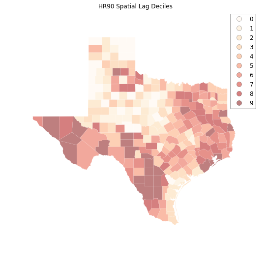
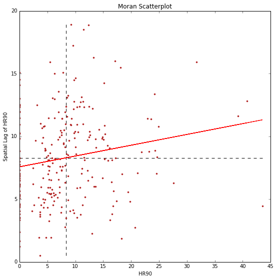
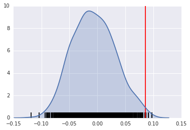
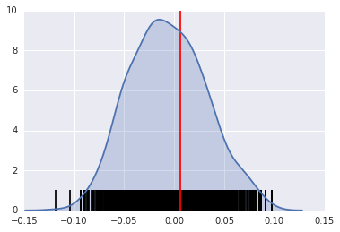
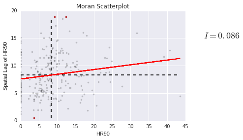
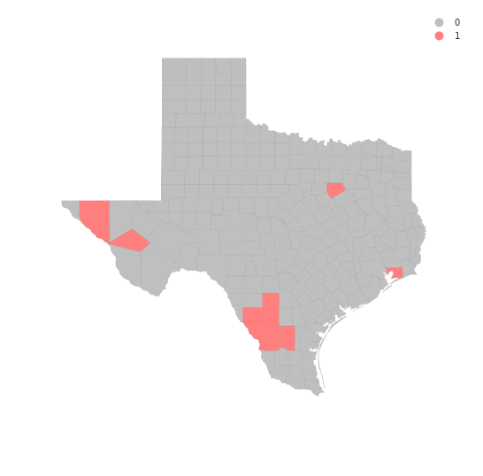
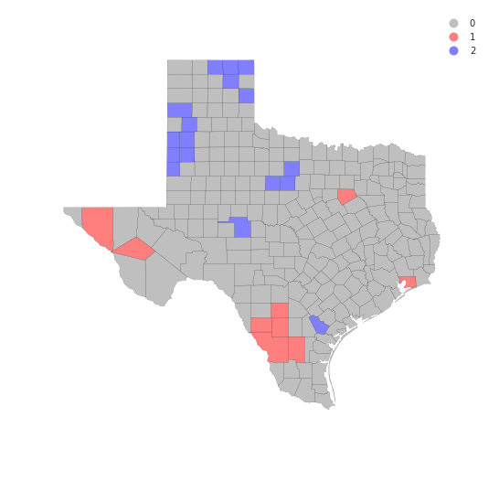

# Exploratory Spatial Data Analysis (ESDA)

> [`IPYNB`](../content/part1/04_esda.ipynb)


```python
%matplotlib inline
import pysal as ps
import pandas as pd
import numpy as np
from pysal.contrib.viz import mapping as maps
```

A well-used functionality in PySAL is the use of PySAL to conduct exploratory spatial data analysis. This notebook will provide an overview of ways to conduct exploratory spatial analysis in Python. 

First, let's read in some data:


```python
data = ps.pdio.read_files("../data/texas.shp")
```


```python
data.head()
```


<div>
<table border="1" class="dataframe">
  <thead>
    <tr style="text-align: right;">
      <th></th>
      <th>NAME</th>
      <th>STATE_NAME</th>
      <th>STATE_FIPS</th>
      <th>CNTY_FIPS</th>
      <th>FIPS</th>
      <th>STFIPS</th>
      <th>COFIPS</th>
      <th>FIPSNO</th>
      <th>SOUTH</th>
      <th>HR60</th>
      <th>...</th>
      <th>BLK90</th>
      <th>GI59</th>
      <th>GI69</th>
      <th>GI79</th>
      <th>GI89</th>
      <th>FH60</th>
      <th>FH70</th>
      <th>FH80</th>
      <th>FH90</th>
      <th>geometry</th>
    </tr>
  </thead>
  <tbody>
    <tr>
      <th>0</th>
      <td>Lipscomb</td>
      <td>Texas</td>
      <td>48</td>
      <td>295</td>
      <td>48295</td>
      <td>48</td>
      <td>295</td>
      <td>48295</td>
      <td>1</td>
      <td>0.0</td>
      <td>...</td>
      <td>0.031817</td>
      <td>0.286929</td>
      <td>0.378219</td>
      <td>0.407005</td>
      <td>0.373005</td>
      <td>6.724512</td>
      <td>4.5</td>
      <td>3.835360</td>
      <td>6.093580</td>
      <td>&lt;pysal.cg.shapes.Polygon object at 0x7f6e7c0d3...</td>
    </tr>
    <tr>
      <th>1</th>
      <td>Sherman</td>
      <td>Texas</td>
      <td>48</td>
      <td>421</td>
      <td>48421</td>
      <td>48</td>
      <td>421</td>
      <td>48421</td>
      <td>1</td>
      <td>0.0</td>
      <td>...</td>
      <td>0.139958</td>
      <td>0.288976</td>
      <td>0.359377</td>
      <td>0.415453</td>
      <td>0.378041</td>
      <td>5.665722</td>
      <td>1.7</td>
      <td>3.253796</td>
      <td>3.869407</td>
      <td>&lt;pysal.cg.shapes.Polygon object at 0x7f6e7c0d3...</td>
    </tr>
    <tr>
      <th>2</th>
      <td>Dallam</td>
      <td>Texas</td>
      <td>48</td>
      <td>111</td>
      <td>48111</td>
      <td>48</td>
      <td>111</td>
      <td>48111</td>
      <td>1</td>
      <td>0.0</td>
      <td>...</td>
      <td>2.050906</td>
      <td>0.331667</td>
      <td>0.385996</td>
      <td>0.370037</td>
      <td>0.376015</td>
      <td>7.546049</td>
      <td>7.2</td>
      <td>9.471366</td>
      <td>14.231738</td>
      <td>&lt;pysal.cg.shapes.Polygon object at 0x7f6e7c0d3...</td>
    </tr>
    <tr>
      <th>3</th>
      <td>Hansford</td>
      <td>Texas</td>
      <td>48</td>
      <td>195</td>
      <td>48195</td>
      <td>48</td>
      <td>195</td>
      <td>48195</td>
      <td>1</td>
      <td>0.0</td>
      <td>...</td>
      <td>0.000000</td>
      <td>0.253527</td>
      <td>0.357813</td>
      <td>0.393938</td>
      <td>0.383924</td>
      <td>7.591786</td>
      <td>4.7</td>
      <td>5.542986</td>
      <td>7.125457</td>
      <td>&lt;pysal.cg.shapes.Polygon object at 0x7f6e7c0d3...</td>
    </tr>
    <tr>
      <th>4</th>
      <td>Ochiltree</td>
      <td>Texas</td>
      <td>48</td>
      <td>357</td>
      <td>48357</td>
      <td>48</td>
      <td>357</td>
      <td>48357</td>
      <td>1</td>
      <td>0.0</td>
      <td>...</td>
      <td>0.021911</td>
      <td>0.236998</td>
      <td>0.352940</td>
      <td>0.343949</td>
      <td>0.374461</td>
      <td>5.172414</td>
      <td>4.0</td>
      <td>4.758392</td>
      <td>9.159159</td>
      <td>&lt;pysal.cg.shapes.Polygon object at 0x7f6e7c0d3...</td>
    </tr>
  </tbody>
</table>
<p>5 rows × 70 columns</p>
</div>


```python
import matplotlib.pyplot as plt

import geopandas as gpd
shp_link = "../data/texas.shp"
tx = gpd.read_file(shp_link)
hr10 = ps.Quantiles(data.HR90, k=10)
f, ax = plt.subplots(1, figsize=(9, 9))
tx.assign(cl=hr10.yb).plot(column='cl', categorical=True, \
        k=10, cmap='OrRd', linewidth=0.1, ax=ax, \
        edgecolor='white', legend=True)
ax.set_axis_off()
plt.title("HR90 Deciles")
plt.show()
```


```python
data = ps.pdio.read_files("../data/texas.shp")
W = ps.queen_from_shapefile("../data/texas.shp")
W.transform = 'r'
```


```python
HR90Lag = ps.lag_spatial(W, data.HR90)
HR90LagQ10 = ps.Quantiles(HR90Lag, k=10)
```


```python
f, ax = plt.subplots(1, figsize=(9, 9))
tx.assign(cl=HR90LagQ10.yb).plot(column='cl', categorical=True, \
        k=10, cmap='OrRd', linewidth=0.1, ax=ax, \
        edgecolor='white', legend=True)
ax.set_axis_off()
plt.title("HR90 Spatial Lag Deciles")

plt.show()
```





```python
HR90 = data.HR90
b,a = np.polyfit(HR90, HR90Lag, 1)
```


```python
f, ax = plt.subplots(1, figsize=(9, 9))

plt.plot(HR90, HR90Lag, '.', color='firebrick')

 # dashed vert at mean of the last year's PCI
plt.vlines(HR90.mean(), HR90Lag.min(), HR90Lag.max(), linestyle='--')
 # dashed horizontal at mean of lagged PCI
plt.hlines(HR90Lag.mean(), HR90.min(), HR90.max(), linestyle='--')

# red line of best fit using global I as slope
plt.plot(HR90, a + b*HR90, 'r')
plt.title('Moran Scatterplot')
plt.ylabel('Spatial Lag of HR90')
plt.xlabel('HR90')
plt.show()
```





## Global Spatial Autocorrelation

In PySAL, commonly-used analysis methods are very easy to access. For example, if we were interested in examining the spatial dependence in `HR90` we could quickly compute a Moran's $I$ statistic:


```python
I_HR90 = ps.Moran(data.HR90.values, W)
```


```python
I_HR90.I, I_HR90.p_sim
```


    (0.085976640313889768, 0.0070000000000000001)


Thus, the $I$ statistic is $0.859$ for this data, and has a very small $p$ value. 


```python
b # note I is same as the slope of the line in the scatterplot
```


    0.085976640313889505


We can visualize the distribution of simulated $I$ statistics using the stored collection of simulated statistics:


```python
I_HR90.sim[0:5]
```


    array([ 0.02513765, -0.01225297,  0.0088749 , -0.04848781,  0.03966136])


A simple way to visualize this distribution is to make a KDEplot (like we've done before), and add a rug showing all of the simulated points, and a vertical line denoting the observed value of the statistic:


```python
import matplotlib.pyplot as plt
import seaborn as sns
%matplotlib inline
```


```python
sns.kdeplot(I_HR90.sim, shade=True)
plt.vlines(I_HR90.sim, 0, 0.5)
plt.vlines(I_HR90.I, 0, 10, 'r')
plt.xlim([-0.15, 0.15])
```

    /home/serge/anaconda2/envs/gds-scipy16/lib/python3.5/site-packages/statsmodels/nonparametric/kdetools.py:20: VisibleDeprecationWarning: using a non-integer number instead of an integer will result in an error in the future
      y = X[:m/2+1] + np.r_[0,X[m/2+1:],0]*1j


    (-0.15, 0.15)





Instead, if our $I$ statistic were close to our expected value, `I_HR90.EI`, our plot might look like this:


```python
sns.kdeplot(I_HR90.sim, shade=True)
plt.vlines(I_HR90.sim, 0, 1)
plt.vlines(I_HR90.EI+.01, 0, 10, 'r')
plt.xlim([-0.15, 0.15])
```

    /home/serge/anaconda2/envs/gds-scipy16/lib/python3.5/site-packages/statsmodels/nonparametric/kdetools.py:20: VisibleDeprecationWarning: using a non-integer number instead of an integer will result in an error in the future
      y = X[:m/2+1] + np.r_[0,X[m/2+1:],0]*1j


    (-0.15, 0.15)





In addition, we can compute a global Bivariate Moran statistic, which relates an observation to the spatial lag of another observation:


```python
bv_HRBLK = ps.Moran_BV(data.HR90.values, data.BLK90.values, W)
```


```python
bv_HRBLK.I, bv_HRBLK.p_sim
```


    (0.080041444794258343, 0.0070000000000000001)


## Local Autocorrelation Statistics

In addition to the Global autocorrelation statistics, PySAL has many local autocorrelation statistics. Let's compute a local Moran statistic for the same data shown above:


```python
LMo_HR90 = ps.Moran_Local(data.HR90.values, W)
```

Now, instead of a single $I$ statistic, we have an *array* of local $I_i$ statistics, stored in the `.Is` attribute, and p-values from the simulation are in `p_sim`. 


```python
LMo_HR90.Is, LMo_HR90.p_sim
```


    (array([  1.12087323e+00,   4.74852232e-01,  -1.22758423e+00,
              9.38686608e-01,   6.89742960e-01,   7.85031726e-01,
              7.10475151e-01,   4.10606860e-01,   7.40368367e-03,
              1.48663520e-01,  -5.99072474e-01,   8.11752611e-02,
             -1.20482997e-01,   3.18800252e-01,   3.47276792e-01,
              4.39609038e-02,  -3.04514513e-01,   2.01610062e-01,
              2.85061414e-01,   5.84462378e-01,   7.56336432e-01,
              3.83077442e-01,   3.99898754e-03,  -9.16855756e-01,
             -4.87000938e-02,   1.46381951e-02,  -1.20220927e-01,
             -7.65176192e-01,  -2.57853261e+00,   2.03465774e-01,
             -1.00025313e-02,   1.51706786e-01,   4.93433817e-01,
              4.35124305e-01,  -3.12259940e-01,  -2.32723324e-01,
              2.82455741e-03,   1.22002377e-01,  -1.27741850e-02,
             -3.54088100e-04,  -9.99830522e-03,  -4.29411693e-02,
              1.14955949e-01,  -5.76707109e-01,  -5.79367567e-01,
             -2.44357064e-01,  -2.45937883e-02,   1.28248005e-01,
              2.40904907e-01,  -1.30657056e+00,   8.75684587e-02,
              7.60257313e-01,   7.46769544e-03,   8.46525604e-02,
             -9.91242446e-02,  -3.63476666e-03,  -1.84994288e-01,
              6.10806717e-02,  -4.10962997e-01,  -1.55435599e-02,
              3.34932522e-01,   5.84998647e-01,   3.97457030e-01,
              4.84549106e-01,  -7.05237462e-01,  -1.89267505e-01,
             -5.36300770e-01,   2.18228666e-01,   2.45387767e-01,
              1.04747657e+00,  -5.03740235e-02,  -4.99501600e-01,
             -6.79039774e-02,  -4.28204631e-01,  -5.19255631e-02,
              1.62667971e-01,   3.96182300e-02,   1.39001221e-01,
              7.85033384e-01,  -6.34873174e-02,  -2.05239166e-01,
              6.70092095e-01,   1.19432435e-01,   8.33565709e-02,
              6.08109031e-02,   4.71129836e-02,  -7.53103370e-01,
              4.12179684e-01,   4.18690212e-01,  -1.24823445e-01,
             -2.20055897e-01,   8.71366261e-01,  -8.79710509e-02,
              1.68820593e-03,   1.07166595e-02,  -3.54370029e-02,
              1.20592772e-03,   2.34359115e-01,   1.74921357e-01,
             -1.82542919e-01,  -2.17921039e-01,  -1.29920391e-03,
             -5.76690555e-02,   1.45723641e-01,   3.62521949e-01,
              4.39212267e-02,   1.62791100e-01,   2.34754317e-01,
              4.24252755e-02,  -7.44382557e-01,   1.01380671e-01,
              1.68446607e-01,   1.36810620e-01,   4.56977527e-02,
              6.92868233e-02,   3.82546883e-02,   1.23206557e-01,
              5.81014061e-01,   6.19044577e-01,   5.97840100e-02,
              6.02552478e-01,   1.98331508e-01,  -2.08124490e-01,
              2.89307856e-01,   2.94694807e-01,   3.17901639e-01,
              3.26156089e-01,   3.01034558e-01,   1.49504893e-01,
              1.95148623e+00,  -2.54303828e-01,   5.08956169e-01,
              6.08264082e-01,  -3.81888449e-02,  -3.00282633e-01,
             -2.65739969e-02,   2.24230408e-01,  -1.44008615e-02,
              4.66594113e-01,  -4.31489357e-02,   1.87061533e-02,
              1.45607307e-01,   2.47182058e-03,  -6.64057756e-01,
              1.54192078e-02,   2.36636263e-01,  -8.45056351e-03,
             -1.34851321e-01,   1.18537899e-01,  -2.27964598e-01,
             -4.18648686e-01,   3.39507930e-01,  -2.63719989e-02,
              1.55681623e-01,   1.22301226e-01,   1.77438253e-01,
              4.10677287e-02,   1.49101636e-01,   1.04297773e-01,
             -7.67634652e-02,  -5.64248729e-03,  -3.05586580e-02,
              5.53503759e-02,   1.37140043e-02,   1.29212068e+00,
             -8.56707799e-02,   2.62786886e-01,  -6.36623531e-01,
             -3.90746796e-01,   2.74114791e-02,  -3.42998234e-02,
              1.96470454e-02,   2.66085647e-01,  -5.86103398e-01,
             -1.40050219e-01,  -9.58183688e-02,   1.06002105e-01,
              5.78305864e-02,   9.12034797e-02,   1.75316202e-01,
              1.53146979e+00,   2.55223569e-01,  -1.07521719e+00,
              2.10421553e-01,   1.79559685e-03,   2.46623711e-01,
             -1.37221563e-01,  -1.93104397e-01,  -6.70944099e-01,
             -6.21994147e-01,   2.62134357e-01,   8.44258361e-02,
              2.15034457e-03,  -1.13695914e-02,  -9.85881978e-01,
             -3.88051312e-02,  -3.94113412e-02,   2.54665339e-01,
              1.03033517e-01,   1.87014888e-01,   6.57921237e-02,
              8.93885114e-01,  -4.12463002e-02,   5.93523798e-04,
             -7.48641130e-01,  -2.33977229e-01,  -1.81364976e-01,
             -2.12719096e-02,  -1.77624803e-01,   7.56458111e-01,
              4.65743492e-02,  -1.17037830e-02,   1.42744115e-01,
             -2.52132245e-01,   2.20273885e-02,   1.32249407e-01,
              1.50840035e-02,   1.58872364e-01,  -3.07330315e-01,
             -2.15826555e-01,   7.78727321e-01,   1.53798953e-01,
              1.39830232e-02,   1.14430614e-02,  -4.13603775e-01,
             -1.13601903e-01,   3.98036147e-02,   5.00495648e-02,
              1.85345062e-02,   8.20513963e-01,  -2.85154006e-03,
              3.37194545e-01,  -6.54881438e-01,   2.87571205e-01,
              3.40025967e+00,   2.79223250e+00,   2.18713536e-01,
              2.57852929e-01,   1.00405907e-01,   1.92499398e-01,
              9.07540052e-02,   1.49438551e-01,   1.33219486e+00,
              9.58722126e-03,  -9.26242513e-02,   1.26208606e-01,
              3.53039195e-01,   1.91842139e-01,  -2.84025227e-03,
              2.62219645e-01,   1.87256013e-01,   2.39837728e-03,
              8.94400168e-02,  -1.39329420e-01]),
     array([ 0.009,  0.149,  0.031,  0.016,  0.001,  0.013,  0.06 ,  0.053,
             0.488,  0.104,  0.079,  0.357,  0.033,  0.01 ,  0.224,  0.467,
             0.238,  0.36 ,  0.268,  0.016,  0.065,  0.056,  0.254,  0.047,
             0.457,  0.142,  0.184,  0.136,  0.057,  0.229,  0.293,  0.111,
             0.032,  0.015,  0.216,  0.276,  0.476,  0.233,  0.487,  0.46 ,
             0.376,  0.177,  0.358,  0.091,  0.073,  0.249,  0.075,  0.281,
             0.027,  0.011,  0.445,  0.029,  0.466,  0.347,  0.046,  0.446,
             0.125,  0.109,  0.087,  0.446,  0.218,  0.067,  0.037,  0.126,
             0.022,  0.18 ,  0.003,  0.313,  0.055,  0.024,  0.323,  0.15 ,
             0.443,  0.213,  0.377,  0.144,  0.462,  0.358,  0.184,  0.054,
             0.369,  0.039,  0.131,  0.458,  0.142,  0.488,  0.016,  0.041,
             0.18 ,  0.251,  0.291,  0.146,  0.117,  0.462,  0.399,  0.498,
             0.467,  0.141,  0.023,  0.025,  0.066,  0.023,  0.026,  0.154,
             0.191,  0.264,  0.078,  0.242,  0.148,  0.122,  0.081,  0.194,
             0.171,  0.25 ,  0.064,  0.366,  0.066,  0.087,  0.069,  0.057,
             0.108,  0.273,  0.127,  0.29 ,  0.122,  0.071,  0.085,  0.065,
             0.26 ,  0.161,  0.032,  0.223,  0.01 ,  0.216,  0.382,  0.473,
             0.093,  0.216,  0.155,  0.355,  0.005,  0.21 ,  0.122,  0.102,
             0.381,  0.28 ,  0.325,  0.075,  0.397,  0.039,  0.181,  0.133,
             0.265,  0.431,  0.13 ,  0.162,  0.099,  0.258,  0.125,  0.395,
             0.426,  0.216,  0.222,  0.479,  0.017,  0.367,  0.063,  0.094,
             0.325,  0.344,  0.235,  0.467,  0.108,  0.19 ,  0.292,  0.304,
             0.288,  0.418,  0.447,  0.379,  0.075,  0.254,  0.055,  0.06 ,
             0.436,  0.094,  0.337,  0.198,  0.085,  0.057,  0.059,  0.233,
             0.445,  0.413,  0.023,  0.322,  0.204,  0.205,  0.2  ,  0.301,
             0.168,  0.127,  0.403,  0.429,  0.325,  0.17 ,  0.191,  0.397,
             0.068,  0.026,  0.159,  0.123,  0.367,  0.33 ,  0.08 ,  0.256,
             0.409,  0.141,  0.244,  0.084,  0.089,  0.125,  0.297,  0.48 ,
             0.004,  0.259,  0.466,  0.211,  0.404,  0.001,  0.205,  0.238,
             0.069,  0.042,  0.013,  0.058,  0.017,  0.104,  0.331,  0.002,
             0.132,  0.236,  0.018,  0.48 ,  0.313,  0.259,  0.108,  0.129,
             0.331,  0.338,  0.29 ,  0.473,  0.382,  0.403]))


We can adjust the number of permutations used to derive every *pseudo*-$p$ value by passing a different `permutations` argument:


```python
LMo_HR90 = ps.Moran_Local(data.HR90.values, W, permutations=9999)
```

In addition to the typical clustermap, a helpful visualization for LISA statistics is a Moran scatterplot with statistically significant LISA values highlighted. 

This is very simple, if we use the same strategy we used before:

First, construct the spatial lag of the covariate:


```python
Lag_HR90 = ps.lag_spatial(W, data.HR90.values)
HR90 = data.HR90.values
```

Then, we want to plot the statistically-significant LISA values in a different color than the others. To do this, first find all of the statistically significant LISAs. Since the $p$-values are in the same order as the $I_i$ statistics, we can do this in the following way


```python
sigs = HR90[LMo_HR90.p_sim <= .001]
W_sigs = Lag_HR90[LMo_HR90.p_sim <= .001]
insigs = HR90[LMo_HR90.p_sim > .001]
W_insigs = Lag_HR90[LMo_HR90.p_sim > .001]
```

Then, since we have a lot of points, we can plot the points with a statistically insignficant LISA value lighter using the `alpha` keyword. In addition, we would like to plot the statistically significant points in a dark red color. 


```python
b,a = np.polyfit(HR90, Lag_HR90, 1)
```

Matplotlib has a list of [named colors](http://matplotlib.org/examples/color/named_colors.html) and will interpret colors that are provided in hexadecimal strings:


```python
plt.plot(sigs, W_sigs, '.', color='firebrick')
plt.plot(insigs, W_insigs, '.k', alpha=.2)
 # dashed vert at mean of the last year's PCI
plt.vlines(HR90.mean(), Lag_HR90.min(), Lag_HR90.max(), linestyle='--')
 # dashed horizontal at mean of lagged PCI
plt.hlines(Lag_HR90.mean(), HR90.min(), HR90.max(), linestyle='--')

# red line of best fit using global I as slope
plt.plot(HR90, a + b*HR90, 'r')
plt.text(s='$I = %.3f$' % I_HR90.I, x=50, y=15, fontsize=18)
plt.title('Moran Scatterplot')
plt.ylabel('Spatial Lag of HR90')
plt.xlabel('HR90')
```


    <matplotlib.text.Text at 0x7f6e70b434e0>





We can also make a LISA map of the data. 


```python
sig = LMo_HR90.p_sim < 0.05
```


```python
sig.sum()
```


    43


```python
hotspots = LMo_HR90.q==1 * sig
```


```python
hotspots.sum()
```


    9


```python
coldspots = LMo_HR90.q==3 * sig
```


```python
coldspots.sum()
```


    17


```python
data.HR90[hotspots]
```


    98      9.784698
    132    11.435106
    164    17.129154
    209    13.274924
    229    12.371338
    234    31.721863
    236     9.584971
    239     9.256549
    242    18.062652
    Name: HR90, dtype: float64


```python
data[hotspots]
```


<div>
<table border="1" class="dataframe">
  <thead>
    <tr style="text-align: right;">
      <th></th>
      <th>NAME</th>
      <th>STATE_NAME</th>
      <th>STATE_FIPS</th>
      <th>CNTY_FIPS</th>
      <th>FIPS</th>
      <th>STFIPS</th>
      <th>COFIPS</th>
      <th>FIPSNO</th>
      <th>SOUTH</th>
      <th>HR60</th>
      <th>...</th>
      <th>BLK90</th>
      <th>GI59</th>
      <th>GI69</th>
      <th>GI79</th>
      <th>GI89</th>
      <th>FH60</th>
      <th>FH70</th>
      <th>FH80</th>
      <th>FH90</th>
      <th>geometry</th>
    </tr>
  </thead>
  <tbody>
    <tr>
      <th>98</th>
      <td>Ellis</td>
      <td>Texas</td>
      <td>48</td>
      <td>139</td>
      <td>48139</td>
      <td>48</td>
      <td>139</td>
      <td>48139</td>
      <td>1</td>
      <td>9.217652</td>
      <td>...</td>
      <td>10.009746</td>
      <td>0.325785</td>
      <td>0.365177</td>
      <td>0.352516</td>
      <td>0.372783</td>
      <td>12.418831</td>
      <td>10.5</td>
      <td>9.076165</td>
      <td>12.031635</td>
      <td>&lt;pysal.cg.shapes.Polygon object at 0x7f6e6e040...</td>
    </tr>
    <tr>
      <th>132</th>
      <td>Hudspeth</td>
      <td>Texas</td>
      <td>48</td>
      <td>229</td>
      <td>48229</td>
      <td>48</td>
      <td>229</td>
      <td>48229</td>
      <td>1</td>
      <td>9.971084</td>
      <td>...</td>
      <td>0.514580</td>
      <td>0.312484</td>
      <td>0.373474</td>
      <td>0.440944</td>
      <td>0.476631</td>
      <td>14.115899</td>
      <td>7.7</td>
      <td>8.959538</td>
      <td>11.363636</td>
      <td>&lt;pysal.cg.shapes.Polygon object at 0x7f6e6dfc6...</td>
    </tr>
    <tr>
      <th>164</th>
      <td>Jeff Davis</td>
      <td>Texas</td>
      <td>48</td>
      <td>243</td>
      <td>48243</td>
      <td>48</td>
      <td>243</td>
      <td>48243</td>
      <td>1</td>
      <td>0.000000</td>
      <td>...</td>
      <td>0.359712</td>
      <td>0.316019</td>
      <td>0.367719</td>
      <td>0.437014</td>
      <td>0.399655</td>
      <td>14.438503</td>
      <td>10.1</td>
      <td>5.970149</td>
      <td>8.255159</td>
      <td>&lt;pysal.cg.shapes.Polygon object at 0x7f6e6dfd3...</td>
    </tr>
    <tr>
      <th>209</th>
      <td>Chambers</td>
      <td>Texas</td>
      <td>48</td>
      <td>071</td>
      <td>48071</td>
      <td>48</td>
      <td>71</td>
      <td>48071</td>
      <td>1</td>
      <td>3.211613</td>
      <td>...</td>
      <td>12.694146</td>
      <td>0.299847</td>
      <td>0.374105</td>
      <td>0.378431</td>
      <td>0.364723</td>
      <td>9.462037</td>
      <td>9.2</td>
      <td>8.568120</td>
      <td>10.598911</td>
      <td>&lt;pysal.cg.shapes.Polygon object at 0x7f6e6dfe0...</td>
    </tr>
    <tr>
      <th>229</th>
      <td>Frio</td>
      <td>Texas</td>
      <td>48</td>
      <td>163</td>
      <td>48163</td>
      <td>48</td>
      <td>163</td>
      <td>48163</td>
      <td>1</td>
      <td>3.296414</td>
      <td>...</td>
      <td>1.358373</td>
      <td>0.390980</td>
      <td>0.463020</td>
      <td>0.435098</td>
      <td>0.473507</td>
      <td>14.665445</td>
      <td>9.4</td>
      <td>11.842919</td>
      <td>18.330362</td>
      <td>&lt;pysal.cg.shapes.Polygon object at 0x7f6e6dfe8...</td>
    </tr>
    <tr>
      <th>234</th>
      <td>La Salle</td>
      <td>Texas</td>
      <td>48</td>
      <td>283</td>
      <td>48283</td>
      <td>48</td>
      <td>283</td>
      <td>48283</td>
      <td>1</td>
      <td>0.000000</td>
      <td>...</td>
      <td>1.008755</td>
      <td>0.421556</td>
      <td>0.482174</td>
      <td>0.489173</td>
      <td>0.492687</td>
      <td>18.167702</td>
      <td>14.1</td>
      <td>13.052937</td>
      <td>20.088626</td>
      <td>&lt;pysal.cg.shapes.Polygon object at 0x7f6e6dfe8...</td>
    </tr>
    <tr>
      <th>236</th>
      <td>Dimmit</td>
      <td>Texas</td>
      <td>48</td>
      <td>127</td>
      <td>48127</td>
      <td>48</td>
      <td>127</td>
      <td>48127</td>
      <td>1</td>
      <td>0.000000</td>
      <td>...</td>
      <td>0.575098</td>
      <td>0.417976</td>
      <td>0.452789</td>
      <td>0.456840</td>
      <td>0.479503</td>
      <td>13.826043</td>
      <td>10.1</td>
      <td>10.944363</td>
      <td>17.769080</td>
      <td>&lt;pysal.cg.shapes.Polygon object at 0x7f6e6dfe8...</td>
    </tr>
    <tr>
      <th>239</th>
      <td>Webb</td>
      <td>Texas</td>
      <td>48</td>
      <td>479</td>
      <td>48479</td>
      <td>48</td>
      <td>479</td>
      <td>48479</td>
      <td>1</td>
      <td>2.057899</td>
      <td>...</td>
      <td>0.117083</td>
      <td>0.382594</td>
      <td>0.443082</td>
      <td>0.439100</td>
      <td>0.461075</td>
      <td>20.292824</td>
      <td>15.5</td>
      <td>17.419676</td>
      <td>20.521271</td>
      <td>&lt;pysal.cg.shapes.Polygon object at 0x7f6e6dfe8...</td>
    </tr>
    <tr>
      <th>242</th>
      <td>Duval</td>
      <td>Texas</td>
      <td>48</td>
      <td>131</td>
      <td>48131</td>
      <td>48</td>
      <td>131</td>
      <td>48131</td>
      <td>1</td>
      <td>2.487934</td>
      <td>...</td>
      <td>0.092894</td>
      <td>0.370217</td>
      <td>0.427660</td>
      <td>0.421041</td>
      <td>0.458937</td>
      <td>15.829478</td>
      <td>13.2</td>
      <td>12.803677</td>
      <td>20.699881</td>
      <td>&lt;pysal.cg.shapes.Polygon object at 0x7f6e6dfe8...</td>
    </tr>
  </tbody>
</table>
<p>9 rows × 70 columns</p>
</div>


```python
from matplotlib import colors
hmap = colors.ListedColormap(['grey', 'red'])
f, ax = plt.subplots(1, figsize=(9, 9))
tx.assign(cl=hotspots*1).plot(column='cl', categorical=True, \
        k=2, cmap=hmap, linewidth=0.1, ax=ax, \
        edgecolor='grey', legend=True)
ax.set_axis_off()
plt.show()
```





```python
data.HR90[coldspots]
```


    0      0.000000
    3      0.000000
    4      3.651767
    5      0.000000
    13     5.669899
    19     3.480743
    21     3.675119
    32     2.211607
    33     4.718762
    48     5.509870
    51     0.000000
    62     3.677958
    69     0.000000
    81     0.000000
    87     3.699593
    140    8.125292
    233    5.304688
    Name: HR90, dtype: float64


```python
cmap = colors.ListedColormap(['grey', 'blue'])
f, ax = plt.subplots(1, figsize=(9, 9))
tx.assign(cl=coldspots*1).plot(column='cl', categorical=True, \
        k=2, cmap=cmap, linewidth=0.1, ax=ax, \
        edgecolor='black', legend=True)
ax.set_axis_off()
plt.show()

```


```python
from matplotlib import colors
hcmap = colors.ListedColormap(['grey', 'red','blue'])
hotcold = hotspots*1 + coldspots*2
f, ax = plt.subplots(1, figsize=(9, 9))
tx.assign(cl=hotcold).plot(column='cl', categorical=True, \
        k=2, cmap=hcmap,linewidth=0.1, ax=ax, \
        edgecolor='black', legend=True)
ax.set_axis_off()
plt.show()
```





```python
sns.kdeplot(data.HR90)
```

    /home/serge/anaconda2/envs/gds-scipy16/lib/python3.5/site-packages/statsmodels/nonparametric/kdetools.py:20: VisibleDeprecationWarning: using a non-integer number instead of an integer will result in an error in the future
      y = X[:m/2+1] + np.r_[0,X[m/2+1:],0]*1j


    <matplotlib.axes._subplots.AxesSubplot at 0x7f6e6e147550>


```python
sns.kdeplot(data.HR90)
sns.kdeplot(data.HR80)
sns.kdeplot(data.HR70)
sns.kdeplot(data.HR60)
```

    /home/serge/anaconda2/envs/gds-scipy16/lib/python3.5/site-packages/statsmodels/nonparametric/kdetools.py:20: VisibleDeprecationWarning: using a non-integer number instead of an integer will result in an error in the future
      y = X[:m/2+1] + np.r_[0,X[m/2+1:],0]*1j


    <matplotlib.axes._subplots.AxesSubplot at 0x7f6e6e5ccdd8>


```python
data.HR90.mean()
```


    8.302494460285041


```python
data.HR90.median()
```


    7.23234613355


```python

```


```python

```


```python

```


```python

```
