# Exploratory Spatial and Temporal Data Analysis (ESTDA)

> [`IPYNB`](../content/part1/05_spatial_dynamics.ipynb)


```python
import matplotlib
import numpy as np
import pysal as ps
import matplotlib.pyplot as plt
%matplotlib inline

```


```python
f = ps.open(ps.examples.get_path('usjoin.csv'), 'r')
```

To determine what is in the file, check the `header` attribute on the file object:


```python
f.header
```


    ['Name',
     'STATE_FIPS',
     '1929',
     '1930',
     '1931',
     '1932',
     '1933',
     '1934',
     '1935',
     '1936',
     '1937',
     '1938',
     '1939',
     '1940',
     '1941',
     '1942',
     '1943',
     '1944',
     '1945',
     '1946',
     '1947',
     '1948',
     '1949',
     '1950',
     '1951',
     '1952',
     '1953',
     '1954',
     '1955',
     '1956',
     '1957',
     '1958',
     '1959',
     '1960',
     '1961',
     '1962',
     '1963',
     '1964',
     '1965',
     '1966',
     '1967',
     '1968',
     '1969',
     '1970',
     '1971',
     '1972',
     '1973',
     '1974',
     '1975',
     '1976',
     '1977',
     '1978',
     '1979',
     '1980',
     '1981',
     '1982',
     '1983',
     '1984',
     '1985',
     '1986',
     '1987',
     '1988',
     '1989',
     '1990',
     '1991',
     '1992',
     '1993',
     '1994',
     '1995',
     '1996',
     '1997',
     '1998',
     '1999',
     '2000',
     '2001',
     '2002',
     '2003',
     '2004',
     '2005',
     '2006',
     '2007',
     '2008',
     '2009']


Ok, lets pull in the `name` variable to see what we have.


```python
name = f.by_col('Name')
```


```python
name
```


    ['Alabama',
     'Arizona',
     'Arkansas',
     'California',
     'Colorado',
     'Connecticut',
     'Delaware',
     'Florida',
     'Georgia',
     'Idaho',
     'Illinois',
     'Indiana',
     'Iowa',
     'Kansas',
     'Kentucky',
     'Louisiana',
     'Maine',
     'Maryland',
     'Massachusetts',
     'Michigan',
     'Minnesota',
     'Mississippi',
     'Missouri',
     'Montana',
     'Nebraska',
     'Nevada',
     'New Hampshire',
     'New Jersey',
     'New Mexico',
     'New York',
     'North Carolina',
     'North Dakota',
     'Ohio',
     'Oklahoma',
     'Oregon',
     'Pennsylvania',
     'Rhode Island',
     'South Carolina',
     'South Dakota',
     'Tennessee',
     'Texas',
     'Utah',
     'Vermont',
     'Virginia',
     'Washington',
     'West Virginia',
     'Wisconsin',
     'Wyoming']


Now obtain per capital incomes in 1929 which is in the column associated with `1929`.


```python
y1929 = f.by_col('1929')
```


```python
y1929
```


    [323,
     600,
     310,
     991,
     634,
     1024,
     1032,
     518,
     347,
     507,
     948,
     607,
     581,
     532,
     393,
     414,
     601,
     768,
     906,
     790,
     599,
     286,
     621,
     592,
     596,
     868,
     686,
     918,
     410,
     1152,
     332,
     382,
     771,
     455,
     668,
     772,
     874,
     271,
     426,
     378,
     479,
     551,
     634,
     434,
     741,
     460,
     673,
     675]


And now 2009


```python
y2009 = f.by_col("2009")
```


```python
y2009
```


    [32274,
     32077,
     31493,
     40902,
     40093,
     52736,
     40135,
     36565,
     33086,
     30987,
     40933,
     33174,
     35983,
     37036,
     31250,
     35151,
     35268,
     47159,
     49590,
     34280,
     40920,
     29318,
     35106,
     32699,
     37057,
     38009,
     41882,
     48123,
     32197,
     46844,
     33564,
     38672,
     35018,
     33708,
     35210,
     38827,
     41283,
     30835,
     36499,
     33512,
     35674,
     30107,
     36752,
     43211,
     40619,
     31843,
     35676,
     42504]


These are read into regular Python lists which are not particularly well suited to efficient data analysis. So let's convert them to numpy arrays.


```python
y2009 = np.array(y2009)
```


```python
y2009
```


    array([32274, 32077, 31493, 40902, 40093, 52736, 40135, 36565, 33086,
           30987, 40933, 33174, 35983, 37036, 31250, 35151, 35268, 47159,
           49590, 34280, 40920, 29318, 35106, 32699, 37057, 38009, 41882,
           48123, 32197, 46844, 33564, 38672, 35018, 33708, 35210, 38827,
           41283, 30835, 36499, 33512, 35674, 30107, 36752, 43211, 40619,
           31843, 35676, 42504])


Much better. But pulling these in and converting them a column at a time is tedious and error prone. So we will do all of this in a list comprehension.


```python
Y = np.array( [ f.by_col(str(year)) for year in range(1929,2010) ] ) * 1.0
```


```python
Y.shape
```


    (81, 48)


```python
Y = Y.transpose()
```


```python
Y.shape
```


    (48, 81)


```python
years = np.arange(1929,2010)
```


```python
plt.plot(years,Y[0])


```


    [<matplotlib.lines.Line2D at 0x7fc12c98b7b8>]


```python
RY = Y / Y.mean(axis=0)
```


```python
plt.plot(years,RY[0])
```


    [<matplotlib.lines.Line2D at 0x7fc12c8f0c18>]


```python
name = np.array(name)
```


```python
np.nonzero(name=='Ohio')
```


    (array([32]),)


```python
plt.plot(years, RY[32], label='Ohio')
plt.plot(years, RY[0], label='Alabama')
plt.legend()
```


    <matplotlib.legend.Legend at 0x7fc12ad18518>


## Spaghetti Plot


```python
for row in RY:
    plt.plot(years, row)
```


## Kernel Density (univariate, aspatial)


```python
from scipy.stats.kde import gaussian_kde
```


```python
density = gaussian_kde(Y[:,0])
```


```python
Y[:,0]
```


    array([  323.,   600.,   310.,   991.,   634.,  1024.,  1032.,   518.,
             347.,   507.,   948.,   607.,   581.,   532.,   393.,   414.,
             601.,   768.,   906.,   790.,   599.,   286.,   621.,   592.,
             596.,   868.,   686.,   918.,   410.,  1152.,   332.,   382.,
             771.,   455.,   668.,   772.,   874.,   271.,   426.,   378.,
             479.,   551.,   634.,   434.,   741.,   460.,   673.,   675.])


```python
density = gaussian_kde(Y[:,0])
```


```python
minY0 = Y[:,0].min()*.90
maxY0 = Y[:,0].max()*1.10
x = np.linspace(minY0, maxY0, 100)
```


```python
plt.plot(x,density(x))
```


    [<matplotlib.lines.Line2D at 0x7fc12c86a2e8>]


```python
d2009 = gaussian_kde(Y[:,-1])
```


```python
minY0 = Y[:,-1].min()*.90
maxY0 = Y[:,-1].max()*1.10
x = np.linspace(minY0, maxY0, 100)
```


```python
plt.plot(x,d2009(x))
```


    [<matplotlib.lines.Line2D at 0x7fc12c9115f8>]


```python
minR0 = RY.min()
```


```python
maxR0 = RY.max()
```


```python
x = np.linspace(minR0, maxR0, 100)
```


```python
d1929 = gaussian_kde(RY[:,0])
```


```python
d2009 = gaussian_kde(RY[:,-1])
```


```python
plt.plot(x, d1929(x))
plt.plot(x, d2009(x))
```


    [<matplotlib.lines.Line2D at 0x7fc12c8aabe0>]


```python
plt.plot(x, d1929(x), label='1929')
plt.plot(x, d2009(x), label='2009')
plt.legend()
```


    <matplotlib.legend.Legend at 0x7fc12c72b240>


```python
import seaborn as sns
for y in range(2010-1929):
    sns.kdeplot(RY[:,y])
#sns.kdeplot(data.HR80)
#sns.kdeplot(data.HR70)
#sns.kdeplot(data.HR60)

```

    /home/serge/anaconda2/envs/gds-scipy16/lib/python3.5/site-packages/statsmodels/nonparametric/kdetools.py:20: VisibleDeprecationWarning: using a non-integer number instead of an integer will result in an error in the future
      y = X[:m/2+1] + np.r_[0,X[m/2+1:],0]*1j


```python
import seaborn as sns
for y in range(2010-1929):
    sns.kdeplot(RY[:,y])
```

    /home/serge/anaconda2/envs/gds-scipy16/lib/python3.5/site-packages/statsmodels/nonparametric/kdetools.py:20: VisibleDeprecationWarning: using a non-integer number instead of an integer will result in an error in the future
      y = X[:m/2+1] + np.r_[0,X[m/2+1:],0]*1j


```python
for cs in RY.T: # take cross sections
    plt.plot(x, gaussian_kde(cs)(x))
```


```python
cs[0]
```


    0.86746356478544273


```python
sigma = RY.std(axis=0)
plt.plot(years, sigma)
plt.ylabel('s')
plt.xlabel('year')
plt.title("Sigma-Convergence")
```


    <matplotlib.text.Text at 0x7fc129c01358>


So the distribution is becoming less dispersed over time.

But what about internal mixing? Do poor (rich) states remain poor (rich), or is there movement within the distribuiton over time?

## Markov Chains


```python
c = np.array([
['b','a','c'],
['c','c','a'],
['c','b','c'],
['a','a','b'],
['a','b','c']])
```


```python
c
```


    array([['b', 'a', 'c'],
           ['c', 'c', 'a'],
           ['c', 'b', 'c'],
           ['a', 'a', 'b'],
           ['a', 'b', 'c']], 
          dtype='<U1')


```python
m = ps.Markov(c)
```


```python
m.classes
```


    array(['a', 'b', 'c'], 
          dtype='<U1')


```python
m.transitions
```


    array([[ 1.,  2.,  1.],
           [ 1.,  0.,  2.],
           [ 1.,  1.,  1.]])


```python
m.p
```


    matrix([[ 0.25      ,  0.5       ,  0.25      ],
            [ 0.33333333,  0.        ,  0.66666667],
            [ 0.33333333,  0.33333333,  0.33333333]])


### State Per Capita Incomes


```python
ps.examples.explain('us_income')
```


    {'description': 'Per-capita income for the lower 47 US states 1929-2010',
     'explanation': [' * us48.shp: shapefile ',
      ' * us48.dbf: dbf for shapefile',
      ' * us48.shx: index for shapefile',
      ' * usjoin.csv: attribute data (comma delimited file)'],
     'name': 'us_income'}


```python
data = ps.pdio.read_files(ps.examples.get_path("us48.dbf"))
W = ps.queen_from_shapefile(ps.examples.get_path("us48.shp"))
W.transform = 'r'
```


```python
data.STATE_NAME
```


    0         Washington
    1            Montana
    2              Maine
    3       North Dakota
    4       South Dakota
    5            Wyoming
    6          Wisconsin
    7              Idaho
    8            Vermont
    9          Minnesota
    10            Oregon
    11     New Hampshire
    12              Iowa
    13     Massachusetts
    14          Nebraska
    15          New York
    16      Pennsylvania
    17       Connecticut
    18      Rhode Island
    19        New Jersey
    20           Indiana
    21            Nevada
    22              Utah
    23        California
    24              Ohio
    25          Illinois
    26          Delaware
    27     West Virginia
    28          Maryland
    29          Colorado
    30          Kentucky
    31            Kansas
    32          Virginia
    33          Missouri
    34           Arizona
    35          Oklahoma
    36    North Carolina
    37         Tennessee
    38             Texas
    39        New Mexico
    40           Alabama
    41       Mississippi
    42           Georgia
    43    South Carolina
    44          Arkansas
    45         Louisiana
    46           Florida
    47          Michigan
    Name: STATE_NAME, dtype: object


```python
f = ps.open(ps.examples.get_path("usjoin.csv"))
pci = np.array([f.by_col[str(y)] for y in range(1929,2010)])
pci.shape
```


    (81, 48)


```python
pci = pci.T
```


```python
pci.shape
```


    (48, 81)


```python
cnames = f.by_col('Name')
```


```python
cnames
```


    ['Alabama',
     'Arizona',
     'Arkansas',
     'California',
     'Colorado',
     'Connecticut',
     'Delaware',
     'Florida',
     'Georgia',
     'Idaho',
     'Illinois',
     'Indiana',
     'Iowa',
     'Kansas',
     'Kentucky',
     'Louisiana',
     'Maine',
     'Maryland',
     'Massachusetts',
     'Michigan',
     'Minnesota',
     'Mississippi',
     'Missouri',
     'Montana',
     'Nebraska',
     'Nevada',
     'New Hampshire',
     'New Jersey',
     'New Mexico',
     'New York',
     'North Carolina',
     'North Dakota',
     'Ohio',
     'Oklahoma',
     'Oregon',
     'Pennsylvania',
     'Rhode Island',
     'South Carolina',
     'South Dakota',
     'Tennessee',
     'Texas',
     'Utah',
     'Vermont',
     'Virginia',
     'Washington',
     'West Virginia',
     'Wisconsin',
     'Wyoming']


```python
ids = [ cnames.index(name) for name in data.STATE_NAME]
```


```python
ids
```


    [44,
     23,
     16,
     31,
     38,
     47,
     46,
     9,
     42,
     20,
     34,
     26,
     12,
     18,
     24,
     29,
     35,
     5,
     36,
     27,
     11,
     25,
     41,
     3,
     32,
     10,
     6,
     45,
     17,
     4,
     14,
     13,
     43,
     22,
     1,
     33,
     30,
     39,
     40,
     28,
     0,
     21,
     8,
     37,
     2,
     15,
     7,
     19]


```python
pci = pci[ids]
RY = RY[ids]
```


```python
import matplotlib.pyplot as plt

import geopandas as gpd
shp_link = ps.examples.get_path('us48.shp')
tx = gpd.read_file(shp_link)
pci29 = ps.Quantiles(pci[:,0], k=5)
f, ax = plt.subplots(1, figsize=(10, 5))
tx.assign(cl=pci29.yb+1).plot(column='cl', categorical=True, \
        k=5, cmap='Greens', linewidth=0.1, ax=ax, \
        edgecolor='grey', legend=True)
ax.set_axis_off()
plt.title('Per Capita Income 1929 Quintiles')

plt.show()
```


```python
pci2009 = ps.Quantiles(pci[:,-1], k=5)
f, ax = plt.subplots(1, figsize=(10, 5))
tx.assign(cl=pci2009.yb+1).plot(column='cl', categorical=True, \
        k=5, cmap='Greens', linewidth=0.1, ax=ax, \
        edgecolor='grey', legend=True)
ax.set_axis_off()
plt.title('Per Capita Income 2009 Quintiles')
plt.show()
```


```python
for y in range(2010-1929):
    pciy = ps.Quantiles(pci[:,y], k=5)
    f, ax = plt.subplots(1, figsize=(10, 5))
    tx.assign(cl=pciy.yb+1).plot(column='cl', categorical=True, \
            k=5, cmap='Greens', linewidth=0.1, ax=ax, \
            edgecolor='grey', legend=True)
    ax.set_axis_off()
    plt.title("Per Capita Income %d Quintiles"%(1929+y))
    plt.show()
```


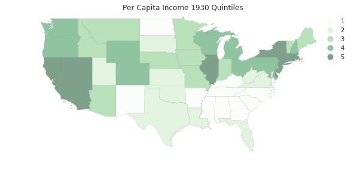


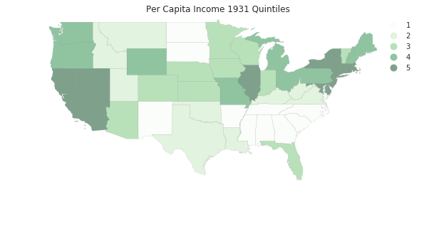


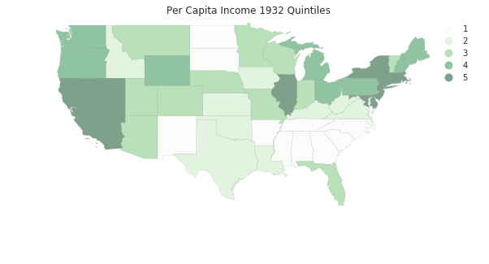


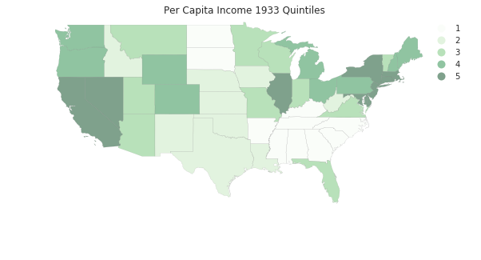


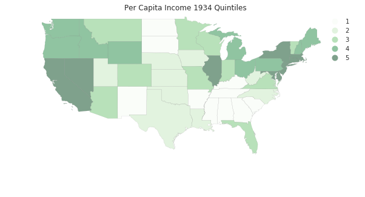


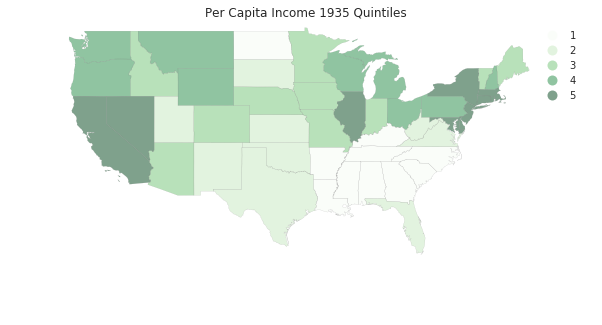


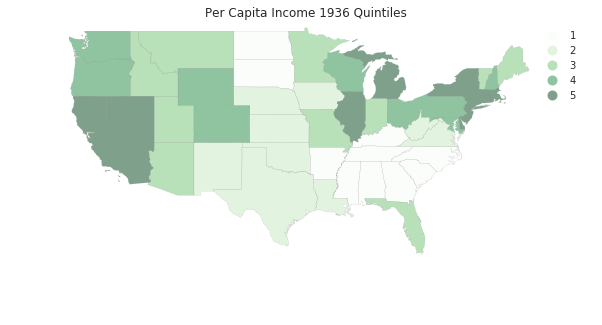


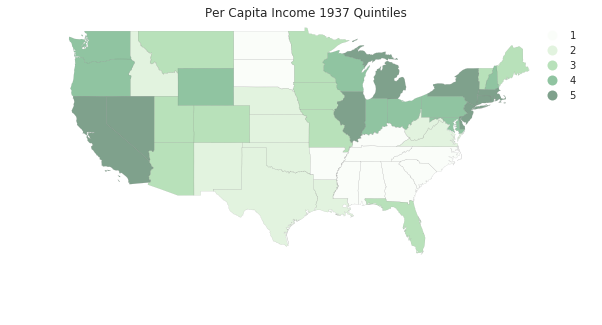


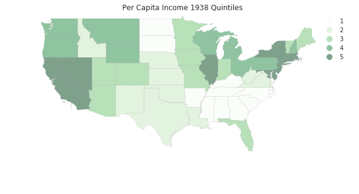


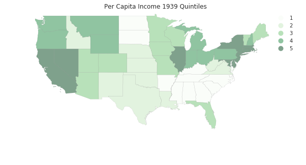


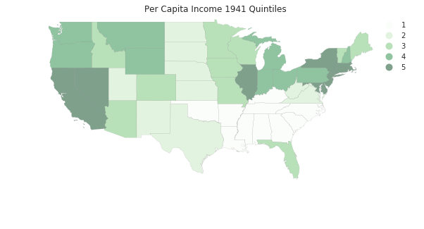


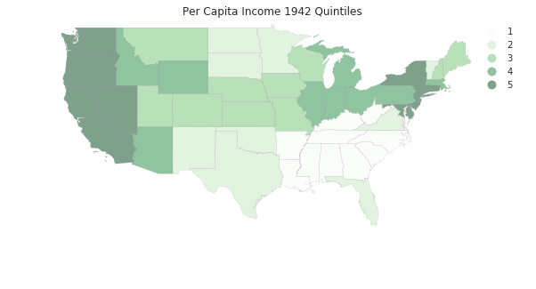


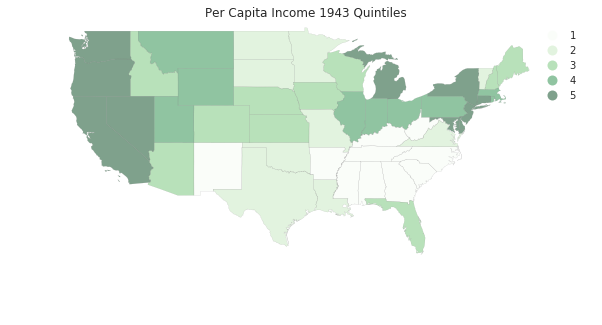


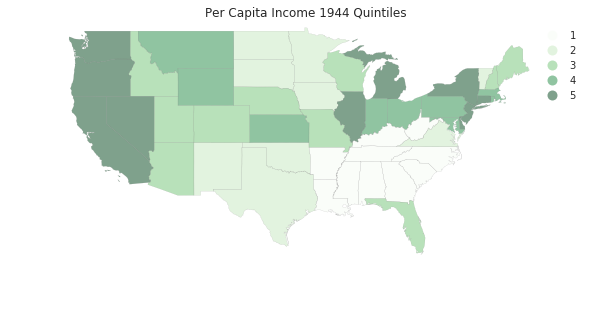


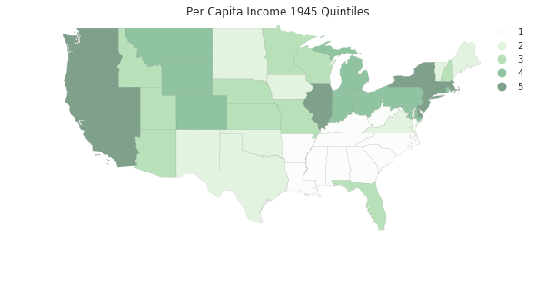


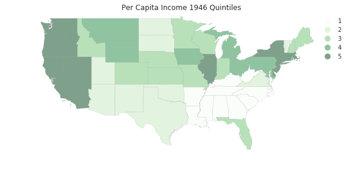


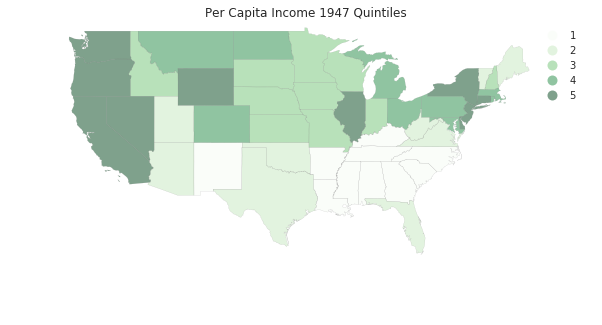


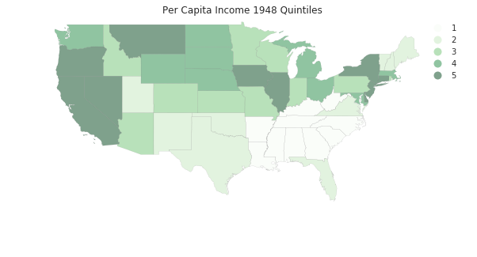


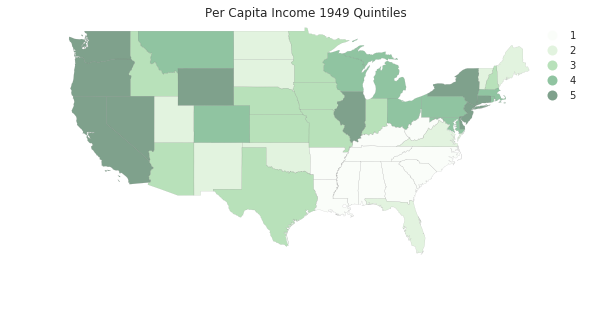


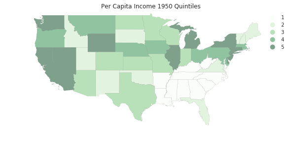


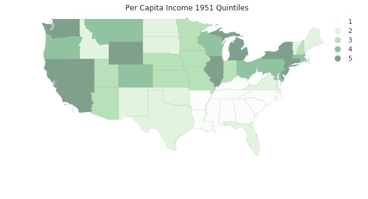


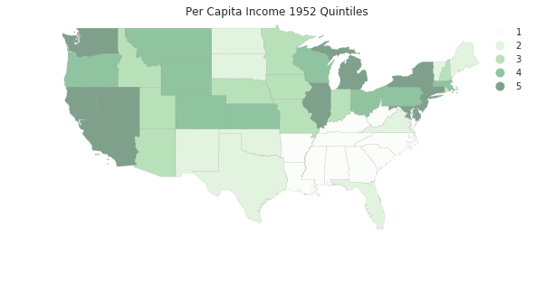


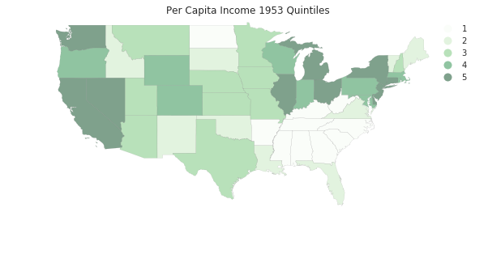


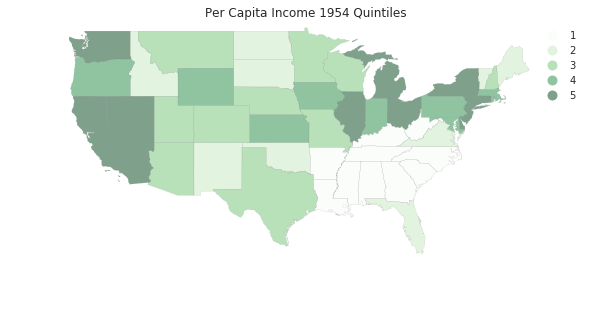


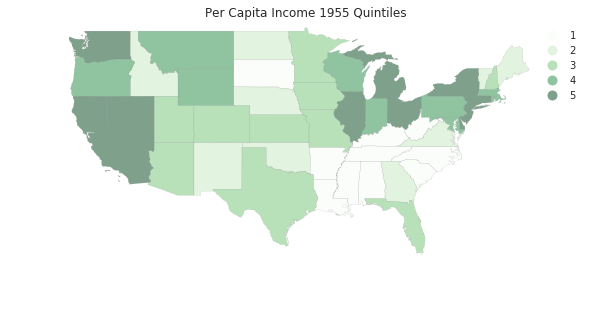


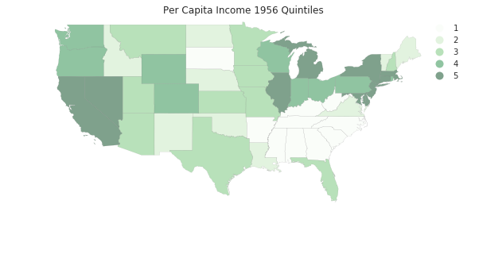


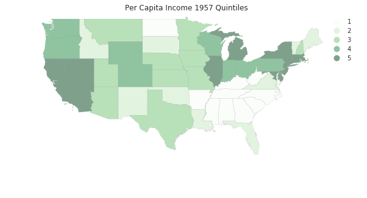


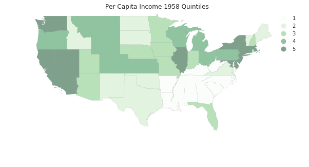


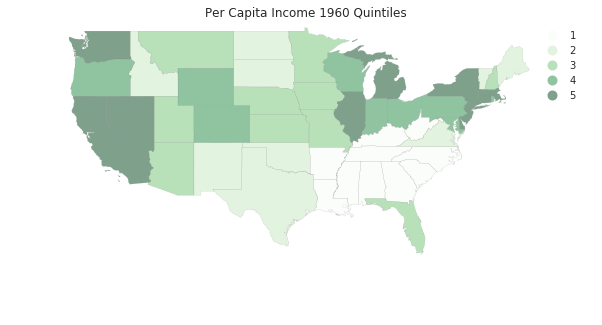


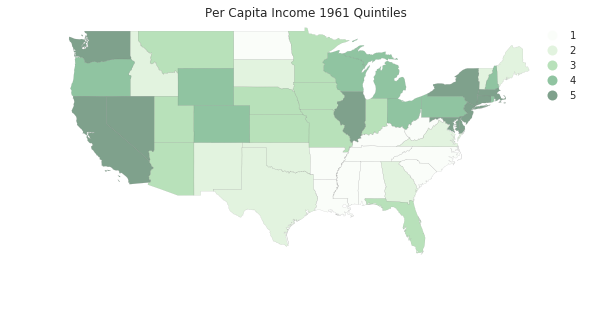


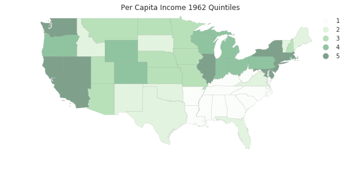


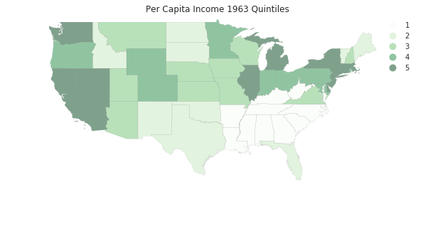


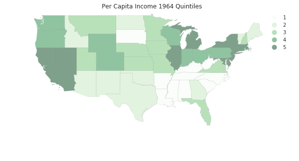


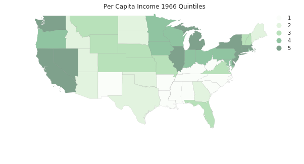


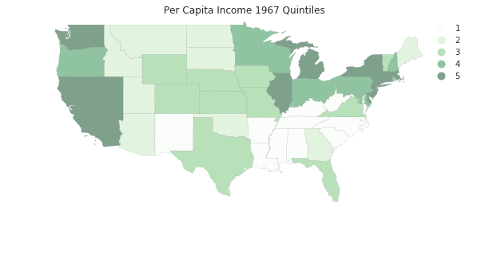


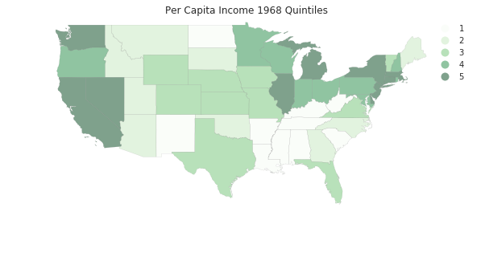


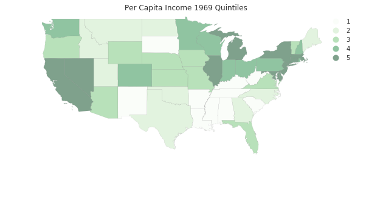


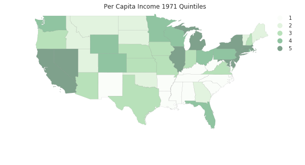


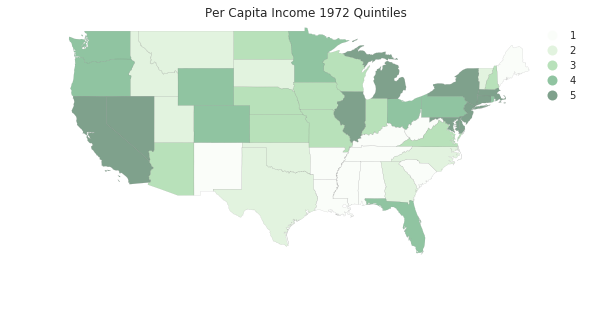


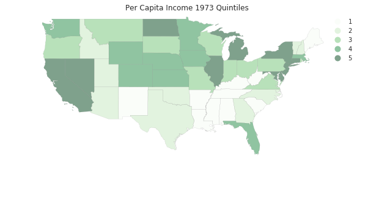


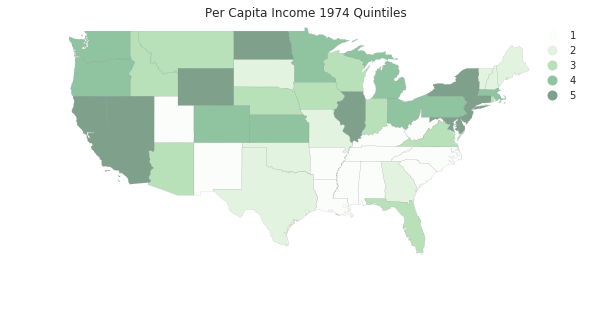


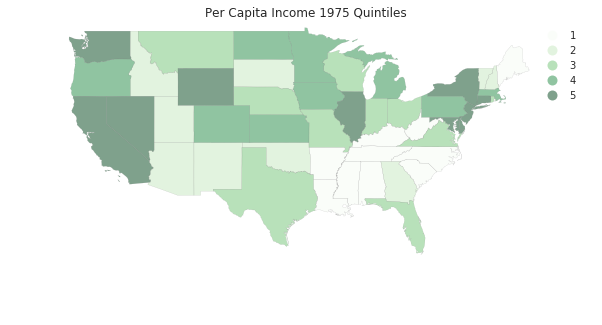


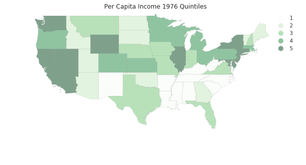


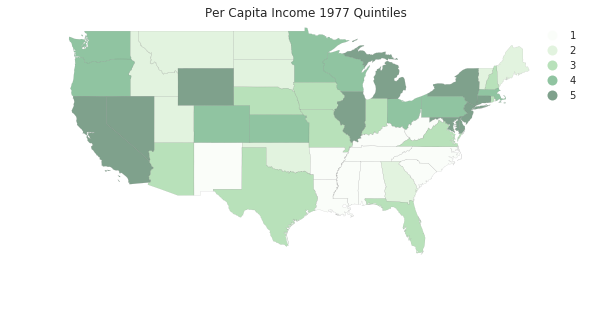


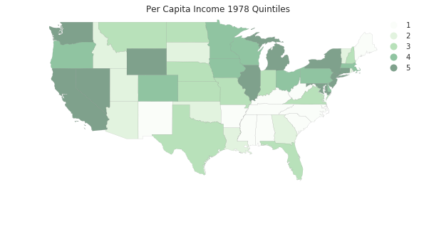


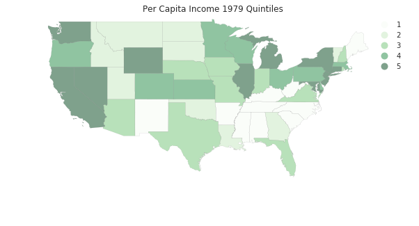


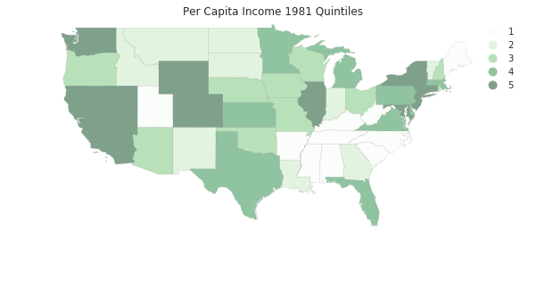


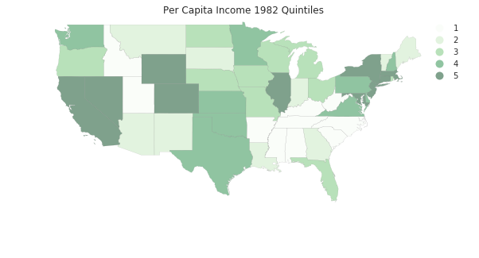


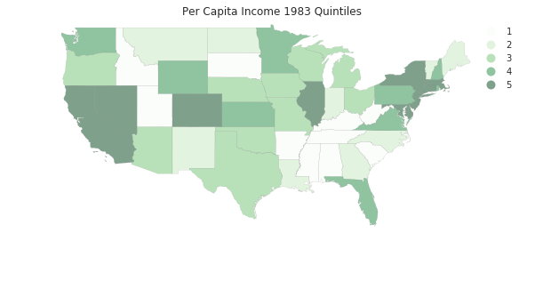


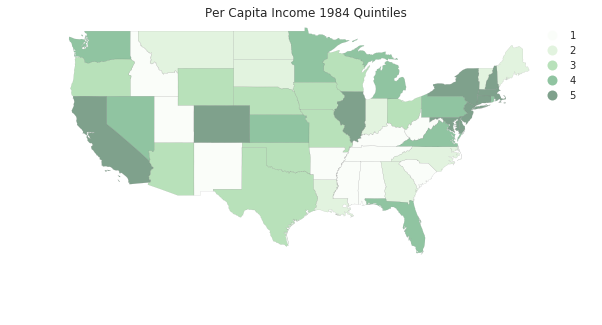


Put series into cross-sectional quintiles (i.e., quintiles for each year).


```python
q5 = np.array([ps.Quantiles(y).yb for y in pci.T]).transpose()
```


```python
q5.shape
```


    (48, 81)


```python
q5[:,0]
```


    array([3, 2, 2, 0, 1, 3, 3, 1, 2, 2, 3, 3, 2, 4, 2, 4, 3, 4, 4, 4, 2, 4, 2,
           4, 3, 4, 4, 1, 3, 2, 0, 1, 1, 2, 2, 1, 0, 0, 1, 0, 0, 0, 0, 0, 0, 1,
           1, 4])


```python
pci.shape
```


    (48, 81)


```python
pci[0]
```


    array([  741,   658,   534,   402,   376,   443,   490,   569,   599,
             582,   614,   658,   864,  1196,  1469,  1527,  1419,  1401,
            1504,  1624,  1595,  1721,  1874,  1973,  2066,  2077,  2116,
            2172,  2262,  2281,  2380,  2436,  2535,  2680,  2735,  2858,
            3078,  3385,  3566,  3850,  4097,  4205,  4381,  4731,  5312,
            5919,  6533,  7181,  7832,  8887,  9965, 10913, 11903, 12431,
           13124, 14021, 14738, 15522, 16300, 17270, 18670, 20026, 20901,
           21917, 22414, 23119, 23878, 25287, 26817, 28632, 30392, 31528,
           32053, 32206, 32934, 34984, 35738, 38477, 40782, 41588, 40619])


we are looping over the rows of y which is ordered $T \times n$ (rows are cross sections, row 0 is the cross-section for period 0.


```python
m5 = ps.Markov(q5)
```


```python
m5.classes
```


    array([0, 1, 2, 3, 4])


```python
m5.transitions
```


    array([[ 729.,   71.,    1.,    0.,    0.],
           [  72.,  567.,   80.,    3.,    0.],
           [   0.,   81.,  631.,   86.,    2.],
           [   0.,    3.,   86.,  573.,   56.],
           [   0.,    0.,    1.,   57.,  741.]])


```python
np.set_printoptions(3, suppress=True)
m5.p
```


    matrix([[ 0.91 ,  0.089,  0.001,  0.   ,  0.   ],
            [ 0.1  ,  0.785,  0.111,  0.004,  0.   ],
            [ 0.   ,  0.101,  0.789,  0.107,  0.003],
            [ 0.   ,  0.004,  0.12 ,  0.798,  0.078],
            [ 0.   ,  0.   ,  0.001,  0.071,  0.927]])


```python
m5.steady_state #steady state distribution
```


    matrix([[ 0.208],
            [ 0.187],
            [ 0.207],
            [ 0.188],
            [ 0.209]])


```python
fmpt = ps.ergodic.fmpt(m5.p) #first mean passage time
fmpt
```


    matrix([[   4.814,   11.503,   29.609,   53.386,  103.598],
            [  42.048,    5.34 ,   18.745,   42.5  ,   92.713],
            [  69.258,   27.211,    4.821,   25.272,   75.433],
            [  84.907,   42.859,   17.181,    5.313,   51.61 ],
            [  98.413,   56.365,   30.66 ,   14.212,    4.776]])


For a state with income in the first quintile, it takes on average 11.5 years for it to first enter the second quintile, 29.6 to get to the third quintile, 53.4 years to enter the fourth, and 103.6 years to reach the richest quintile.

But, this approach assumes the movement of a state in the income distribution is independent of the movement of its neighbors or the position of the neighbors in the distribution. Does spatial context matter?

## Dynamics of Spatial Dependence

Create a queen contiguity matrix that is row standardized


```python
w = ps.queen_from_shapefile(ps.examples.get_path('us48.shp'))
w.transform = 'R'
```


```python
mits = [ps.Moran(cs, w) for cs in RY.T]
```


```python
res = np.array([(m.I, m.EI, m.p_sim, m.z_sim) for m in mits])
```


```python
plt.plot(years, res[:,0], label='I')
plt.plot(years, res[:,1], label='E[I]')
plt.title("Moran's I")
plt.legend()
```


    <matplotlib.legend.Legend at 0x7fc1189b5e80>


```python
plt.plot(years, res[:,-1])
plt.ylim(0,7.0)
plt.title('z-values, I')
```


    <matplotlib.text.Text at 0x7fc129b46b70>


## Spatial Markov


```python
pci.shape
```


    (48, 81)


```python
rpci = pci / pci.mean(axis=0)
```


```python
rpci[:,0]
```


    array([ 1.204,  0.962,  0.977,  0.621,  0.692,  1.097,  1.094,  0.824,
            1.031,  0.974,  1.086,  1.115,  0.944,  1.473,  0.969,  1.873,
            1.255,  1.664,  1.421,  1.492,  0.987,  1.411,  0.896,  1.611,
            1.253,  1.541,  1.677,  0.748,  1.248,  1.031,  0.639,  0.865,
            0.705,  1.009,  0.975,  0.74 ,  0.54 ,  0.614,  0.779,  0.666,
            0.525,  0.465,  0.564,  0.441,  0.504,  0.673,  0.842,  1.284])


```python
rpci[:,0].mean()
```


    0.99999999999999989


```python
sm = ps.Spatial_Markov(rpci, W, fixed=True, k=5)
```


```python
sm.p
```


    matrix([[ 0.915,  0.075,  0.009,  0.001,  0.   ],
            [ 0.066,  0.827,  0.105,  0.001,  0.001],
            [ 0.005,  0.103,  0.794,  0.095,  0.003],
            [ 0.   ,  0.009,  0.094,  0.849,  0.048],
            [ 0.   ,  0.   ,  0.   ,  0.062,  0.938]])


```python
for p in sm.P:
    print(p)
```

    [[ 0.963  0.03   0.006  0.     0.   ]
     [ 0.06   0.832  0.107  0.     0.   ]
     [ 0.     0.14   0.74   0.12   0.   ]
     [ 0.     0.036  0.321  0.571  0.071]
     [ 0.     0.     0.     0.167  0.833]]
    [[ 0.798  0.168  0.034  0.     0.   ]
     [ 0.075  0.882  0.042  0.     0.   ]
     [ 0.005  0.07   0.866  0.059  0.   ]
     [ 0.     0.     0.064  0.902  0.034]
     [ 0.     0.     0.     0.194  0.806]]
    [[ 0.847  0.153  0.     0.     0.   ]
     [ 0.081  0.789  0.129  0.     0.   ]
     [ 0.005  0.098  0.793  0.098  0.005]
     [ 0.     0.     0.094  0.871  0.035]
     [ 0.     0.     0.     0.102  0.898]]
    [[ 0.885  0.098  0.     0.016  0.   ]
     [ 0.039  0.814  0.14   0.     0.008]
     [ 0.005  0.094  0.777  0.119  0.005]
     [ 0.     0.023  0.129  0.754  0.094]
     [ 0.     0.     0.     0.097  0.903]]
    [[ 0.333  0.667  0.     0.     0.   ]
     [ 0.048  0.774  0.161  0.016  0.   ]
     [ 0.011  0.161  0.747  0.08   0.   ]
     [ 0.     0.01   0.062  0.896  0.031]
     [ 0.     0.     0.     0.024  0.976]]


```python
sm.S
```


    array([[ 0.435,  0.264,  0.204,  0.068,  0.029],
           [ 0.134,  0.34 ,  0.252,  0.233,  0.041],
           [ 0.121,  0.211,  0.264,  0.29 ,  0.114],
           [ 0.078,  0.197,  0.254,  0.225,  0.247],
           [ 0.018,  0.2  ,  0.19 ,  0.255,  0.337]])


```python
for f in sm.F:
    print(f)
```

    [[   2.298   28.956   46.143   80.81   279.429]
     [  33.865    3.795   22.571   57.238  255.857]
     [  43.602    9.737    4.911   34.667  233.286]
     [  46.629   12.763    6.257   14.616  198.619]
     [  52.629   18.763   12.257    6.      34.103]]
    [[   7.468    9.706   25.768   74.531  194.234]
     [  27.767    2.942   24.971   73.735  193.438]
     [  53.575   28.484    3.976   48.763  168.467]
     [  72.036   46.946   18.462    4.284  119.703]
     [  77.179   52.089   23.604    5.143   24.276]]
    [[   8.248    6.533   18.388   40.709  112.767]
     [  47.35     4.731   11.854   34.175  106.234]
     [  69.423   24.767    3.795   22.321   94.38 ]
     [  83.723   39.067   14.3      3.447   76.367]
     [  93.523   48.867   24.1      9.8      8.793]]
    [[  12.88    13.348   19.834   28.473   55.824]
     [  99.461    5.064   10.545   23.051   49.689]
     [ 117.768   23.037    3.944   15.084   43.579]
     [ 127.898   32.439   14.569    4.448   31.631]
     [ 138.248   42.789   24.919   10.35     4.056]]
    [[  56.282    1.5     10.572   27.022  110.543]
     [  82.922    5.009    9.072   25.522  109.043]
     [  97.177   19.531    5.26    21.424  104.946]
     [ 127.141   48.741   33.296    3.918   83.522]
     [ 169.641   91.241   75.796   42.5      2.965]]


```python
sm.summary()
```

    --------------------------------------------------------------
                         Spatial Markov Test                      
    --------------------------------------------------------------
    Number of classes: 5
    Number of transitions: 3840
    Number of regimes: 5
    Regime names: LAG0, LAG1, LAG2, LAG3, LAG4
    --------------------------------------------------------------
       Test                   LR                Chi-2
      Stat.              170.659              200.624
        DOF                   60                   60
    p-value                0.000                0.000
    --------------------------------------------------------------
    P(H0)           C0         C1         C2         C3         C4
         C0      0.915      0.075      0.009      0.001      0.000
         C1      0.066      0.827      0.105      0.001      0.001
         C2      0.005      0.103      0.794      0.095      0.003
         C3      0.000      0.009      0.094      0.849      0.048
         C4      0.000      0.000      0.000      0.062      0.938
    --------------------------------------------------------------
    P(LAG0)         C0         C1         C2         C3         C4
         C0      0.963      0.030      0.006      0.000      0.000
         C1      0.060      0.832      0.107      0.000      0.000
         C2      0.000      0.140      0.740      0.120      0.000
         C3      0.000      0.036      0.321      0.571      0.071
         C4      0.000      0.000      0.000      0.167      0.833
    --------------------------------------------------------------
    P(LAG1)         C0         C1         C2         C3         C4
         C0      0.798      0.168      0.034      0.000      0.000
         C1      0.075      0.882      0.042      0.000      0.000
         C2      0.005      0.070      0.866      0.059      0.000
         C3      0.000      0.000      0.064      0.902      0.034
         C4      0.000      0.000      0.000      0.194      0.806
    --------------------------------------------------------------
    P(LAG2)         C0         C1         C2         C3         C4
         C0      0.847      0.153      0.000      0.000      0.000
         C1      0.081      0.789      0.129      0.000      0.000
         C2      0.005      0.098      0.793      0.098      0.005
         C3      0.000      0.000      0.094      0.871      0.035
         C4      0.000      0.000      0.000      0.102      0.898
    --------------------------------------------------------------
    P(LAG3)         C0         C1         C2         C3         C4
         C0      0.885      0.098      0.000      0.016      0.000
         C1      0.039      0.814      0.140      0.000      0.008
         C2      0.005      0.094      0.777      0.119      0.005
         C3      0.000      0.023      0.129      0.754      0.094
         C4      0.000      0.000      0.000      0.097      0.903
    --------------------------------------------------------------
    P(LAG4)         C0         C1         C2         C3         C4
         C0      0.333      0.667      0.000      0.000      0.000
         C1      0.048      0.774      0.161      0.016      0.000
         C2      0.011      0.161      0.747      0.080      0.000
         C3      0.000      0.010      0.062      0.896      0.031
         C4      0.000      0.000      0.000      0.024      0.976
    --------------------------------------------------------------

