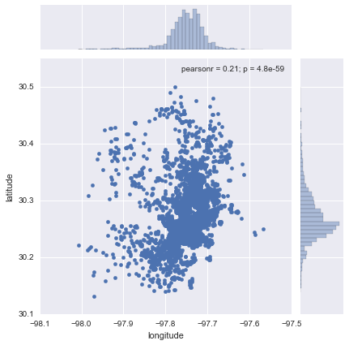

# Point Patterns

> [`IPYNB`](../content/part2/06_points.ipynb)

> **NOTE**: some of this material has been ported and adapted from "Lab 9" in [Arribas-Bel (2016)](http://darribas.org/gds15/labs/Lab_09.html).

This notebook covers a brief introduction on how to visualize and analyze point patterns. To demonstrate this, we will use a dataset of all the AirBnb listings in the city of Austin (check the Data section for more information about the dataset).

Before anything, let us load up the libraries we will use:


```python
%matplotlib inline

import numpy as np
import pandas as pd
import geopandas as gpd
import seaborn as sns
import matplotlib.pyplot as plt
import mplleaflet as mpll
```

## Data preparation

Let us first set the paths to the datasets we will be using:


```python
# Adjust this to point to the right file in your computer
listings_link = '../data/listings.csv.gz'
```

The core dataset we will use is `listings.csv`, which contains a lot of information about each individual location listed at AirBnb within Austin:


```python
lst = pd.read_csv(listings_link)
lst.info()
```

    <class 'pandas.core.frame.DataFrame'>
    RangeIndex: 5835 entries, 0 to 5834
    Data columns (total 92 columns):
    id                                  5835 non-null int64
    listing_url                         5835 non-null object
    scrape_id                           5835 non-null int64
    last_scraped                        5835 non-null object
    name                                5835 non-null object
    summary                             5373 non-null object
    space                               4475 non-null object
    description                         5832 non-null object
    experiences_offered                 5835 non-null object
    neighborhood_overview               3572 non-null object
    notes                               2413 non-null object
    transit                             3492 non-null object
    thumbnail_url                       5542 non-null object
    medium_url                          5542 non-null object
    picture_url                         5835 non-null object
    xl_picture_url                      5542 non-null object
    host_id                             5835 non-null int64
    host_url                            5835 non-null object
    host_name                           5820 non-null object
    host_since                          5820 non-null object
    host_location                       5810 non-null object
    host_about                          3975 non-null object
    host_response_time                  4177 non-null object
    host_response_rate                  4177 non-null object
    host_acceptance_rate                3850 non-null object
    host_is_superhost                   5820 non-null object
    host_thumbnail_url                  5820 non-null object
    host_picture_url                    5820 non-null object
    host_neighbourhood                  4977 non-null object
    host_listings_count                 5820 non-null float64
    host_total_listings_count           5820 non-null float64
    host_verifications                  5835 non-null object
    host_has_profile_pic                5820 non-null object
    host_identity_verified              5820 non-null object
    street                              5835 non-null object
    neighbourhood                       4800 non-null object
    neighbourhood_cleansed              5835 non-null int64
    neighbourhood_group_cleansed        0 non-null float64
    city                                5835 non-null object
    state                               5835 non-null object
    zipcode                             5810 non-null float64
    market                              5835 non-null object
    smart_location                      5835 non-null object
    country_code                        5835 non-null object
    country                             5835 non-null object
    latitude                            5835 non-null float64
    longitude                           5835 non-null float64
    is_location_exact                   5835 non-null object
    property_type                       5835 non-null object
    room_type                           5835 non-null object
    accommodates                        5835 non-null int64
    bathrooms                           5789 non-null float64
    bedrooms                            5829 non-null float64
    beds                                5812 non-null float64
    bed_type                            5835 non-null object
    amenities                           5835 non-null object
    square_feet                         302 non-null float64
    price                               5835 non-null object
    weekly_price                        2227 non-null object
    monthly_price                       1717 non-null object
    security_deposit                    2770 non-null object
    cleaning_fee                        3587 non-null object
    guests_included                     5835 non-null int64
    extra_people                        5835 non-null object
    minimum_nights                      5835 non-null int64
    maximum_nights                      5835 non-null int64
    calendar_updated                    5835 non-null object
    has_availability                    5835 non-null object
    availability_30                     5835 non-null int64
    availability_60                     5835 non-null int64
    availability_90                     5835 non-null int64
    availability_365                    5835 non-null int64
    calendar_last_scraped               5835 non-null object
    number_of_reviews                   5835 non-null int64
    first_review                        3827 non-null object
    last_review                         3829 non-null object
    review_scores_rating                3789 non-null float64
    review_scores_accuracy              3776 non-null float64
    review_scores_cleanliness           3778 non-null float64
    review_scores_checkin               3778 non-null float64
    review_scores_communication         3778 non-null float64
    review_scores_location              3779 non-null float64
    review_scores_value                 3778 non-null float64
    requires_license                    5835 non-null object
    license                             1 non-null float64
    jurisdiction_names                  0 non-null float64
    instant_bookable                    5835 non-null object
    cancellation_policy                 5835 non-null object
    require_guest_profile_picture       5835 non-null object
    require_guest_phone_verification    5835 non-null object
    calculated_host_listings_count      5835 non-null int64
    reviews_per_month                   3827 non-null float64
    dtypes: float64(20), int64(14), object(58)
    memory usage: 4.1+ MB


It turns out that one record displays a very odd location and, for the sake of the illustration, we will remove it:


```python
odd = lst.loc[lst.longitude>-80, ['longitude', 'latitude']]
odd
```


<div>
<table border="1" class="dataframe">
  <thead>
    <tr style="text-align: right;">
      <th></th>
      <th>longitude</th>
      <th>latitude</th>
    </tr>
  </thead>
  <tbody>
    <tr>
      <th>5832</th>
      <td>-5.093682</td>
      <td>43.214991</td>
    </tr>
  </tbody>
</table>
</div>


```python
lst = lst.drop(odd.index)
```

## Point Visualization

The most straighforward way to get a first glimpse of the distribution of the data is to plot their latitude and longitude:


```python
sns.jointplot?
```


```python
sns.jointplot(x="longitude", y="latitude", data=lst);
```





Now this does not neccesarily tell us much about the dataset or the distribution of locations within Austin. There are two main challenges in interpreting the plot: one, there is lack of context, which means the points are not identifiable over space (unless you are so familiar with lon/lat pairs that they have a clear meaning to you); and two, in the center of the plot, there are so many points that it is hard to tell any pattern other than a big blurb of blue.

Let us first focus on the first problem, geographical context. The quickest and easiest way to provide context to this set of points is to overlay a general map. If we had an image with the map or a set of several data sources that we could aggregate to create a map, we could build it from scratch. But in the XXI Century, the easiest is to overlay our point dataset on top of a web map. In this case, we will use [Leaflet](http://leafletjs.com/), and we will convert our underlying `matplotlib` points with `mplleaflet`. The full dataset (+5k observations) is a bit too much for leaflet to plot it directly on screen, so we will obtain a random sample of 100 points:


```python
# NOTE: `mpll.display` turned off to be able to compile the website,
#       comment out the last line of this cell for rendering Leaflet map.
rids = np.arange(lst.shape[0])
np.random.shuffle(rids)
f, ax = plt.subplots(1, figsize=(6, 6))
lst.iloc[rids[:100], :].plot(kind='scatter', x='longitude', y='latitude', \
                      s=30, linewidth=0, ax=ax);
#mpll.display(fig=f,)
```


This map allows us to get a much better sense of where the points are and what type of location they might be in. For example, now we can see that the big blue blurb has to do with the urbanized core of Austin.

### `bokeh` alternative

Leaflet is not the only technology to display data on maps, although it is probably the default option in many cases. When the data is larger than "acceptable", we need to resort to more technically sophisticated alternatives. One option is provided by `bokeh` and its `datashaded` submodule (see [here](https://anaconda.org/jbednar/nyc_taxi/notebook) for a very nice introduction to the library, from where this example has been adapted).

Before we delve into `bokeh`, let us reproject our original data (lon/lat coordinates) into Web Mercator, as `bokeh` will expect them. To do that, we turn the coordinates into a `GeoSeries`:


```python
from shapely.geometry import Point
xys_wb = gpd.GeoSeries(lst[['longitude', 'latitude']].apply(Point, axis=1), \
                      crs="+init=epsg:4326")
xys_wb = xys_wb.to_crs(epsg=3857)
x_wb = xys_wb.apply(lambda i: i.x)
y_wb = xys_wb.apply(lambda i: i.y)
```

Now we are ready to setup the plot in `bokeh`:


```python
from bokeh.plotting import figure, output_notebook, show
from bokeh.tile_providers import STAMEN_TERRAIN
output_notebook()

minx, miny, maxx, maxy = xys_wb.total_bounds
y_range = miny, maxy
x_range = minx, maxx

def base_plot(tools='pan,wheel_zoom,reset',plot_width=600, plot_height=400, **plot_args):
    p = figure(tools=tools, plot_width=plot_width, plot_height=plot_height,
        x_range=x_range, y_range=y_range, outline_line_color=None,
        min_border=0, min_border_left=0, min_border_right=0,
        min_border_top=0, min_border_bottom=0, **plot_args)
    
    p.axis.visible = False
    p.xgrid.grid_line_color = None
    p.ygrid.grid_line_color = None
    return p
    
options = dict(line_color=None, fill_color='#800080', size=4)
```


    <div class="bk-banner">
        <a href="http://bokeh.pydata.org" target="_blank" class="bk-logo bk-logo-small bk-logo-notebook"></a>
        <span id="efa98bda-2ccf-4dbf-ae97-94033d60c79b">Loading BokehJS ...</span>
    </div>


And good to go for mapping!


```python
# NOTE: `show` turned off to be able to compile the website,
#       comment out the last line of this cell for rendering.
p = base_plot()
p.add_tile(STAMEN_TERRAIN)
p.circle(x=x_wb, y=y_wb, **options)
#show(p)
```


    <bokeh.models.renderers.GlyphRenderer at 0x1052bb5f8>


As you can quickly see, `bokeh` is substantially faster at rendering larger amounts of data.

The second problem we have spotted with the first scatter is that, when the number of points grows, at some point it becomes impossible to discern anything other than a big blur of color. To some extent, interactivity gets at that problem by allowing the user to zoom in until every point is an entity on its own. However, there exist techniques that allow to summarize the data to be able to capture the overall pattern at once. Traditionally, kernel density estimation (KDE) has been one of the most common solutions by approximating a continuous surface of point intensity. In this context, however, we will explore a more recent alternative suggested by the [`datashader`](https://github.com/bokeh/datashader) library (see the [paper](http://www.crest.iu.edu/publications/prints/2014/Cottam2014OutOfCore.pdf) if interested in more details).

Arguably, our dataset is not large enough to justify the use of a reduction technique like datashader, but we will create the plot for the sake of the illustration. Keep in mind, the usefulness of this approach increases the more points you need to be plotting.


```python
# NOTE: `show` turned off to be able to compile the website,
#       comment out the last line of this cell for rendering.

import datashader as ds
from datashader.callbacks import InteractiveImage
from datashader.colors import viridis
from datashader import transfer_functions as tf
from bokeh.tile_providers import STAMEN_TONER

p = base_plot()
p.add_tile(STAMEN_TONER)

pts = pd.DataFrame({'x': x_wb, 'y': y_wb})
pts['count'] = 1
def create_image90(x_range, y_range, w, h):
    cvs = ds.Canvas(plot_width=w, plot_height=h, x_range=x_range, y_range=y_range)
    agg = cvs.points(pts, 'x', 'y',  ds.count('count'))
    img = tf.interpolate(agg.where(agg > np.percentile(agg,90)), \
                         cmap=viridis, how='eq_hist')
    return tf.dynspread(img, threshold=0.1, max_px=4)
    
#InteractiveImage(p, create_image90)
```

The key advandage of `datashader` is that is decouples the point processing from the plotting. That is the bit that allows it to be scalable to truly large datasets (e.g. millions of points). Essentially, the approach is based on generating a very fine grid, counting points within pixels, and encoding the count into a color scheme. In our map, this is not particularly effective because we do not have too many points (the previous plot is probably a more effective one) and esssentially there is a pixel per location of every point. However, hopefully this example shows how to create this kind of scalable maps.

## Kernel Density Estimation

A common alternative when the number of points grows is to replace plotting every single point by estimating the continuous observed probability distribution. In this case, we will not be visualizing the points themselves, but an abstracted surface that models the probability of point density over space. The most commonly used method to do this is the so called kernel density estimate (KDE). The idea behind KDEs is to count the number of points in a continious way. Instead of using discrete counting, where you include a point in the count if it is inside a certain boundary and ignore it otherwise, KDEs use functions (kernels) that include points but give different weights to each one depending of how far of the location where we are counting the point is.

Creating a KDE is very straightfoward in Python. In its simplest form, we can run the following single line of code:


```python
sns.kdeplot(lst['longitude'], lst['latitude'], shade=True, cmap='viridis');
```


Now, if we want to include additional layers of data to provide context, we can do so in the same way we would layer up different elements in `matplotlib`. Let us load first the Zip codes in Austin, for example:


```python
zc = gpd.read_file('../data/Zipcodes.geojson')
zc.plot();
```


And, to overlay both layers:


```python
f, ax = plt.subplots(1, figsize=(9, 9))

zc.plot(color='white', linewidth=0.1, ax=ax)

sns.kdeplot(lst['longitude'], lst['latitude'], \
            shade=True, cmap='Purples', \
            ax=ax);

ax.set_axis_off()
plt.axis('equal')
plt.show()
```


<!--
## `bokeh` alternative

pts.head()

from sklearn.neighbors import KernelDensity
from sklearn.grid_search import GridSearchCV

# Setup kernel
kde = KernelDensity(metric='euclidean',
                    kernel='gaussian', algorithm='ball_tree')
# Bandwidth selection
gs = GridSearchCV(kde, \
                {'bandwidth': np.linspace(0.1, 1.0, 30)}, \
                cv=3)
%time cv = gs.fit(pts[['x', 'y']].values)
bw = cv.best_params_['bandwidth']
kde.bandwidth = bw
# Fit the KDE
kde.fit(pts[['x', 'y']].values)

# Build a mesh
minX, minY = pts[['x', 'y']].values.min(axis=0)
maxX, maxY = pts[['x', 'y']].values.max(axis=0)
bbox = [minX, minY, maxX, maxY]
mn = 100
mx = np.linspace(minX, maxX, mn)
my = np.linspace(minY, maxY, mn)
mxx, myy = np.meshgrid(mx, my)
mxxyy = np.hstack((mxx.reshape(-1, 1), myy.reshape(-1, 1)))
# Fit to the KDE
d = kde.score_samples(mxxyy).reshape(mn, mn)

print pts.min()['x'], pts.min()['y']

print pts.max()['x'], pts.max()['y']

mxxyy.max(axis=0)

from bokeh.plotting import figure, show

p = base_plot()
p.add_tile(STAMEN_TERRAIN)

p.image(image=[d], x=minX, y=minY, dw=maxX-minX, dh=maxY-minY, \
        alpha=0.001, palette="Blues9")

show(p)
-->

## Exercise

> *Split the dataset by type of property and create a map for the five most common types.*

Consider the following sorting of property types:


```python
lst.property_type.groupby(lst.property_type)\
                 .count()\
                 .sort_values(ascending=False)
```


    property_type
    House              3549
    Apartment          1855
    Condominium         106
    Loft                 83
    Townhouse            57
    Other                47
    Bed & Breakfast      37
    Camper/RV            34
    Bungalow             18
    Cabin                17
    Tent                 11
    Villa                 7
    Treehouse             7
    Earth House           2
    Chalet                1
    Hut                   1
    Boat                  1
    Tipi                  1
    Name: property_type, dtype: int64


```python

```
